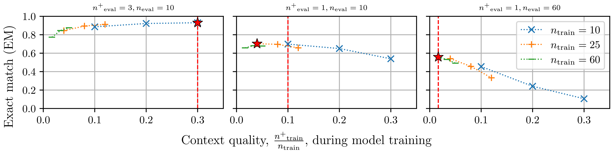
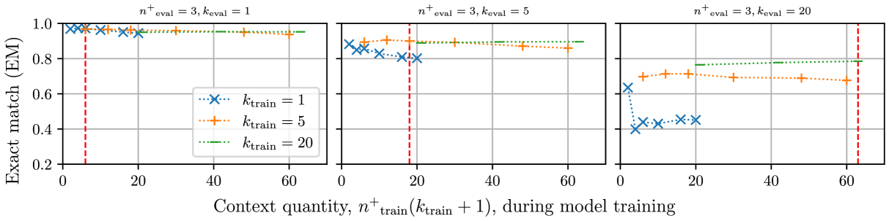
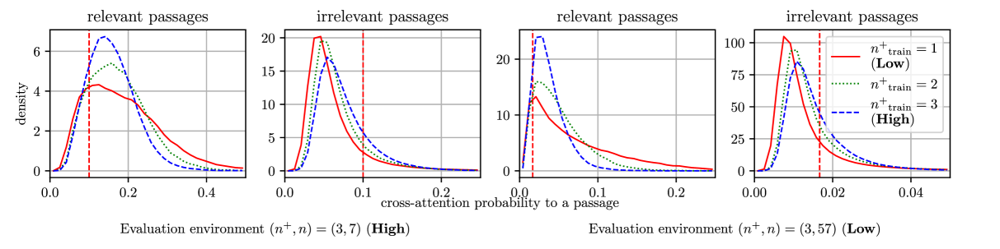
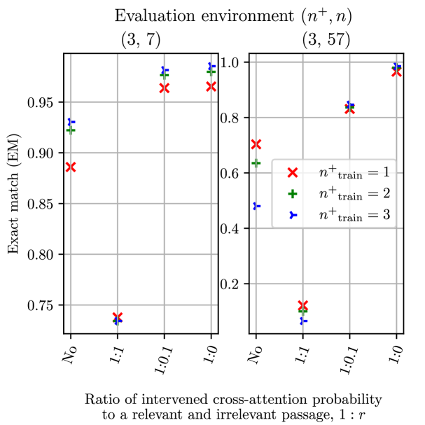
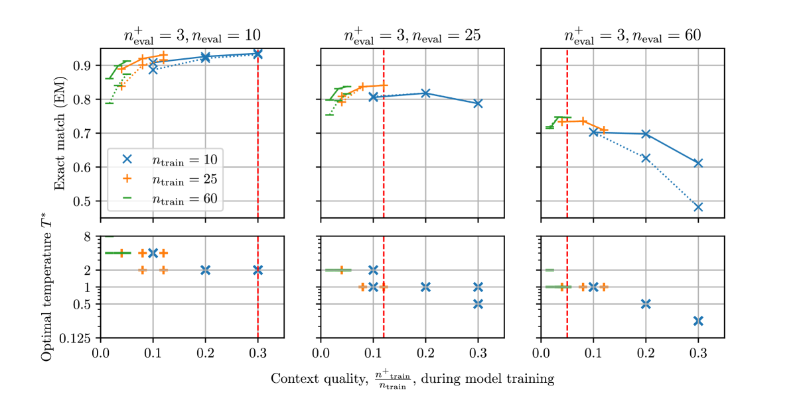
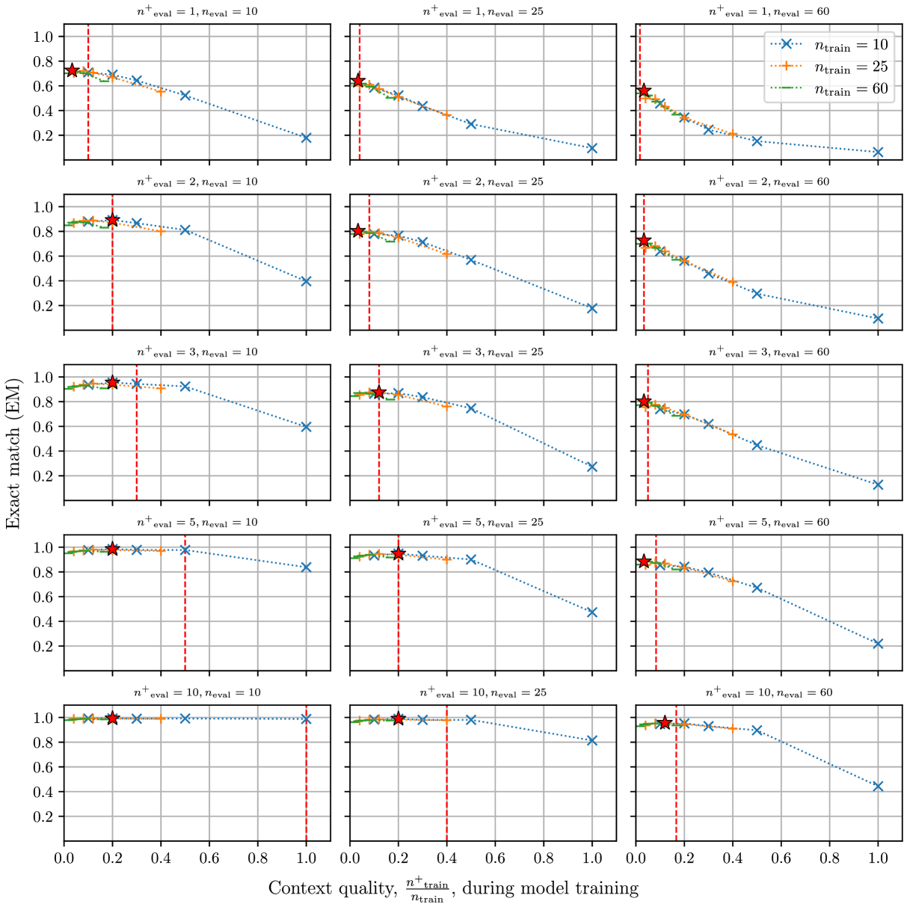
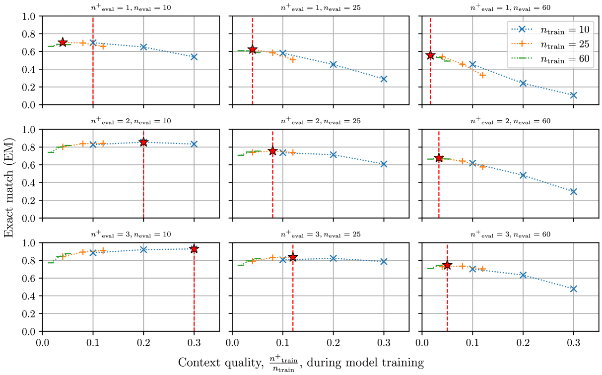
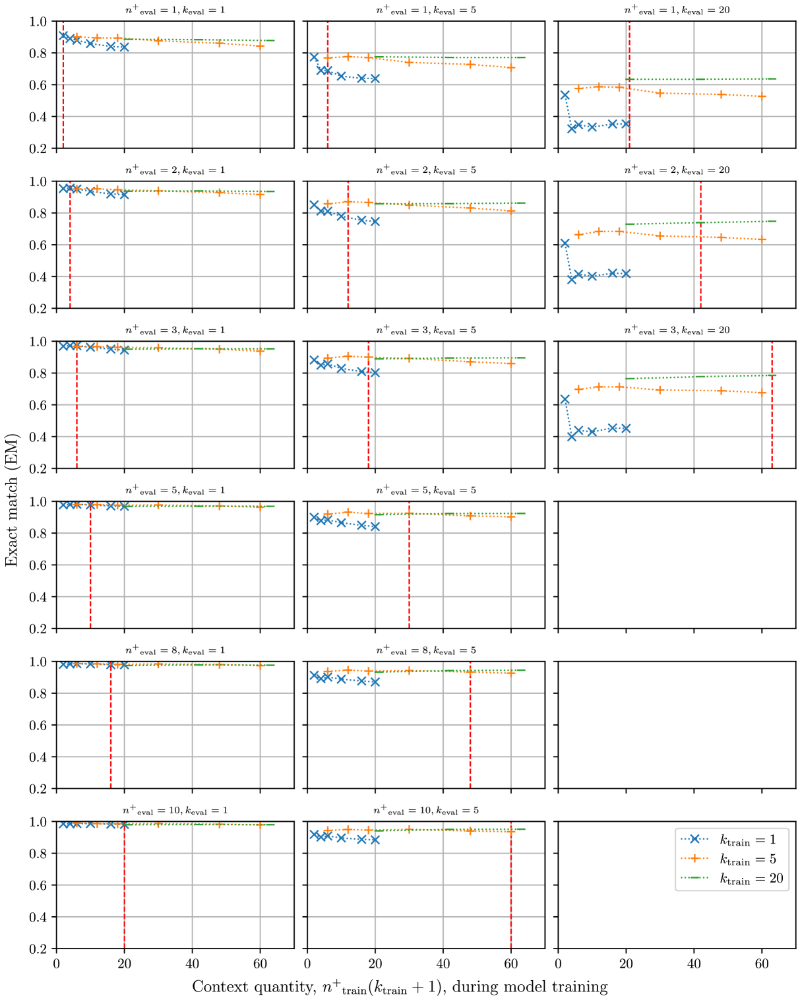
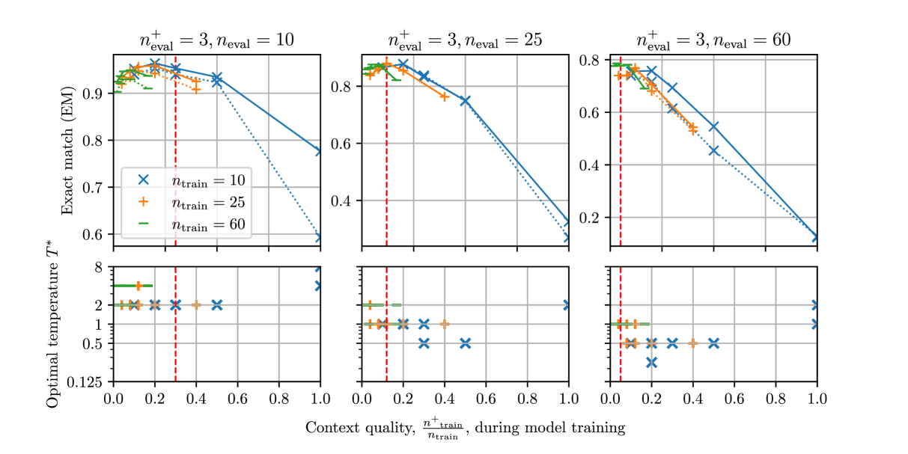

# 对于提取式开放领域问题回答任务中解码器融合技术的训练，上下文质量扮演着举足轻重的角色。

发布时间：2024年03月21日

`RAG` `问答系统`

> Context Quality Matters in Training Fusion-in-Decoder for Extractive Open-Domain Question Answering

> 检索增强生成模型在生成过程中结合外部相关知识，以丰富语言模型的内部信息。虽然已有研究表明，在推理阶段，上下文的数量和质量会影响此类模型的表现，但关于这些因素在训练阶段的影响尚缺乏深入研究。本文聚焦于探究模型训练期间上下文质量和数量如何影响顶尖检索增强生成模型——Fusion-in-Decoder (FiD) 在开放领域抽取式问答任务中的表现。实验揭示，FiD 模型在训练中易对高质量上下文产生过拟合并因此在面对不同质量的上下文时表现出欠佳性能。进一步分析表明，采用不同质量上下文训练的 FiD 模型其跨注意力分布呈现出各异的规律：当训练所用上下文质量越高，模型越趋向于均匀分配注意力至各个相关段落。据此，我们创新性地提出一种方法，通过调整跨注意力分布的偏向，旨在缓解对特定上下文质量的过拟合现象，并成功证实该方法有助于 FiD 模型在多种上下文质量条件下的性能提升。

> Retrieval-augmented generation models augment knowledge encoded in a language model by providing additional relevant external knowledge (context) during generation. Although it has been shown that the quantity and quality of context impact the performance of retrieval-augmented generation models during inference, limited research explores how these characteristics affect model training. This paper explores how context quantity and quality during model training affect the performance of Fusion-in-Decoder (FiD), the state-of-the-art retrieval-augmented generation model, in extractive open-domain question answering tasks. Experimental results suggest that FiD models overfit to context quality during training and show suboptimal performance when evaluated on different context quality. Through the experimental results, we also reveal FiD models trained with different context quality have different cross-attention distribution patterns. Specifically, as context quality during training increases, FiD models tend to attend more uniformly to each passage in context. Finally, based on these observations, we propose a method to mitigate overfitting to specific context quality by introducing bias to the cross-attention distribution, which we demonstrate to be effective in improving the performance of FiD models on different context quality.

[Arxiv](https://arxiv.org/abs/2403.14197)