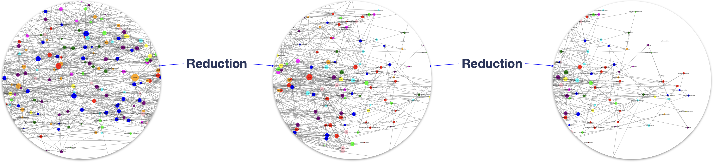
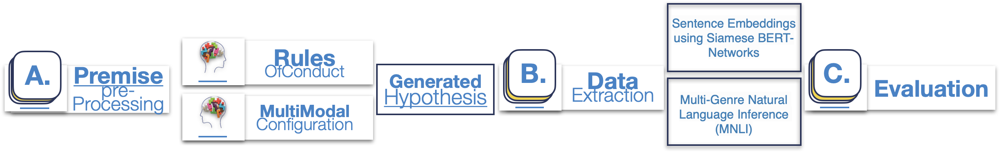
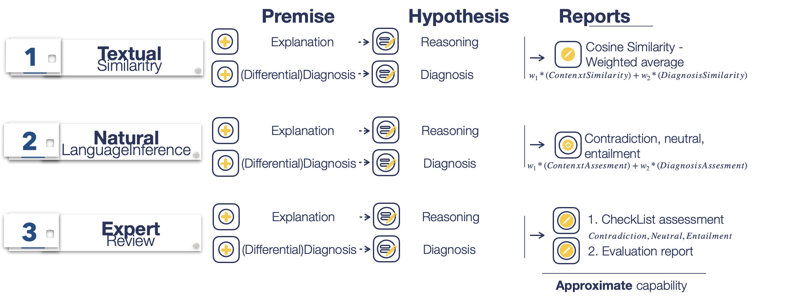
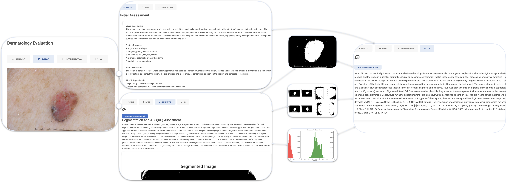
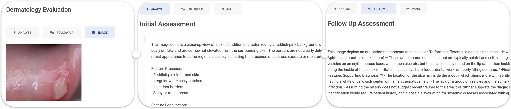
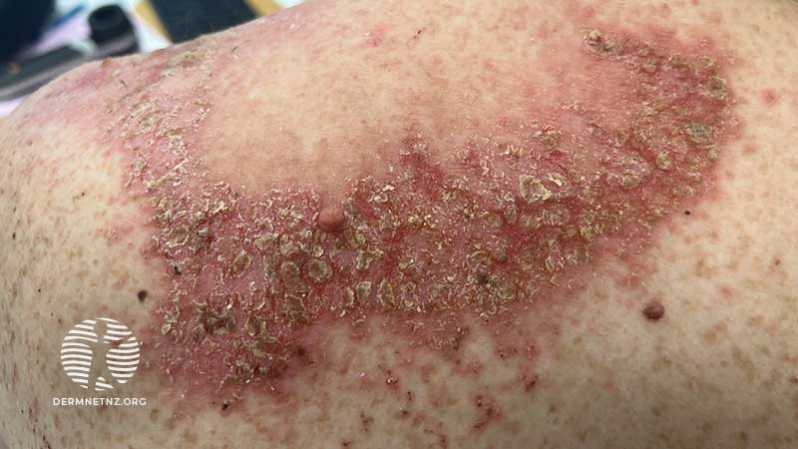
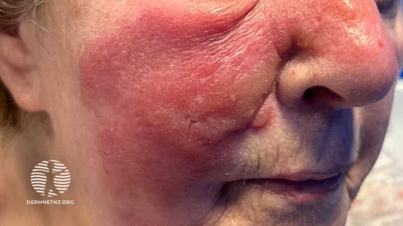
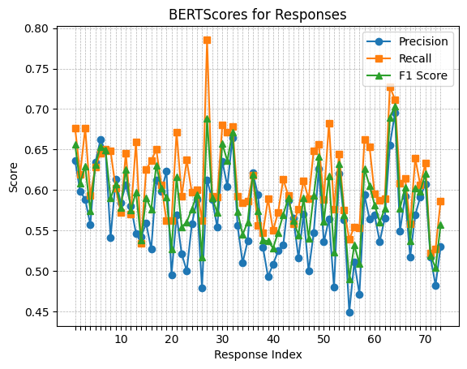
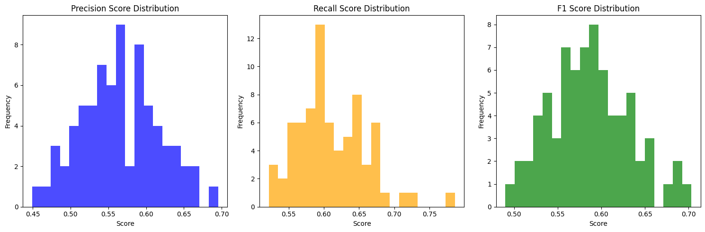

# Dermacen Analytica 是一种创新的方法，它巧妙地融合了多模态大型语言模型和机器学习技术，为远程皮肤病诊疗提供有力支持。

发布时间：2024年03月21日

`LLM应用` `皮肤病学`

> Dermacen Analytica: A Novel Methodology Integrating Multi-Modal Large Language Models with Machine Learning in tele-dermatology

> 人工智能的发展为医疗领域的突破带来了无限可能，尤其是在皮肤病灶及其他皮肤状况的诊断与患者管理上。然而，面对医学各领域的庞杂性，我们需要采取更综合的方法，整合机器学习算法、各类分类器、分割算法，以及最新的大型语言模型。本文介绍并实证了一套采用人工智能技术的系统和方法论，它专注于协助皮肤科领域内的皮肤病变及其他状况诊断全流程，构建了一个融合大规模语言模型、基于变换器的视觉模型以及高级机器学习工具的整体解决方案，力求精准细腻地模拟皮肤科医生的实际工作流程。我们运用严谨的跨模型验证技术和公开的皮肤病症案例研究资料及其相关图片，对这套方案进行全面评估。通过先进的机器学习与自然语言处理技术，侧重于相似度对比和自然语言推理，量化评估系统的性能表现。另外，我们还引入了由专业皮肤科医生根据结构化清单进行的人工评估环节，以深化验证实验结果。最终，我们将这一方法论成功应用于某系统中，其在上下文理解与诊断准确率方面均取得了约0.87的加权评分，有力证明了该方法在强化皮肤科诊疗分析方面的有效性。预期这一创新方法论将助力开发新一代远程皮肤科应用软件，提升远程咨询服务的能力和就医便利性，尤其对于那些亟待改善医疗资源的地区。

> The rise of Artificial Intelligence creates great promise in the field of medical discovery, diagnostics and patient management. However, the vast complexity of all medical domains require a more complex approach that combines machine learning algorithms, classifiers, segmentation algorithms and, lately, large language models. In this paper, we describe, implement and assess an Artificial Intelligence-empowered system and methodology aimed at assisting the diagnosis process of skin lesions and other skin conditions within the field of dermatology that aims to holistically address the diagnostic process in this domain. The workflow integrates large language, transformer-based vision models and sophisticated machine learning tools. This holistic approach achieves a nuanced interpretation of dermatological conditions that simulates and facilitates a dermatologist's workflow. We assess our proposed methodology through a thorough cross-model validation technique embedded in an evaluation pipeline that utilizes publicly available medical case studies of skin conditions and relevant images. To quantitatively score the system performance, advanced machine learning and natural language processing tools are employed which focus on similarity comparison and natural language inference. Additionally, we incorporate a human expert evaluation process based on a structured checklist to further validate our results. We implemented the proposed methodology in a system which achieved approximate (weighted) scores of 0.87 for both contextual understanding and diagnostic accuracy, demonstrating the efficacy of our approach in enhancing dermatological analysis. The proposed methodology is expected to prove useful in the development of next-generation tele-dermatology applications, enhancing remote consultation capabilities and access to care, especially in underserved areas.

[Arxiv](https://arxiv.org/abs/2403.14243)