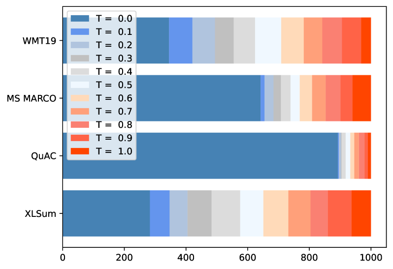
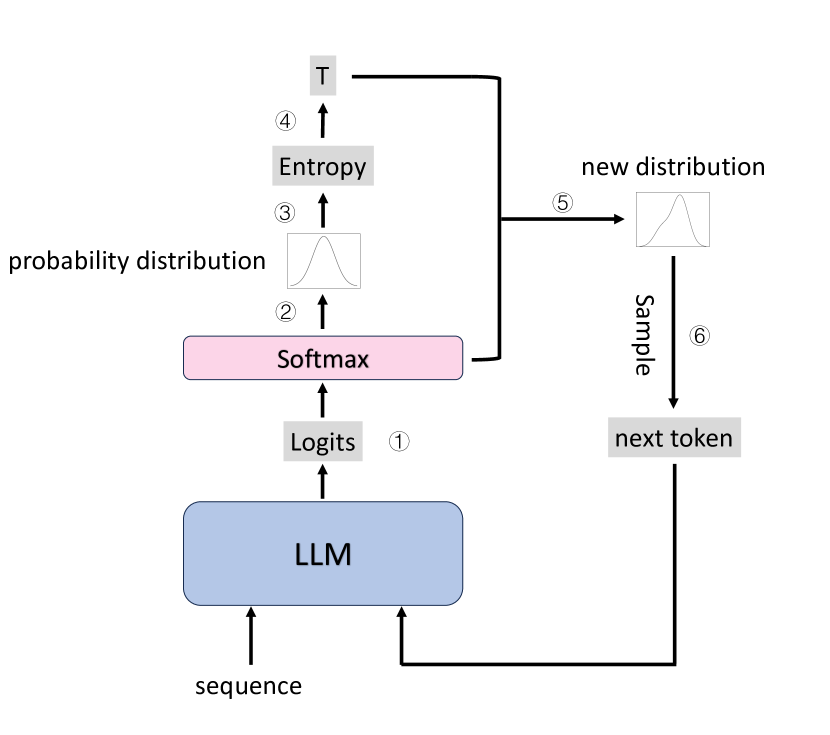
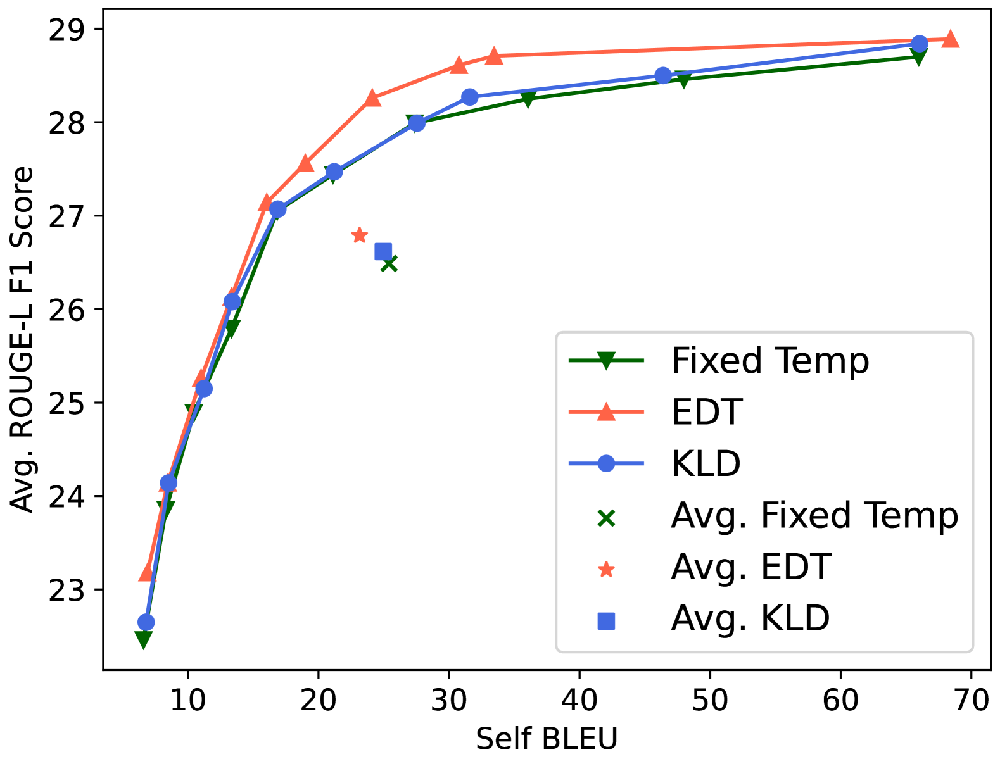
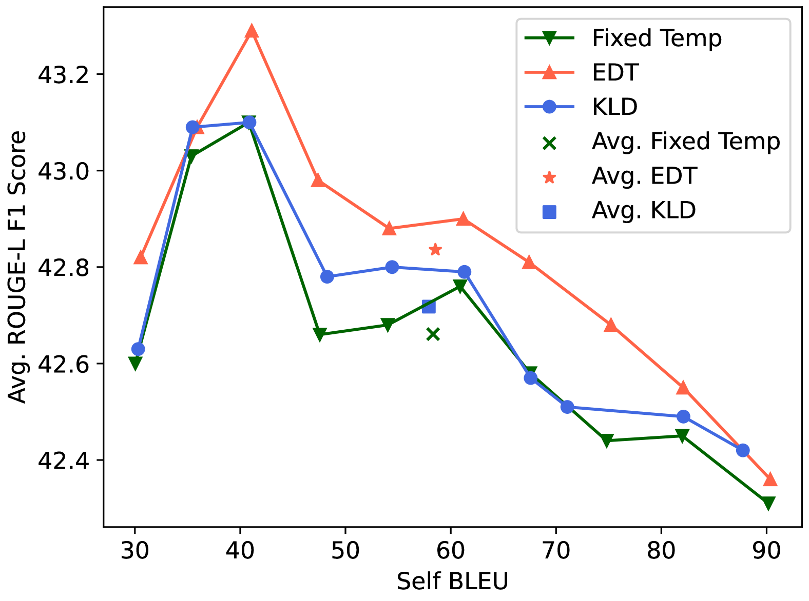
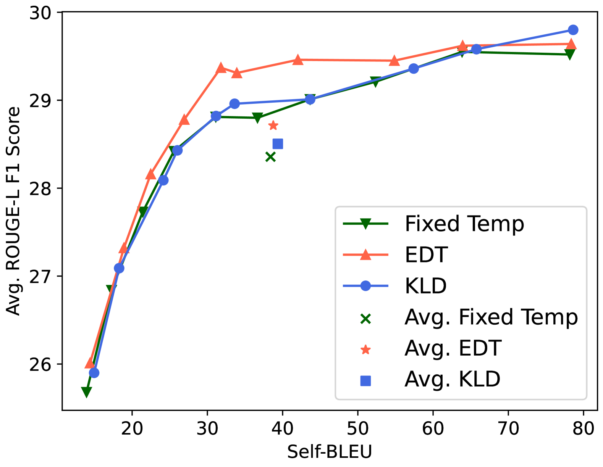
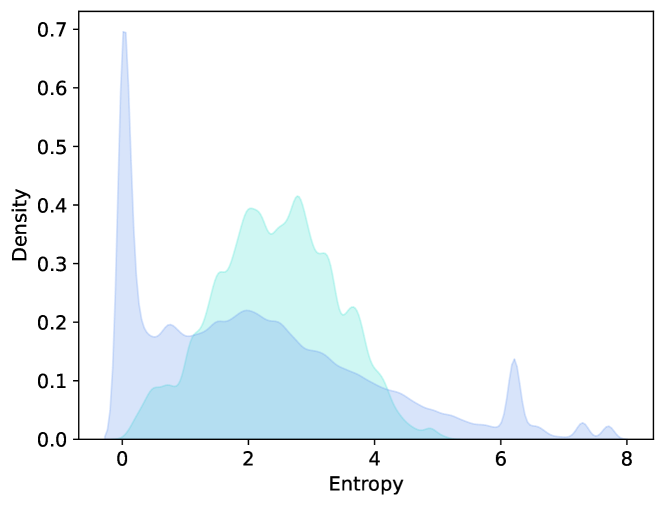

# EDT 方法利用熵为基础的动态温度采样技术，有效优化大型语言模型在文本生成任务上的表现。

发布时间：2024年03月21日

`LLM应用` `生成式模型`

> EDT: Improving Large Language Models' Generation by Entropy-based Dynamic Temperature Sampling

> 近期，LLMs在各类下游语言任务上大放异彩，其中温度采样作为其生成过程中的主流策略被广泛应用。但通常使用的固定温度参数并不总是能在生成质量和多样性间达到最佳平衡点。为此，本研究提出了一项创新的基于熵的有效动态温度（EDT）采样技术，旨在根据实际情况动态调整温度参数，从而实现在生成质量和多样性上的双重优化。同时，我们在四项不同的生成基准测试上展示了该模型的性能，并进行了深入全面的分析。实验结果表明，无论何种任务场景，EDT策略均能明显超越现有的采样策略。

> Recently, Large Language Models (LLMs) have demonstrated outstanding performance across a wide range of downstream language tasks. Temperature sampling is a commonly used decoding strategy for LLMs' generation process. However, a fixed temperature parameter is used in most cases, which may not always be an optimal choice for balancing generation quality and diversity. In this paper, we propose an effective Entropy-based Dynamic Temperature (EDT) Sampling method, to achieve a more balanced performance in terms of both generation quality and diversity by dynamically selecting the temperature parameter. Additionally, we also show model performance and comprehensive analyses for 4 different generation benchmarks. Our experiments show that EDT significantly outperforms the existing strategies across different tasks.

[Arxiv](https://arxiv.org/abs/2403.14541)