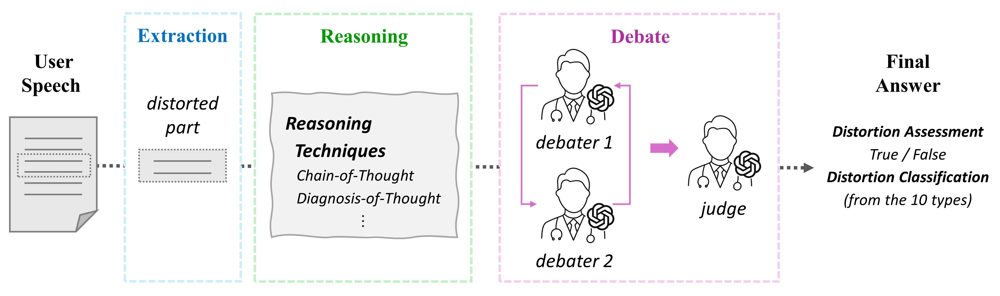
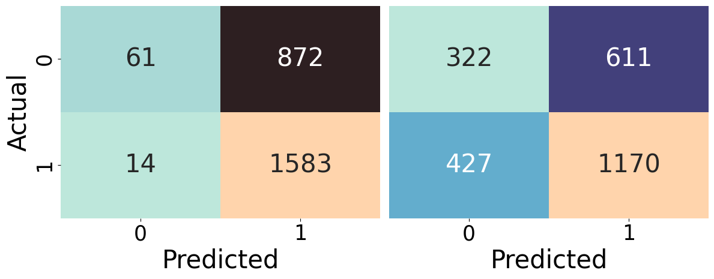

# ERD 框架：旨在提升 LLM 对认知扭曲分类任务推理性能的新方案

发布时间：2024年03月21日

`Agent` `心理健康`

> ERD: A Framework for Improving LLM Reasoning for Cognitive Distortion Classification

# 摘要

> 近年来，利用LLMs改善心理治疗的普及性成为了研究热点。认知行为疗法中，从患者谈话内容中识别认知扭曲至关重要。本研究提出了一项创新方案——ERD，它借助额外的两个模块增强LLMs对认知扭曲的分类效果：一方面抽取出与扭曲相关的内容；另一方面通过多个代理展开推理步骤的辩论。实验证明，在公开数据集上，ERD不仅能提升多类别F1分数，而且显著增强了二元特异性得分，尤其体现在通过提供多代理辩论总结有效地降低了原本高误报率的基线方法。

> Improving the accessibility of psychotherapy with the aid of Large Language Models (LLMs) is garnering a significant attention in recent years. Recognizing cognitive distortions from the interviewee's utterances can be an essential part of psychotherapy, especially for cognitive behavioral therapy. In this paper, we propose ERD, which improves LLM-based cognitive distortion classification performance with the aid of additional modules of (1) extracting the parts related to cognitive distortion, and (2) debating the reasoning steps by multiple agents. Our experimental results on a public dataset show that ERD improves the multi-class F1 score as well as binary specificity score. Regarding the latter score, it turns out that our method is effective in debiasing the baseline method which has high false positive rate, especially when the summary of multi-agent debate is provided to LLMs.

[Arxiv](https://arxiv.org/abs/2403.14255)