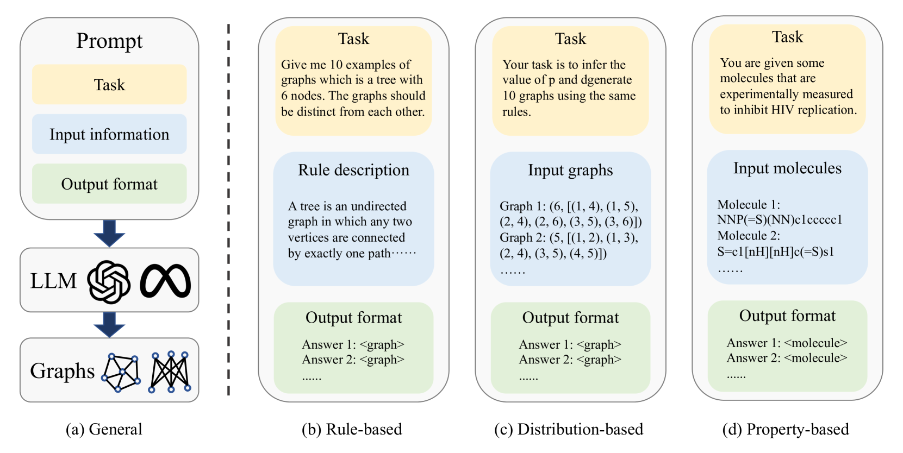
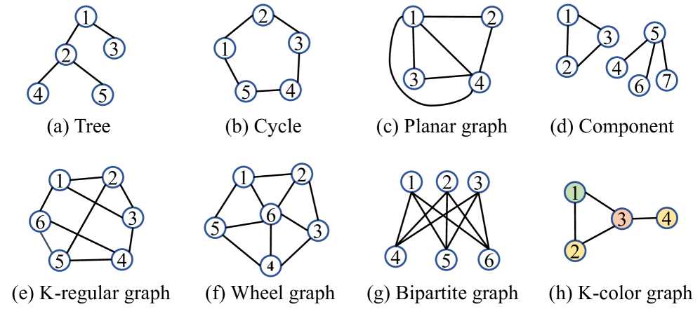
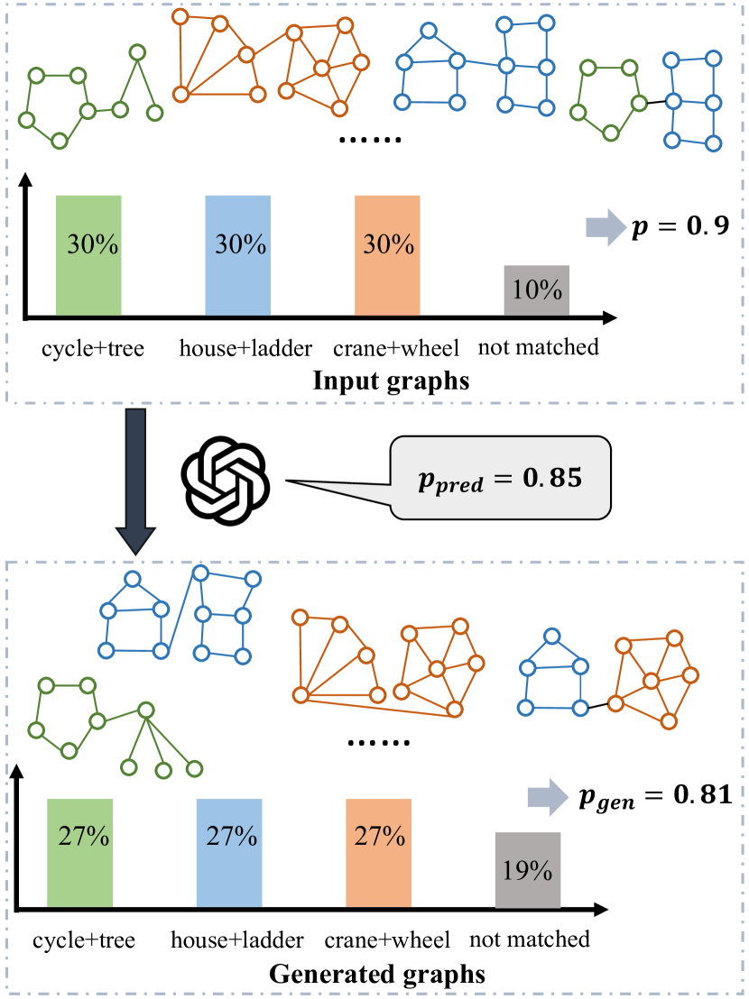
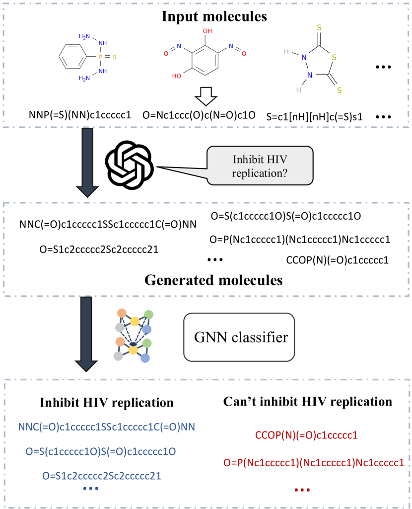
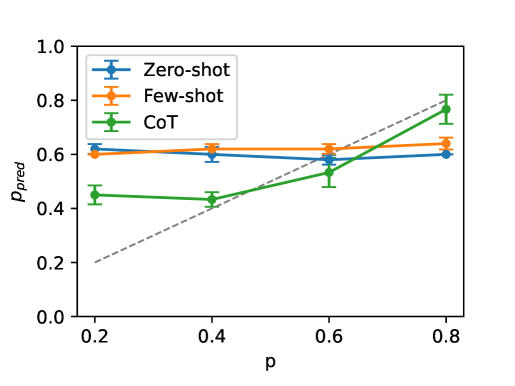
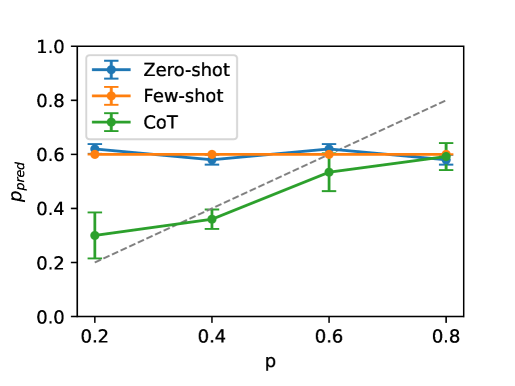
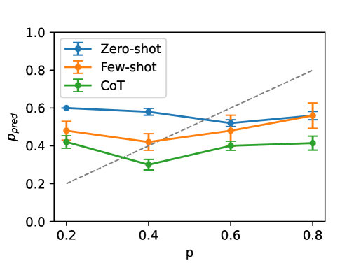
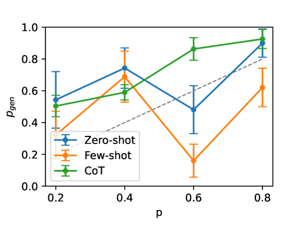
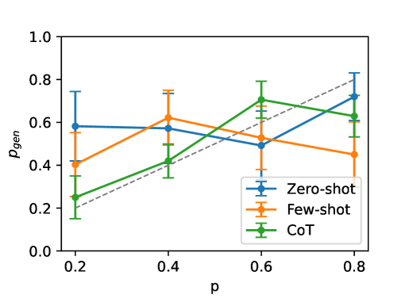
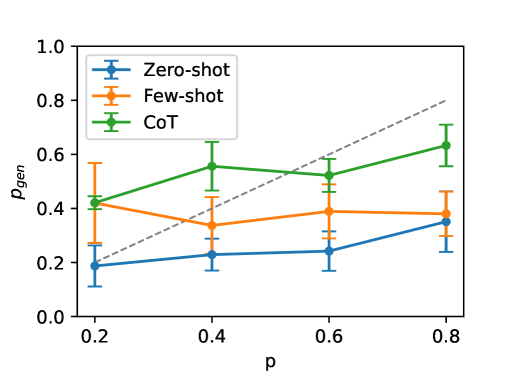

# 本研究致力于揭示大型语言模型在图生成领域的可能性，深入探究其在构建和生成图形结构中的能力。

发布时间：2024年03月21日

`LLM应用` `药物发现` `图生成`

> Exploring the Potential of Large Language Models in Graph Generation

# 摘要

> 近年来，LLMs已在众多领域取得显著成就，其中不乏研究者尝试将其应用于图鉴别任务如节点分类。然而，LLMs在更为复杂且具挑战性的图生成领域的潜能尚待挖掘，这涉及到根据特定属性生成图形，对药物发现等领域极具实用价值。本文提出的LLM4GraphGen项目，通过精心设计的任务体系与广泛实验，深入探寻LLMs在图生成任务上的能力。我们专门设计了一系列任务并进行了详尽实验，旨在揭示LLMs对各类图结构规则的理解深度、捕捉结构类型分布的能力以及如何利用领域知识实现基于属性的图生成。实验证明，尤其是GPT-4这样的LLMs在图生成任务上已初露锋芒，包括基于规则和基于分布的生成方式。然而，常用的少量样本提示和链式思维提示法并未表现出稳定的性能提升效果。此外，LLMs还展现出在生成具有特定属性的分子方面的潜在优势。以上研究成果不仅为构建适用于图生成任务的强大LLMs模型奠定了基础，也为未来的研究提供了宝贵的洞见和方向。

> Large language models (LLMs) have achieved great success in many fields, and recent works have studied exploring LLMs for graph discriminative tasks such as node classification. However, the abilities of LLMs for graph generation remain unexplored in the literature. Graph generation requires the LLM to generate graphs with given properties, which has valuable real-world applications such as drug discovery, while tends to be more challenging. In this paper, we propose LLM4GraphGen to explore the ability of LLMs for graph generation with systematical task designs and extensive experiments. Specifically, we propose several tasks tailored with comprehensive experiments to address key questions regarding LLMs' understanding of different graph structure rules, their ability to capture structural type distributions, and their utilization of domain knowledge for property-based graph generation. Our evaluations demonstrate that LLMs, particularly GPT-4, exhibit preliminary abilities in graph generation tasks, including rule-based and distribution-based generation. We also observe that popular prompting methods, such as few-shot and chain-of-thought prompting, do not consistently enhance performance. Besides, LLMs show potential in generating molecules with specific properties. These findings may serve as foundations for designing good LLMs based models for graph generation and provide valuable insights and further research.

[Arxiv](https://arxiv.org/abs/2403.14358)