# FIT-RAG是一种改进型黑盒RAG模型，它集成了事实信息并减少了令牌数量，以提升性能。

发布时间：2024年03月21日

`RAG` `问答系统`

> FIT-RAG: Black-Box RAG with Factual Information and Token Reduction

> 面对拥有海量参数的大型语言模型（LLMs），在众多应用场景下，对其针对性更新长尾或过时知识进行微调是不切实际的。因此，我们提出采用黑盒策略处理LLMs，即冻结其参数，并结合检索增强生成（RAG）系统，形成“黑盒RAG”。这一方案近期在处理知识密集型任务中表现出色，受到了广泛关注。然而，现有黑盒RAG方法一般会优化检索器以匹配LLMs的喜好，将检索到的所有文档简单拼接作为输入，存在两大痛点：一是忽视了事实信息，LLM可能因偏好不含问题所需事实信息的文档而误导检索器，降低黑盒RAG效果；二是浪费令牌资源，无差别拼接检索结果导致大量无关令牌输入LLMs，影响其运行效率。为此，本研究提出一种创新的黑盒RAG框架——FIT-RAG，该框架巧妙利用检索出的事实信息，并有效减少用于增强输入的令牌数。具体来说，FIT-RAG通过构建双标签文档评分器实现对事实信息的利用，并借助自我知识识别器和子文档层级令牌削减机制减少令牌使用量。经过TriviaQA、NQ及PopQA三大开放域问答数据集的广泛实验验证，FIT-RAG在保持高效的同时显著提升了回答准确率，例如可使Llama2-13B-Chat在TriviaQA上的准确率提升14.3\%，在NQ上提升19.9\%，在PopQA上更是提高了27.5\%。此外，平均来看，FIT-RAG在这些数据集上能够节约大约一半的令牌资源。

> Due to the extraordinarily large number of parameters, fine-tuning Large Language Models (LLMs) to update long-tail or out-of-date knowledge is impractical in lots of applications. To avoid fine-tuning, we can alternatively treat a LLM as a black-box (i.e., freeze the parameters of the LLM) and augment it with a Retrieval-Augmented Generation (RAG) system, namely black-box RAG. Recently, black-box RAG has achieved success in knowledge-intensive tasks and has gained much attention. Existing black-box RAG methods typically fine-tune the retriever to cater to LLMs' preferences and concatenate all the retrieved documents as the input, which suffers from two issues: (1) Ignorance of Factual Information. The LLM preferred documents may not contain the factual information for the given question, which can mislead the retriever and hurt the effectiveness of black-box RAG; (2) Waste of Tokens. Simply concatenating all the retrieved documents brings large amounts of unnecessary tokens for LLMs, which degenerates the efficiency of black-box RAG. To address these issues, this paper proposes a novel black-box RAG framework which utilizes the factual information in the retrieval and reduces the number of tokens for augmentation, dubbed FIT-RAG. FIT-RAG utilizes the factual information by constructing a bi-label document scorer. Besides, it reduces the tokens by introducing a self-knowledge recognizer and a sub-document-level token reducer. FIT-RAG achieves both superior effectiveness and efficiency, which is validated by extensive experiments across three open-domain question-answering datasets: TriviaQA, NQ and PopQA. FIT-RAG can improve the answering accuracy of Llama2-13B-Chat by 14.3\% on TriviaQA, 19.9\% on NQ and 27.5\% on PopQA, respectively. Furthermore, it can save approximately half of the tokens on average across the three datasets.

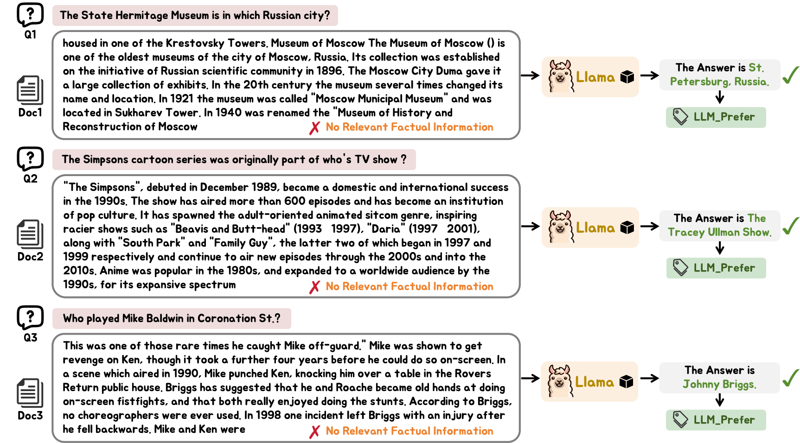

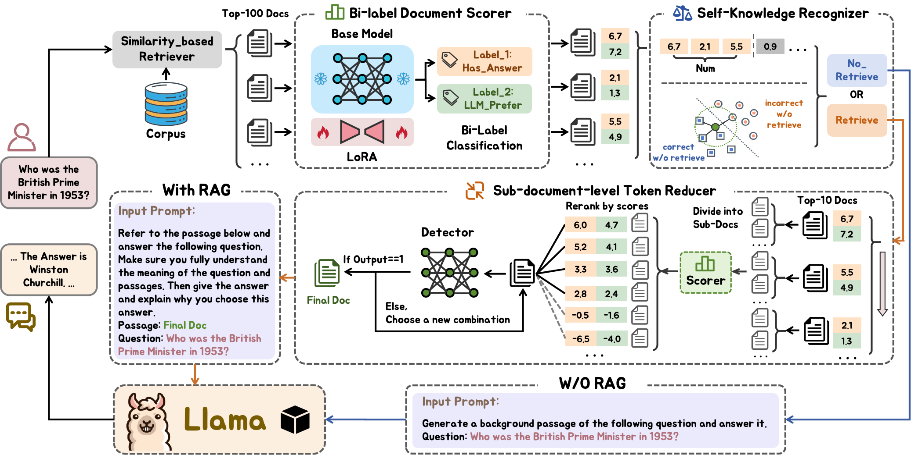

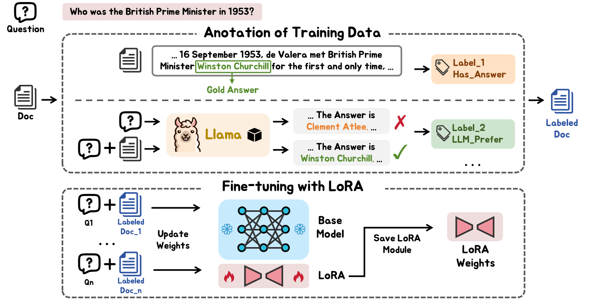

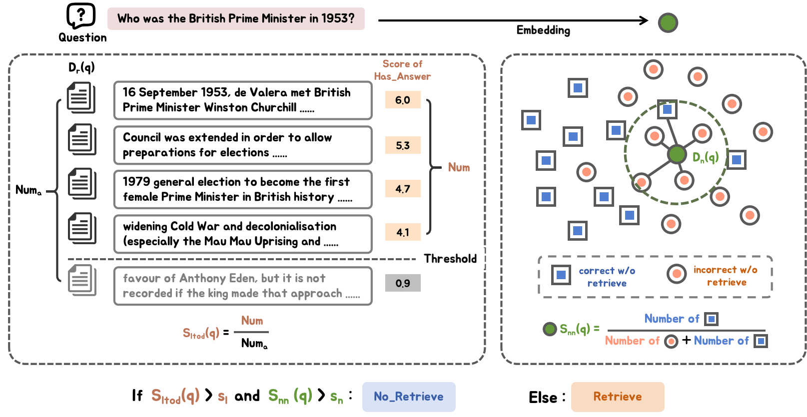

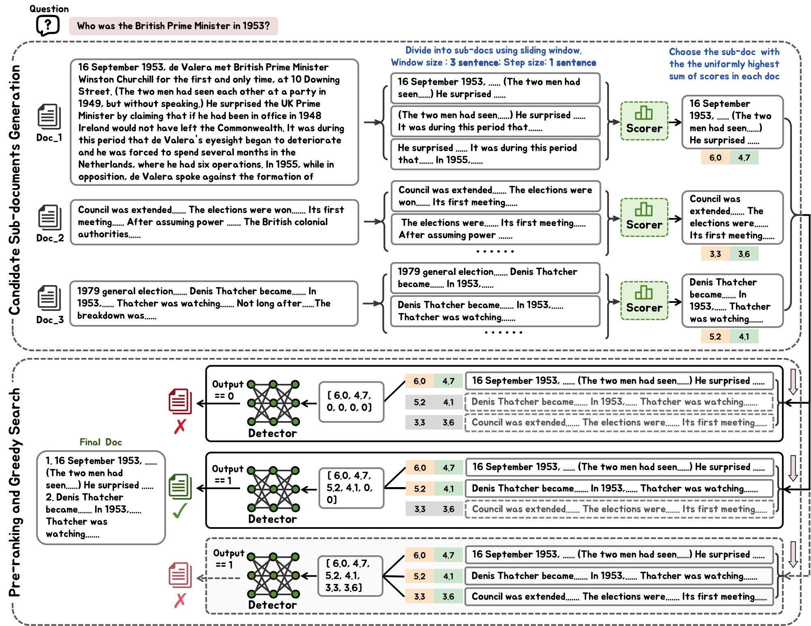

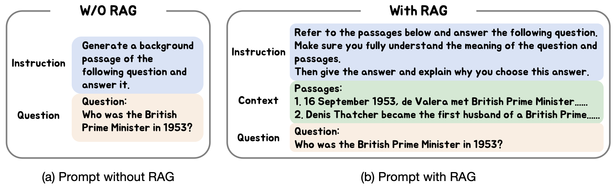

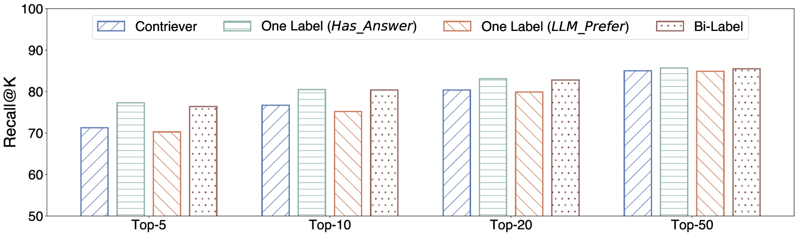

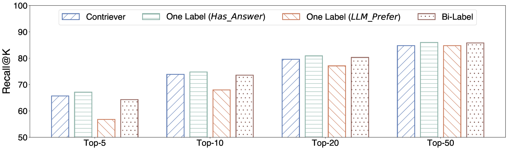

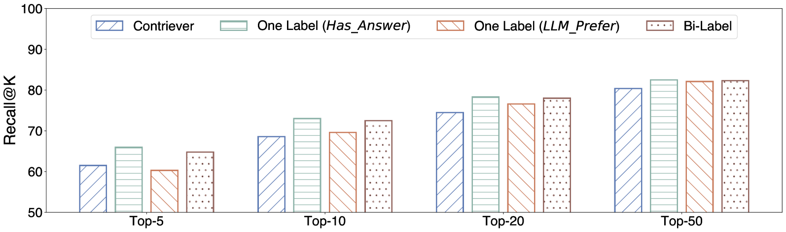

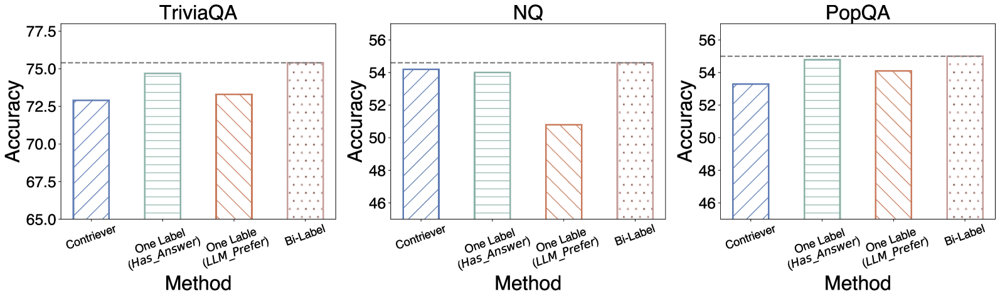

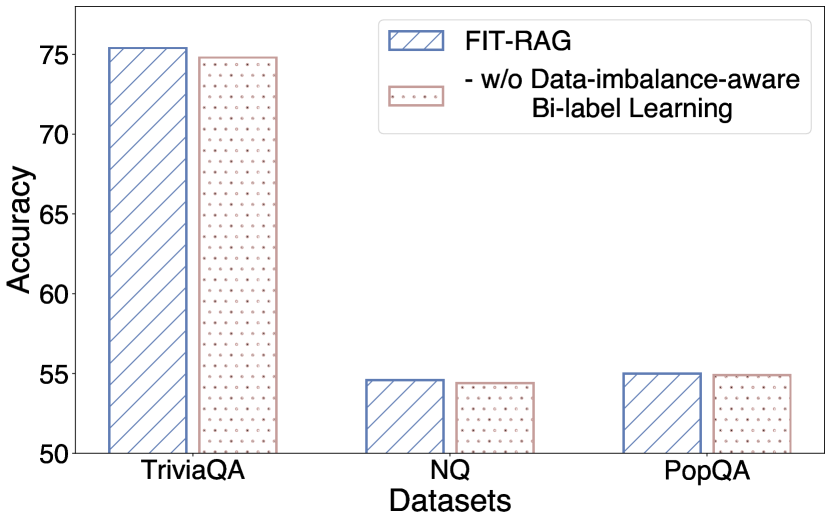

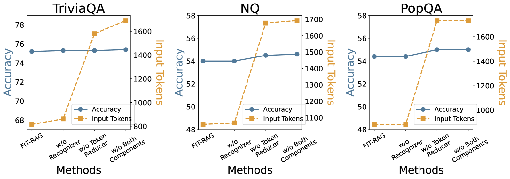

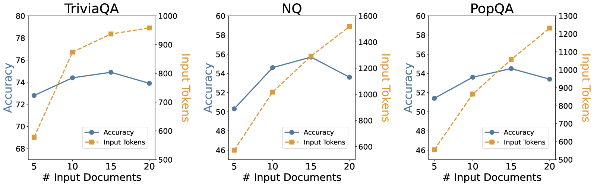

[Arxiv](https://arxiv.org/abs/2403.14374)