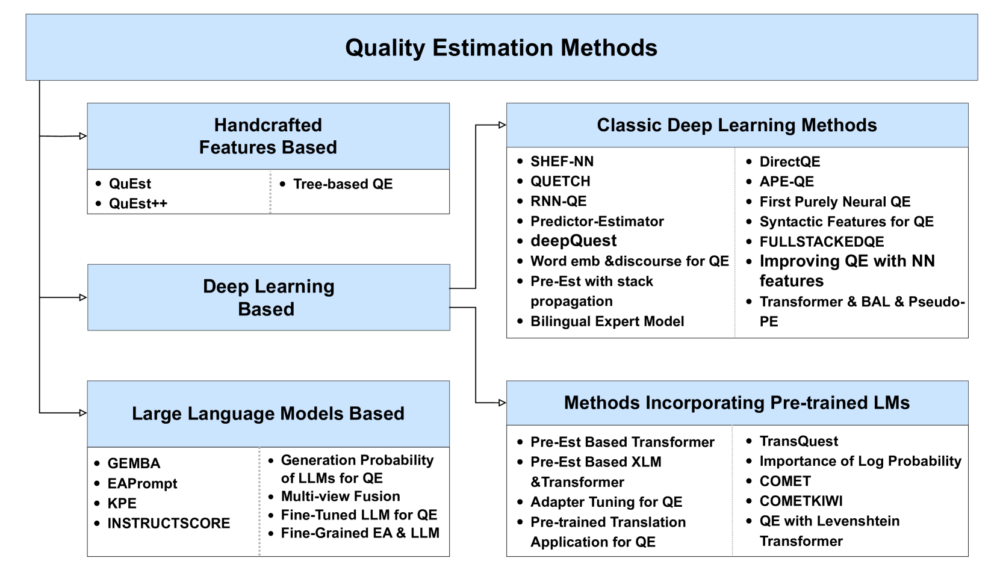

# 从精心设计的特征到大型语言模型（LLMs），本篇论文对机器翻译质量评估进行了一次精炼概述。

发布时间：2024年03月21日

`LLM应用` `机器翻译` `文本质量评估`

> From Handcrafted Features to LLMs: A Brief Survey for Machine Translation Quality Estimation

> MTQE 作为一项无需参照翻译实现实时评估机翻文本品质的任务，在推动 MT 技术进步中扮演关键角色。历经二十年的发展积淀，该领域硕果累累。本文系统梳理了 QE 相关的数据集、标注手段、共享任务竞赛、研究方法、挑战以及未来趋势。开篇即引入 QE 的背景及其重要意义，随后逐一解析词级别、句子级别、文档级别以及可解释性 QE 的核心概念和评价标准。在方法归类上，文章将历年来形成的 QE 方法划分为基于人工特征、深度学习以及大型语言模型（LLMs）三大阵营，并进一步细分出基于深度学习的经典方法与融合预训练语言模型（LMs）的方法分支。同时，详尽分析各类方法的优势与局限，并直观对比各种途径的特点。文末深入剖析当前 QE 研究所面临的问题，并为未来的科研方向勾勒蓝图。

> Machine Translation Quality Estimation (MTQE) is the task of estimating the quality of machine-translated text in real time without the need for reference translations, which is of great importance for the development of MT. After two decades of evolution, QE has yielded a wealth of results. This article provides a comprehensive overview of QE datasets, annotation methods, shared tasks, methodologies, challenges, and future research directions. It begins with an introduction to the background and significance of QE, followed by an explanation of the concepts and evaluation metrics for word-level QE, sentence-level QE, document-level QE, and explainable QE. The paper categorizes the methods developed throughout the history of QE into those based on handcrafted features, deep learning, and Large Language Models (LLMs), with a further division of deep learning-based methods into classic deep learning and those incorporating pre-trained language models (LMs). Additionally, the article details the advantages and limitations of each method and offers a straightforward comparison of different approaches. Finally, the paper discusses the current challenges in QE research and provides an outlook on future research directions.

[Arxiv](https://arxiv.org/abs/2403.14118)