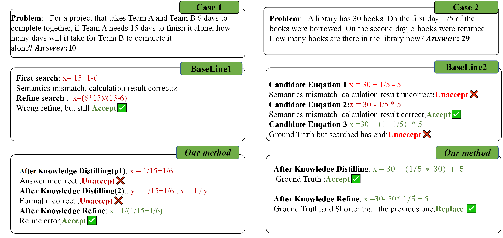
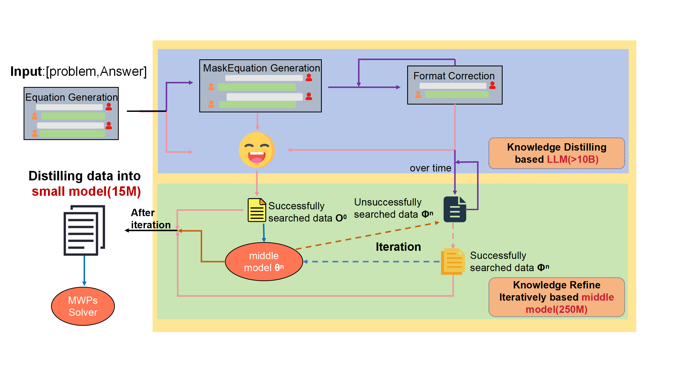

# 在弱监督下，我们将大型模型中蕴含的数学专业知识浓缩并精细化，应用于解决数学问题，实现从小型模型中高效提取数学专长解决数学词题。

发布时间：2024年03月21日

`LLM应用`

> From Large to Tiny: Distilling and Refining Mathematical Expertise for Math Word Problems with Weakly Supervision

> 面对MWPs高标注成本难题，新研究转向依赖于最终答案的弱监督设定。现有顶级方法虽能推导中间方程，却难以确保其与文本描述相符。随着ChatGPT等大型语言模型（LLMs）的崛起，直接解决MWPs展现出新的可能，然而其庞大的计算需求限制了在资源受限环境的应用。为此，我们创新性地提出一个两阶段框架，高效地将大模型中的数学专业知识转移至小型语言模型。在“知识蒸馏阶段”，我们设计一系列针对MWPs特性提取过程，从LLMs提炼出数学知识并构建用于监督训练的问题-方程对；而在“知识精炼阶段”，为克服知识蒸馏未能充分利用所有数据的问题，我们进一步运用知识精炼法有效利用未能成功匹配的数据。最终，我们运用两阶段生成的蒸馏数据训练得到的小型模型，在Math23K和Weak12K数据集上的性能明显优于现有小型模型方法，同时保持远低于ChatGPT的计算开销。

> Addressing the challenge of high annotation costs in solving Math Word Problems (MWPs) through full supervision with intermediate equations, recent works have proposed weakly supervised task settings that rely solely on the final answer as a supervised signal. Existing leading approaches typically employ various search techniques to infer intermediate equations, but cannot ensure their semantic consistency with natural language descriptions. The rise of Large Language Models (LLMs) like ChatGPT has opened up new possibilities for addressing MWPs directly. However, the computational demands of LLMs make them less than ideal for use in settings where resources are tight. In light of these challenges, we introduce an innovative two-stage framework that adeptly transfers mathematical Expertise from large to tiny language models. In \emph{Distillation Stage}, we propose a series of extraction processes that satisfy the properties of MWPs to distill mathematical knowledge from LLMs to construct problem-equation pairs required for supervised training. In \emph{Refinement Stage}, Due to Knowledge distilling method cannot guarantee the full utilization of all data, we further utilize the unsuccessfully searched data effectively by Knowledge Refine method. Finally, We train a small model using distilled data generated through two-stage methods. As our method fully leverages the semantic understanding capabilities during the searching 'problem-equation' pair, it demonstrates significantly improved performance on the Math23K and Weak12K datasets compared to existing small model methods, while maintaining a much lower computational cost than ChatGPT.

[Arxiv](https://arxiv.org/abs/2403.14390)