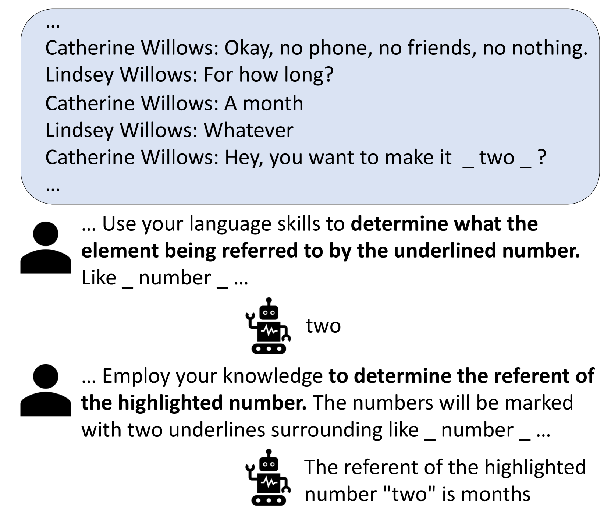
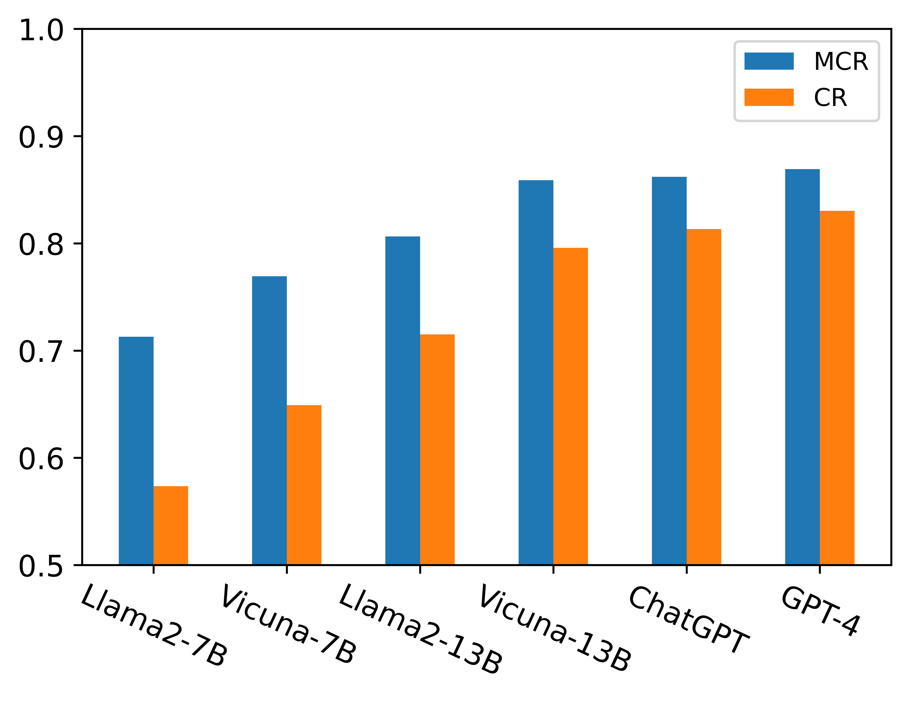
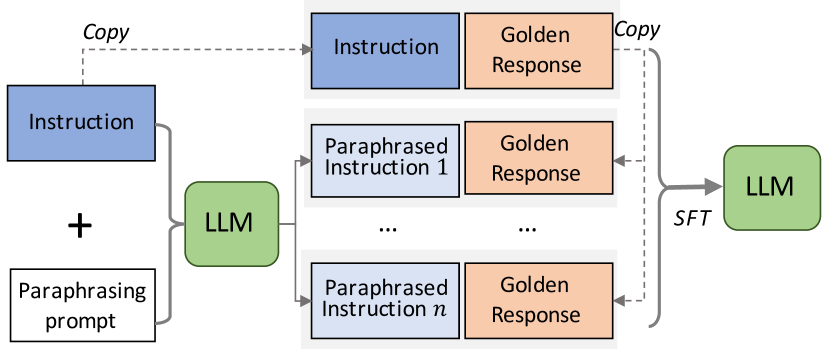
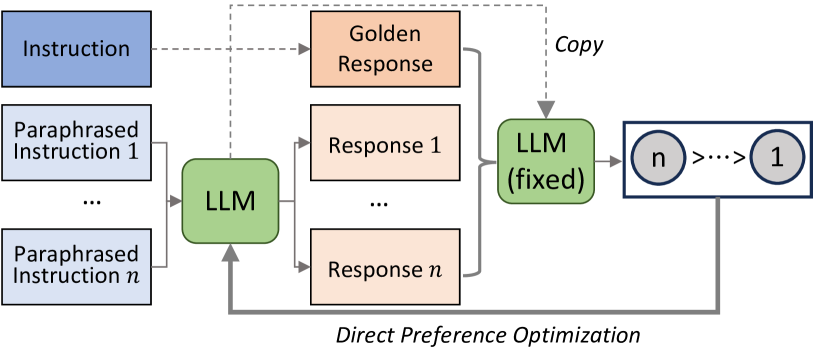
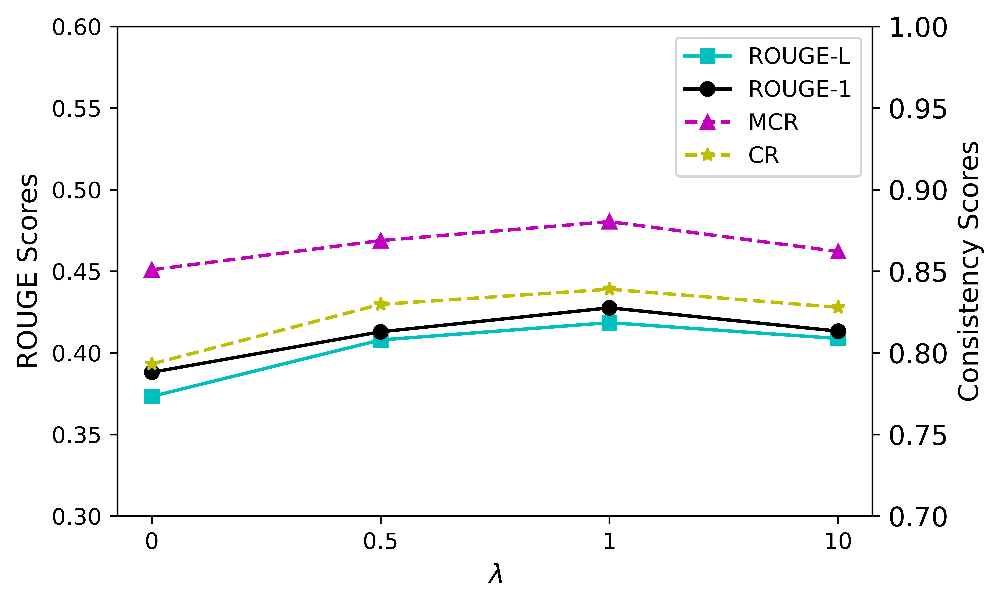
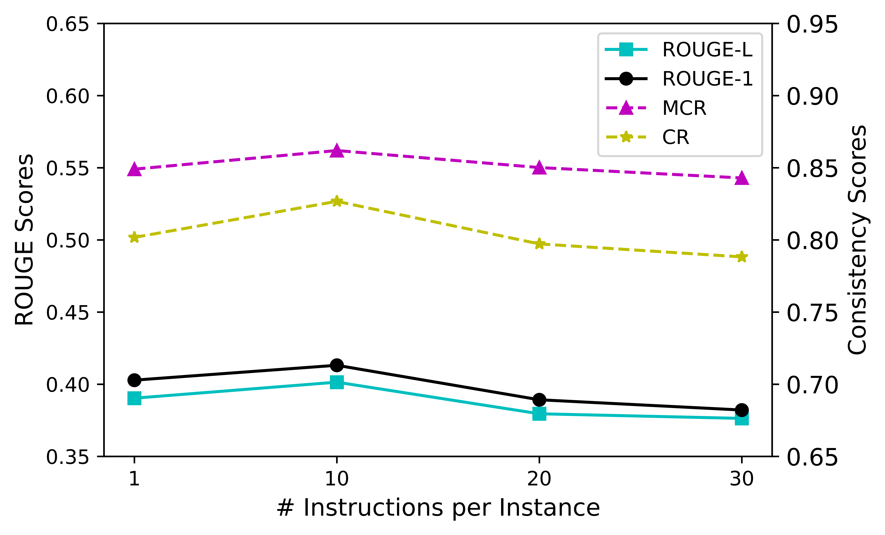

# 为提升大型语言模型（LLM）的鲁棒性，本研究提出了一种基于一致性对齐的方法。这种方法致力于调整LLM，使其在面临各种输入和情境时表现更为稳定和一致，从而增强模型对于复杂多变场景的适应能力和抗干扰性能。

发布时间：2024年03月21日

`LLM应用` `对话系统`

> Improving the Robustness of Large Language Models via Consistency Alignment

> 尽管LLMs在执行用户指令和生成高质量回复上表现出色，但面对指令细微改动时易产生显著不一致的回应，揭示其稳健性仍有较大提升空间。现有研究已关注到这一问题，并强调了强化响应生成鲁棒性的紧迫性，然而对此尚欠缺深入系统的剖析与解决策略。本文首先明确量化了这一不一致现象，并创新性地提出了一个双阶段训练方案，包括增强指令监督下的微调及一致性对齐训练。首阶段借助类似指令增强手段，助力模型更好地学习遵循指令的一般规律；而在第二阶段，则通过对相似回应间的细微差别进行甄别，提升模型输出多样性和准确把握何种回应更贴合人类期望的能力。值得注意的是，整个训练过程中所采用的自我奖励机制，是基于首阶段训练后模型自身的推断而生成，无需依赖额外的人类偏好数据集。最后，我们在一系列公开的最新LLMs上，针对指令跟随任务展开了广泛的实验验证，有力证明了我们提出的训练框架的确能有效改善模型的稳健性和一致性表现。

> Large language models (LLMs) have shown tremendous success in following user instructions and generating helpful responses. Nevertheless, their robustness is still far from optimal, as they may generate significantly inconsistent responses due to minor changes in the verbalized instructions. Recent literature has explored this inconsistency issue, highlighting the importance of continued improvement in the robustness of response generation. However, systematic analysis and solutions are still lacking. In this paper, we quantitatively define the inconsistency problem and propose a two-stage training framework consisting of instruction-augmented supervised fine-tuning and consistency alignment training. The first stage helps a model generalize on following instructions via similar instruction augmentations. In the second stage, we improve the diversity and help the model understand which responses are more aligned with human expectations by differentiating subtle differences in similar responses. The training process is accomplished by self-rewards inferred from the trained model at the first stage without referring to external human preference resources. We conduct extensive experiments on recent publicly available LLMs on instruction-following tasks and demonstrate the effectiveness of our training framework.

[Arxiv](https://arxiv.org/abs/2403.14221)