# 探究LLM在偏见检测中的潜在偏差问题，对比分析LLM与人类感知之间的显著差异。（注：此处根据上下文及语境，将“Disparities”翻译为“差异”，而非严格意义上的“不平等”。若需强调两者间的不平等性，可将“差异”改为“不平等现象”。）

发布时间：2024年03月21日

`LLM应用` `社交媒体` `偏见检测`

> Investigating Bias in LLM-Based Bias Detection: Disparities between LLMs and Human Perception

# 摘要

> 社交媒体中的误导与不实信息泛滥，凸显出识别媒体偏见的紧迫性。尽管强大的大型语言模型（LLMs）已在偏见预测领域崭露头角，但对其内部固有偏见的疑虑仍未消除。本研究不仅聚焦于传统的内容偏见检测，更深入挖掘LLMs自身存在的偏见问题，以及这种偏见如何实质性地影响到媒体偏见检测工作。我们精细探究LLMs在政治偏见预测及文本续写等任务中是否存在偏见现象，并进一步跨多个话题探索其潜在的偏见表达变化。在此基础上，我们提出采用提示工程和模型微调等去偏策略。通过对各类LLMs偏见趋势的广泛分析，我们得以洞悉语言模型中偏见传播的整体风貌。这项研究拓展了我们对LLM偏见的认知边界，为偏见检测任务提供深刻见解，助力构建更为稳健且公正的人工智能体系。

> The pervasive spread of misinformation and disinformation in social media underscores the critical importance of detecting media bias. While robust Large Language Models (LLMs) have emerged as foundational tools for bias prediction, concerns about inherent biases within these models persist. In this work, we investigate the presence and nature of bias within LLMs and its consequential impact on media bias detection. Departing from conventional approaches that focus solely on bias detection in media content, we delve into biases within the LLM systems themselves. Through meticulous examination, we probe whether LLMs exhibit biases, particularly in political bias prediction and text continuation tasks. Additionally, we explore bias across diverse topics, aiming to uncover nuanced variations in bias expression within the LLM framework. Importantly, we propose debiasing strategies, including prompt engineering and model fine-tuning. Extensive analysis of bias tendencies across different LLMs sheds light on the broader landscape of bias propagation in language models. This study advances our understanding of LLM bias, offering critical insights into its implications for bias detection tasks and paving the way for more robust and equitable AI systems

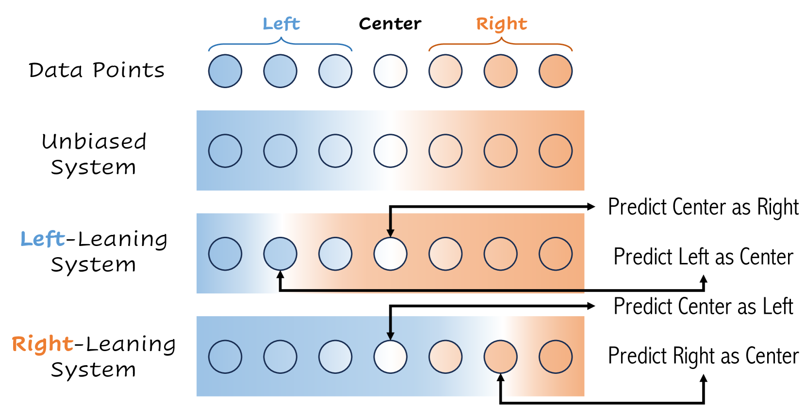

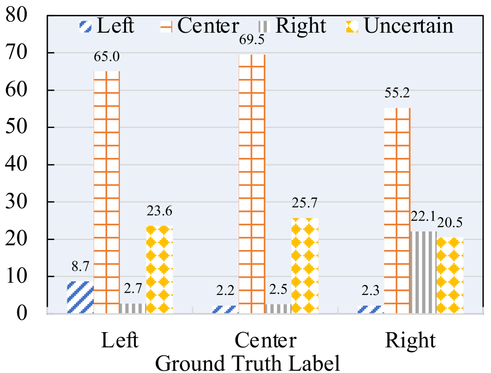

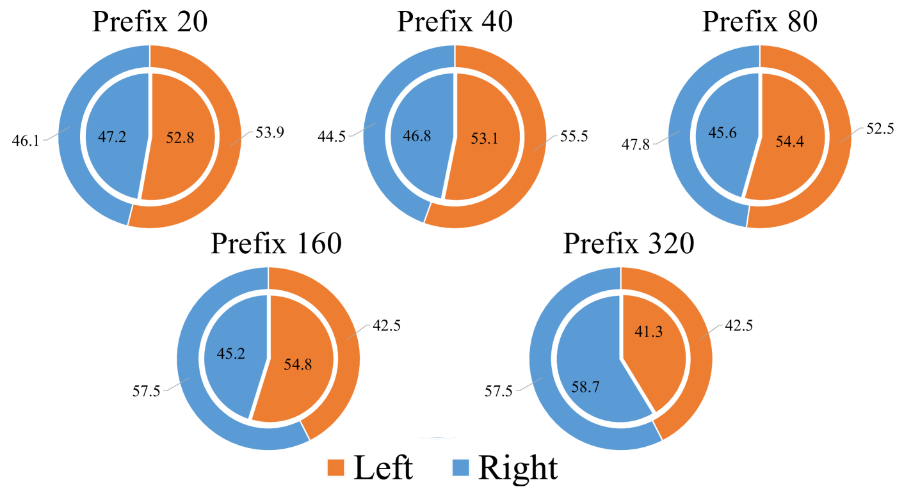

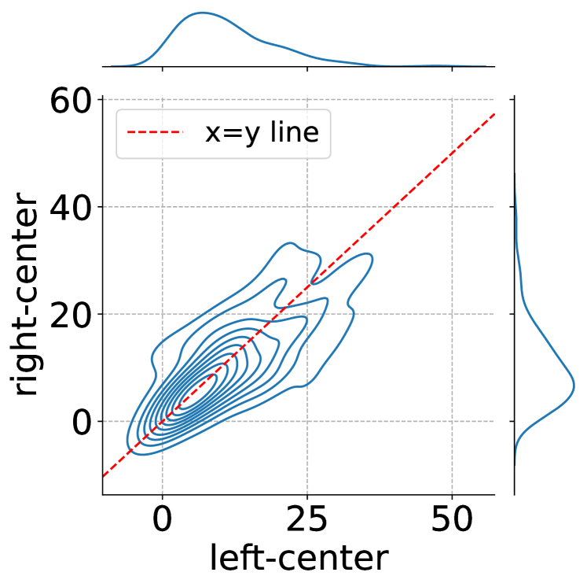

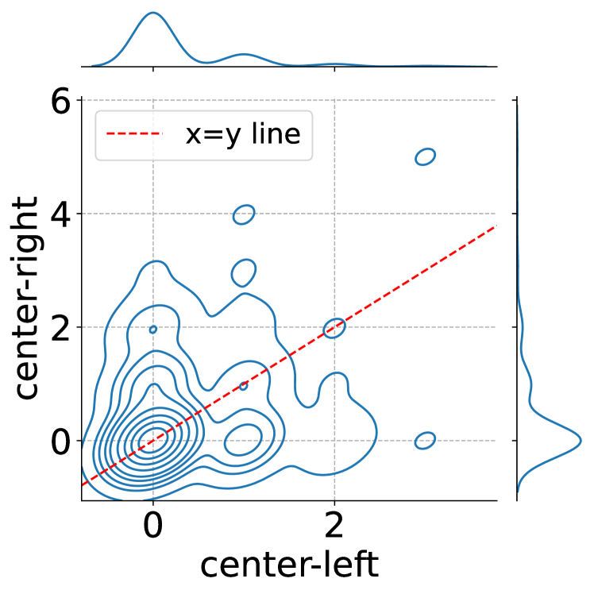

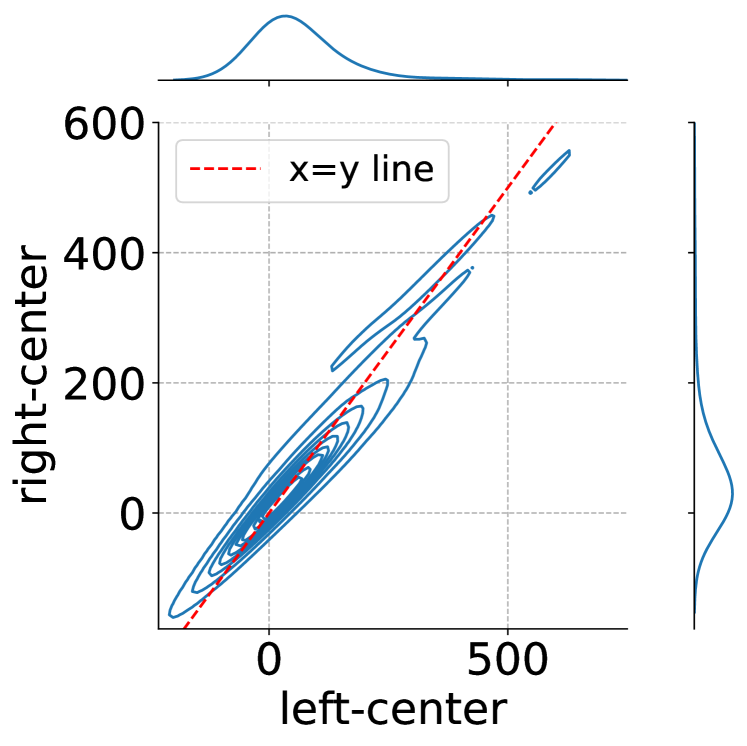

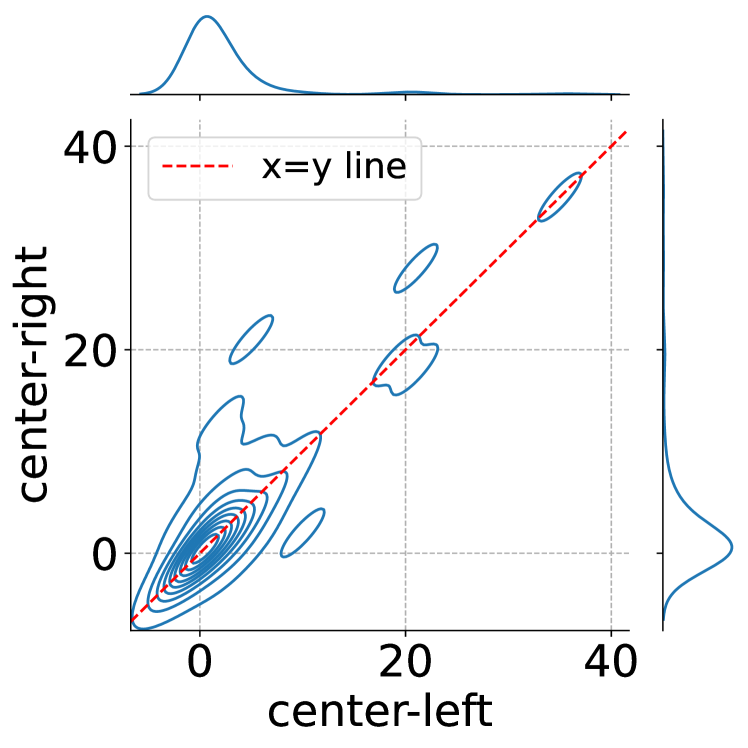

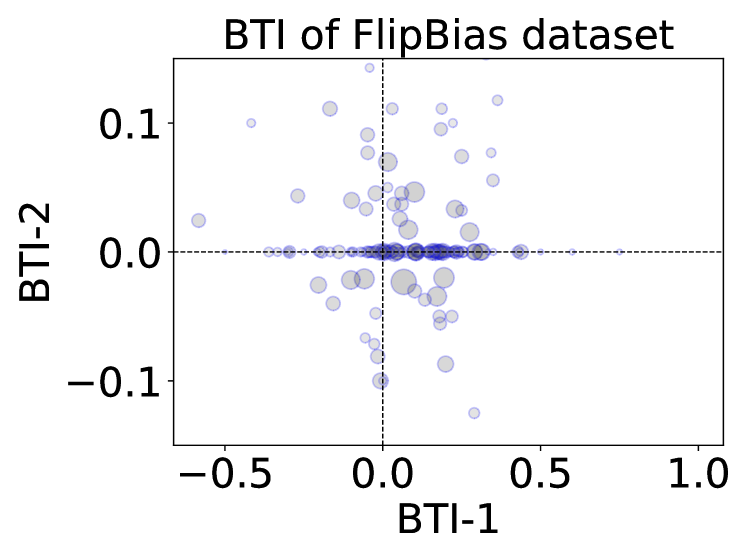

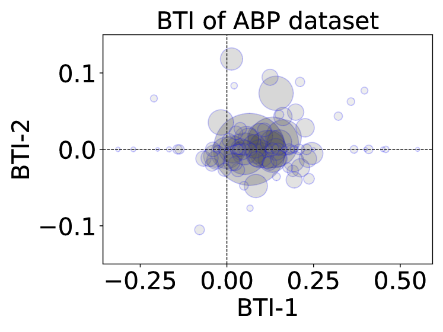

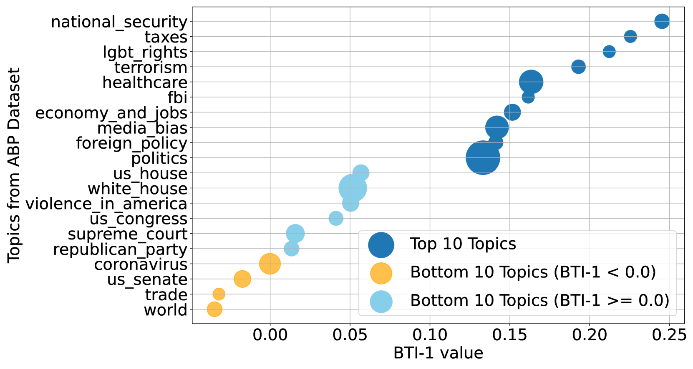

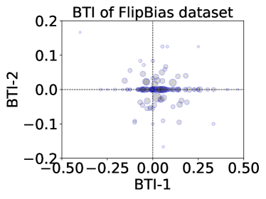

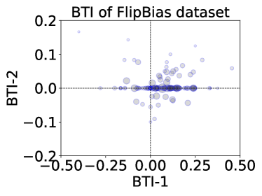

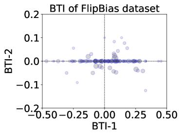

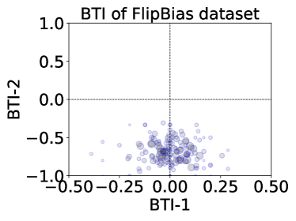

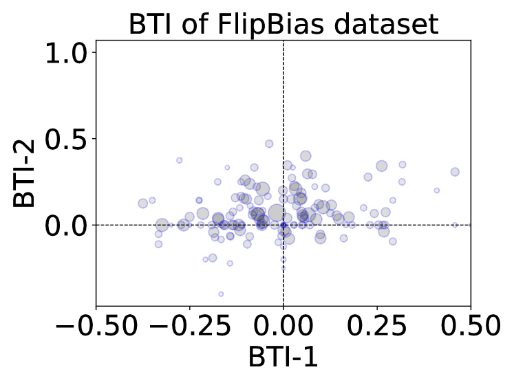

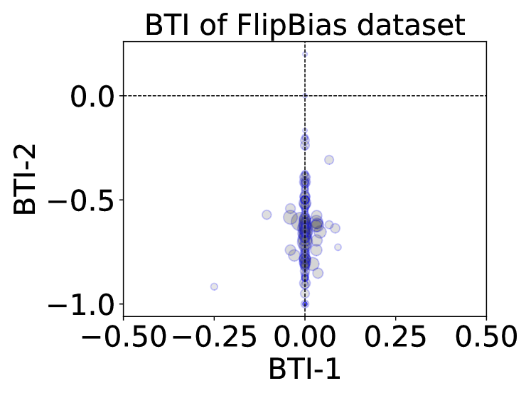

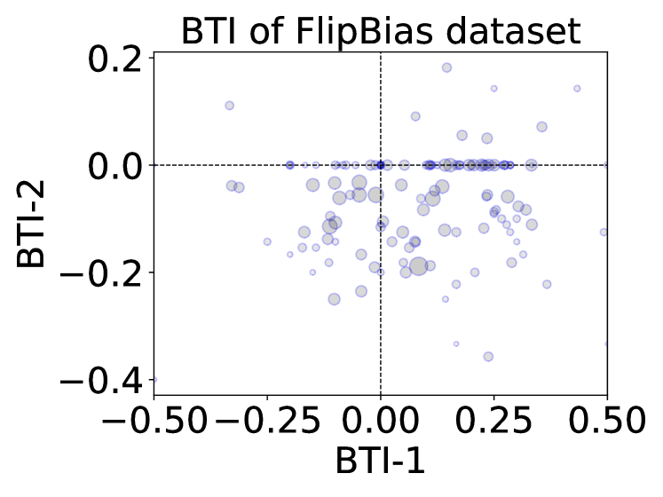

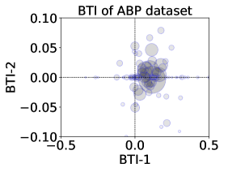

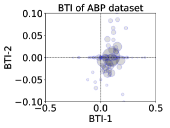

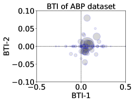

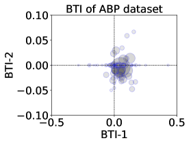

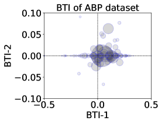

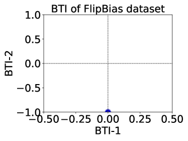

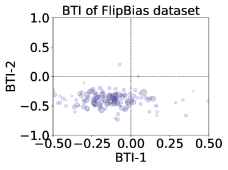

[Arxiv](https://arxiv.org/abs/2403.14896)