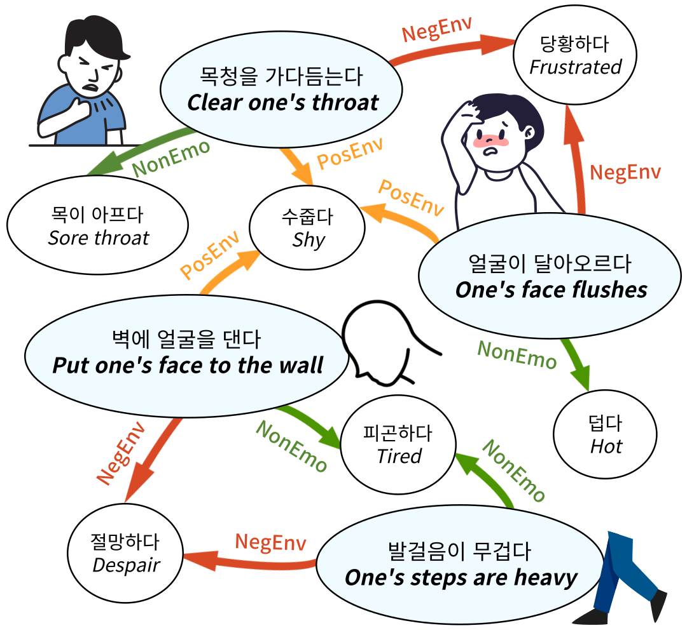
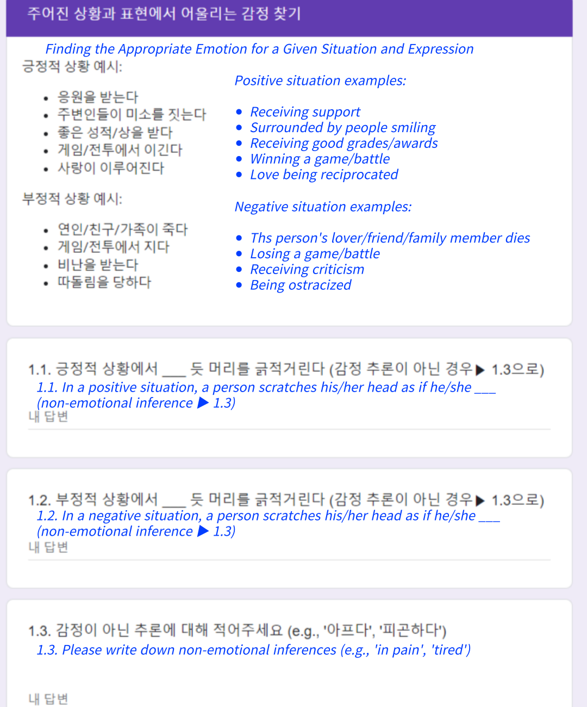

# K-Act2Emo 是一款专为解析间接情绪表达而构建的韩语文档常识知识图谱。它通过整合与情绪表达相关的各类情境行为，为理解和推断复杂情感线索提供了有力支持。

发布时间：2024年03月21日

`LLM应用` `情感分析`

> K-Act2Emo: Korean Commonsense Knowledge Graph for Indirect Emotional Expression

# 摘要

> 为深入理解文学叙事，我们引入了一款专攻情感领域的韩语常识知识图谱 K-Act2Emo，它收录了1900条蕴含间接情感表达的内容及其对应可推断出的情绪。我们创新性地将推理类型划分为积极情境推理、消极情境推理及非情绪线索表达的推理三类。不同于其他 CSKG，K-Act2Emo 针对情感上下文进行了优化，并经实验证明在训练情感推理模型上成效显著。尤为重要的是，经过 K-Act2Emo 微调后的 BART 知识模型在性能上超越了多个现存的大型韩语文本生成模型，展现出堪比 GPT-4 Turbo 的出色表现。

> In many literary texts, emotions are indirectly conveyed through descriptions of actions, facial expressions, and appearances, necessitating emotion inference for narrative understanding. In this paper, we introduce K-Act2Emo, a Korean commonsense knowledge graph (CSKG) comprising 1,900 indirect emotional expressions and the emotions inferable from them. We categorize reasoning types into inferences in positive situations, inferences in negative situations, and inferences when expressions do not serve as emotional cues. Unlike existing CSKGs, K-Act2Emo specializes in emotional contexts, and experimental results validate its effectiveness for training emotion inference models. Significantly, the BART-based knowledge model fine-tuned with K-Act2Emo outperforms various existing Korean large language models, achieving performance levels comparable to GPT-4 Turbo.

[Arxiv](https://arxiv.org/abs/2403.14253)