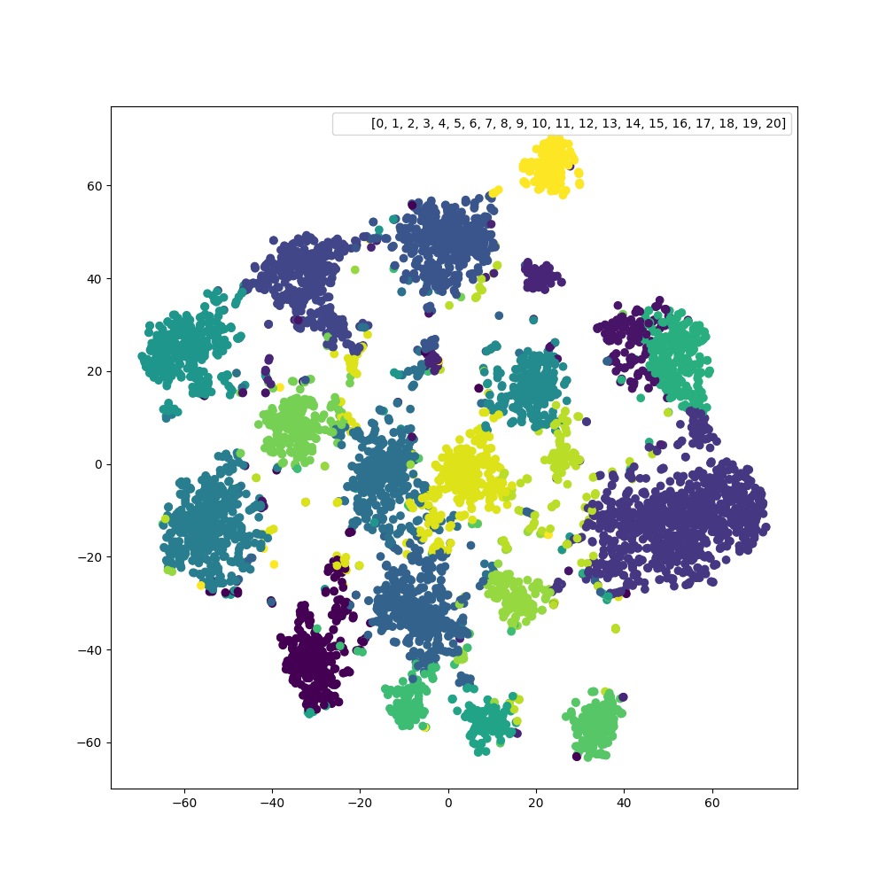

# 针对医学主题的多选题分类问题，本研究探讨了大型语言模型的有效应用。

发布时间：2024年03月21日

`LLM应用` `自动问答系统`

> Large Language Models for Multi-Choice Question Classification of Medical Subjects

> 本研究致力于探索在多选题数据集上训练的大型语言模型能否有效区分医学主题，这对于自动问答系统来说意义重大且颇具难度。为此，我们运用深度学习技术构建了一个针对医疗问题的多类别分类器。借助创新的MQ序列-BERT方法，我们在MedMCQA数据集上取得了显著成果，分别在开发集和测试集上获得了0.68和0.60的高精度成绩，成功超越了现有最优水平。这一突破性成果有力证明了AI及LLMs在医疗健康领域的多类别问题分类任务中的强大实力。

> The aim of this paper is to evaluate whether large language models trained on multi-choice question data can be used to discriminate between medical subjects. This is an important and challenging task for automatic question answering. To achieve this goal, we train deep neural networks for multi-class classification of questions into the inferred medical subjects. Using our Multi-Question (MQ) Sequence-BERT method, we outperform the state-of-the-art results on the MedMCQA dataset with an accuracy of 0.68 and 0.60 on their development and test sets, respectively. In this sense, we show the capability of AI and LLMs in particular for multi-classification tasks in the Healthcare domain.

[Arxiv](https://arxiv.org/abs/2403.14582)