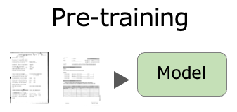
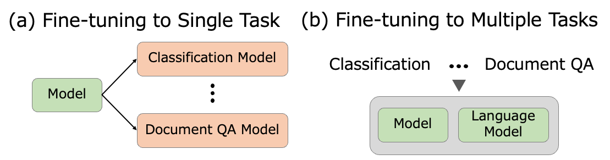
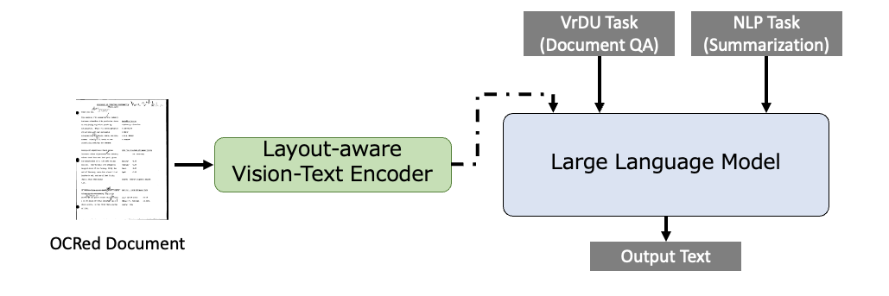

# LayoutLLM 是一种为提升对富含视觉元素文档理解能力而设计的大型语言模型指令调优方案。

发布时间：2024年03月21日

`LLM应用` `文档分析` `图像识别`

> LayoutLLM: Large Language Model Instruction Tuning for Visually Rich Document Understanding

> 本文介绍了一种创新文档分析法——LayoutLLM，旨在深入理解图像化文档，尤其关注如文档图像分类和信息提取这类具有重要意义的视觉丰富的文档理解任务。当前方法虽然结合了图像、文本及布局结构的预训练感知以提升理解效果，但它们在每项任务和数据集上都需要微调，而且训练和操作成本较高。为此，我们提出的新方案LayoutLLM巧妙地融合了现有文档图像理解研究成果与大型语言模型（LLMs）的强大语言理解力，并采用多模态指令数据集对模型进行优化，使得单一模型就能高效解析文档图像。实验结果显示，在各类文档分析任务中，LayoutLLM相较于基准模型展现出了显著的性能提升。

> This paper proposes LayoutLLM, a more flexible document analysis method for understanding imaged documents. Visually Rich Document Understanding tasks, such as document image classification and information extraction, have gained significant attention due to their importance. Existing methods have been developed to enhance document comprehension by incorporating pre-training awareness of images, text, and layout structure. However, these methods require fine-tuning for each task and dataset, and the models are expensive to train and operate. To overcome this limitation, we propose a new LayoutLLM that integrates these with large-scale language models (LLMs). By leveraging the strengths of existing research in document image understanding and LLMs' superior language understanding capabilities, the proposed model, fine-tuned with multimodal instruction datasets, performs an understanding of document images in a single model. Our experiments demonstrate improvement over the baseline model in various document analysis tasks.

[Arxiv](https://arxiv.org/abs/2403.14252)