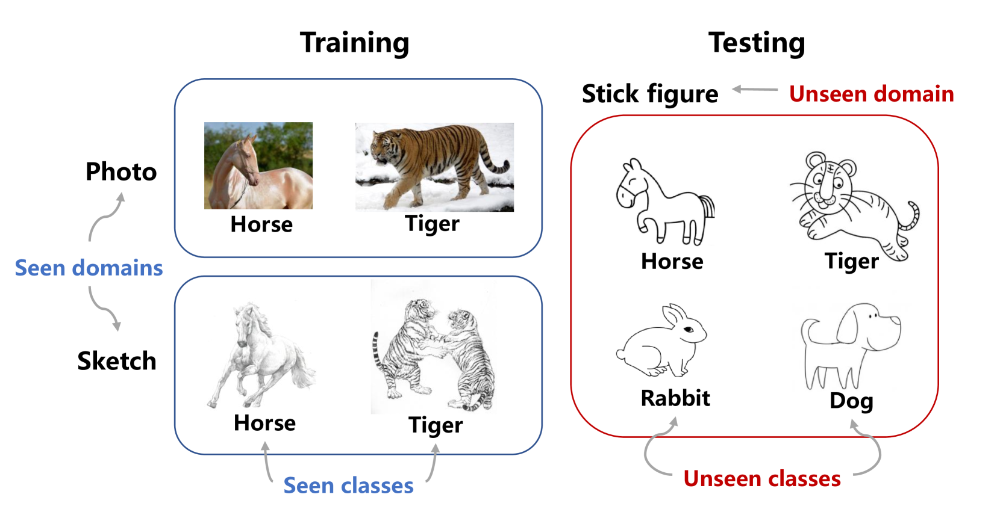
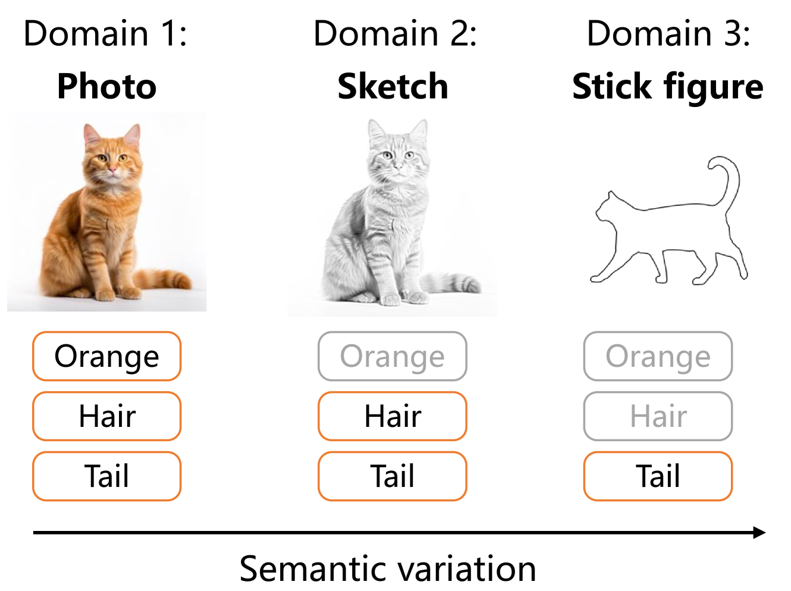
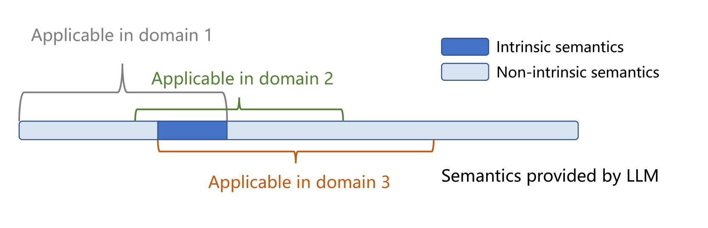
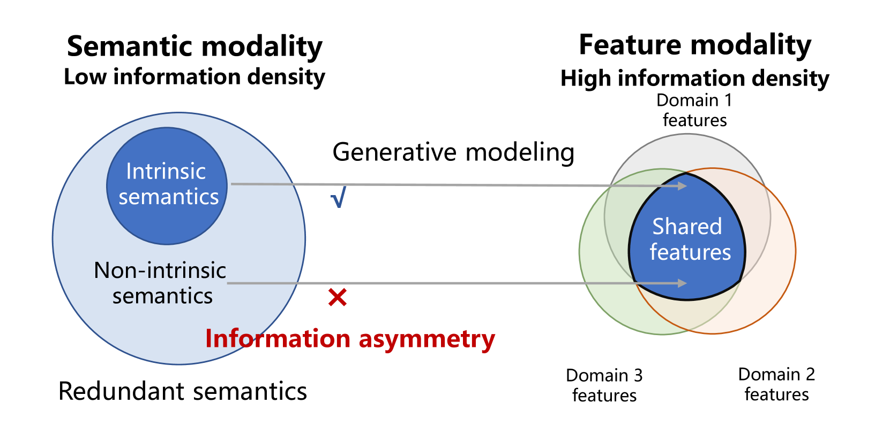
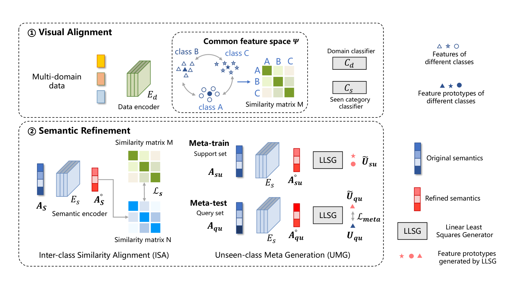

# 精简而高效：从冗余的 LLM 语义中提取本质，赋能针对未知领域的泛化零样本学习

发布时间：2024年03月21日

`LLM应用` `领域适应` `零样本学习`

> Less but Better: Enabling Generalized Zero-shot Learning Towards Unseen Domains by Intrinsic Learning from Redundant LLM Semantics

> 泛化零样本学习（GZSL）着力于解决领域转移问题（DSP）下，既有已知类别又有未知类别的识别难题，但现有方法仅限于处理已知领域。在此研究中，我们开创性地提出了一种跨领域泛化零样本学习（CDGZSL），直面未知领域的挑战。不同于以往通过语义生成未见类别特征来缓解DSP的GZSL技术，CDGZSL更进一步，需要构建跨越多个领域的公共特征空间，并挖掘这些领域间共享的内在语义，从而实现从已知到未知领域的迁移。鉴于大型语言模型（LLMs）标记的冗余类别语义引发的信息不对称问题，我们创新设计了“元域对齐语义精炼”（MDASR）方案。MDASR主要包含两大部分：“类间相似性对齐”（ISA），依据类间特征关联剔除非本质、不跨域共享的语义噪声；以及“未见类元生成”（UMG），通过模拟特征生成过程保护内在语义完整性，确保已知与未知类别间的连续性。MDASR成功地将冗余语义空间与公共特征空间精准对齐，有效缓解了CDGZSL中的信息不对称现象。在Office-Home和Mini-DomainNet数据集上的实验充分证明了MDASR的有效性，同时我们也公开了基于LLM的语义数据作为评测基准。

> Generalized zero-shot learning (GZSL) focuses on recognizing seen and unseen classes against domain shift problem (DSP) where data of unseen classes may be misclassified as seen classes. However, existing GZSL is still limited to seen domains. In the current work, we pioneer cross-domain GZSL (CDGZSL) which addresses GZSL towards unseen domains. Different from existing GZSL methods which alleviate DSP by generating features of unseen classes with semantics, CDGZSL needs to construct a common feature space across domains and acquire the corresponding intrinsic semantics shared among domains to transfer from seen to unseen domains. Considering the information asymmetry problem caused by redundant class semantics annotated with large language models (LLMs), we present Meta Domain Alignment Semantic Refinement (MDASR). Technically, MDASR consists of two parts: Inter-class Similarity Alignment (ISA), which eliminates the non-intrinsic semantics not shared across all domains under the guidance of inter-class feature relationships, and Unseen-class Meta Generation (UMG), which preserves intrinsic semantics to maintain connectivity between seen and unseen classes by simulating feature generation. MDASR effectively aligns the redundant semantic space with the common feature space, mitigating the information asymmetry in CDGZSL. The effectiveness of MDASR is demonstrated on the Office-Home and Mini-DomainNet, and we have shared the LLM-based semantics for these datasets as the benchmark.

[Arxiv](https://arxiv.org/abs/2403.14362)