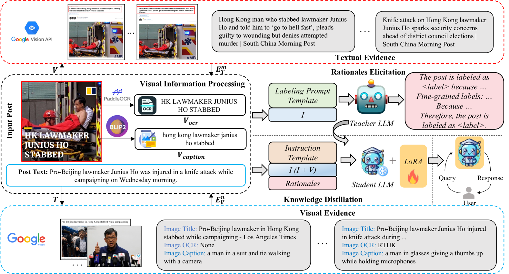

# MMIDR 是一种创新方法，通过知识蒸馏技术，教导大型语言模型理解和解析多模态误导信息。

发布时间：2024年03月21日

`LLM应用` `多模态` `误导信息检测`

> MMIDR: Teaching Large Language Model to Interpret Multimodal Misinformation via Knowledge Distillation

# 摘要

> 近期，自动识别多模态误导信息的研究引起了广泛关注，但大型语言模型（LLMs）在此领域的巨大潜力尚未被充分挖掘。同时，如何经济有效地让LLMs理解和解析多模态误导信息依然是一个开放性挑战。为此，我们创新提出了MMIDR框架，它能够训练LLMs生成流畅、详实的文本说明，解析其针对多模态误导信息决策过程。我们引入了数据增强视角及相应流程，通过视觉信息处理模块与证据检索模块，将多模态误导信息适配为可遵循指令的格式。然后，我们引导专有LLMs基于处理后的素材，提炼出判断多模态误导信息真实性的依据。不仅如此，我们还设计了一种高效的知识蒸馏技术，将专有LLMs解释多模态误导信息的能力转移至开源LLMs上。为了深入研究LLMs在多模态误导信息检测任务上的表现，我们创建了一个遵循指令的多模态误导信息数据集并进行了广泛实验。实验结果显示，MMIDR展现出了稳健的检测效果，并具备提供有力证据支撑其判断的能力。

> Automatic detection of multimodal misinformation has gained a widespread attention recently. However, the potential of powerful Large Language Models (LLMs) for multimodal misinformation detection remains underexplored. Besides, how to teach LLMs to interpret multimodal misinformation in cost-effective and accessible way is still an open question. To address that, we propose MMIDR, a framework designed to teach LLMs in providing fluent and high-quality textual explanations for their decision-making process of multimodal misinformation. To convert multimodal misinformation into an appropriate instruction-following format, we present a data augmentation perspective and pipeline. This pipeline consists of a visual information processing module and an evidence retrieval module. Subsequently, we prompt the proprietary LLMs with processed contents to extract rationales for interpreting the authenticity of multimodal misinformation. Furthermore, we design an efficient knowledge distillation approach to distill the capability of proprietary LLMs in explaining multimodal misinformation into open-source LLMs. To explore several research questions regarding the performance of LLMs in multimodal misinformation detection tasks, we construct an instruction-following multimodal misinformation dataset and conduct comprehensive experiments. The experimental findings reveal that our MMIDR exhibits sufficient detection performance and possesses the capacity to provide compelling rationales to support its assessments.

[Arxiv](https://arxiv.org/abs/2403.14171)