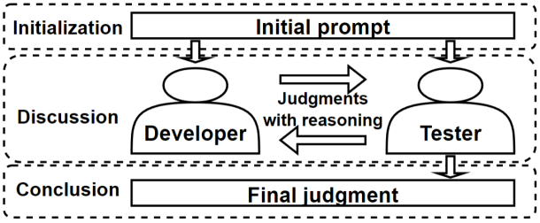

# 为提升漏洞检测能力，我们提出利用 LLMs 进行多角色讨论并达成共识的方法。

发布时间：2024年03月21日

`LLM应用` `软件开发` `安全测试`

> Multi-role Consensus through LLMs Discussions for Vulnerability Detection

# 摘要

> 近期 LLMS 的发展揭示了其在软件质量保障核心部分——漏洞探测上的巨大可能性。尽管已有显著进步，但现有研究大多仅从单一方面（通常为测试者的角度）进行探讨，忽视了软件开发生命周期中开发者与测试者等多元角色的不同视角。因此，本文提出运用LLMs模拟多种角色，仿照实际情景参与代码审查讨论，以求就代码中的漏洞是否存在及其类别达成一致意见。初步评估结果显示，该方法使精确率提升了4.73%，召回率跃升了58.9%，F1分数也增长了28.1%。

> Recent advancements in large language models (LLMs) have highlighted the potential for vulnerability detection, a crucial component of software quality assurance. Despite this progress, most studies have been limited to the perspective of a single role, usually testers, lacking diverse viewpoints from different roles in a typical software development life-cycle, including both developers and testers. To this end, this paper introduces an approach to employ LLMs to act as different roles to simulate real-life code review process, engaging in discussions towards a consensus on the existence and classification of vulnerabilities in the code. Preliminary evaluation of the proposed approach indicates a 4.73% increase in the precision rate, 58.9% increase in the recall rate, and a 28.1% increase in the F1 score.

[Arxiv](https://arxiv.org/abs/2403.14274)