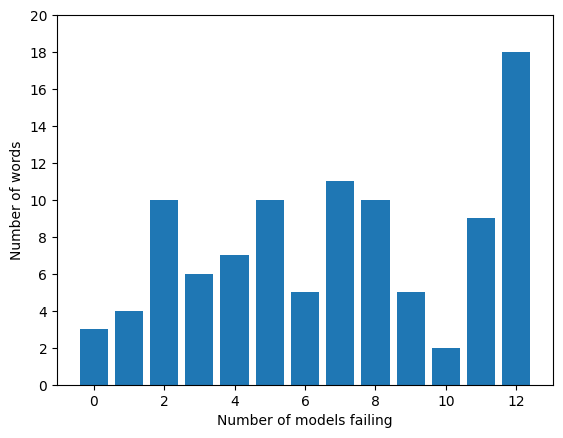
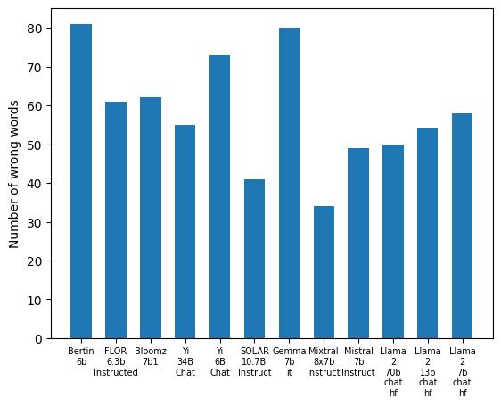
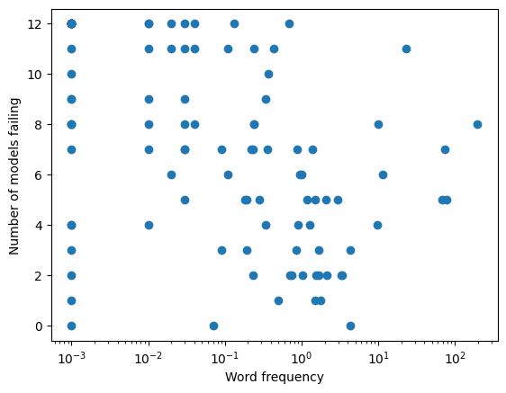
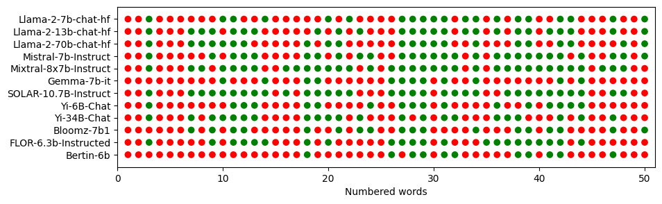
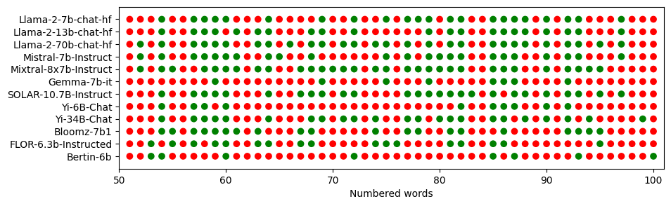

# 开源对话型LLM对大多数西班牙语词汇并不熟悉

发布时间：2024年03月21日

`LLM应用` `对话系统`

> Open Source Conversational LLMs do not know most Spanish words

> 随着对LLMs特别是交互式对话模型关注度的提升，大量开源聊天LLMs应运而生，并在多种基准测试下接受检验，以评估其在广泛主题上的问答能力、问题解决能力或是文本理解和推理能力。然而，相较于这些能力，对模型所掌握的多语言知识，尤其是识别和运用各语言词汇的能力关注不足。本文聚焦于此，通过在参考词典中选取一批西班牙语单词样本，对开源聊天LLMs的西班牙语词汇知识进行了评测。结果显示，开源聊天LLMs对相当比例的单词释义存在误判，并且难以准确运用大多数单词在语境中造句。这一发现揭示了在开源LLM竞赛中西班牙语的相对滞后，并强调了在对话LLMs中推动语言公平性的重要性，以确保跨语言时具备相近的性能水平。

> The growing interest in Large Language Models (LLMs) and in particular in conversational models with which users can interact has led to the development of a large number of open-source chat LLMs. These models are evaluated on a wide range of benchmarks to assess their capabilities in answering questions or solving problems on almost any possible topic or to test their ability to reason or interpret texts. Instead, the evaluation of the knowledge that these models have of the languages has received much less attention. For example, the words that they can recognize and use in different languages. In this paper, we evaluate the knowledge that open-source chat LLMs have of Spanish words by testing a sample of words in a reference dictionary. The results show that open-source chat LLMs produce incorrect meanings for an important fraction of the words and are not able to use most of the words correctly to write sentences with context. These results show how Spanish is left behind in the open-source LLM race and highlight the need to push for linguistic fairness in conversational LLMs ensuring that they provide similar performance across languages.

[Arxiv](https://arxiv.org/abs/2403.15491)