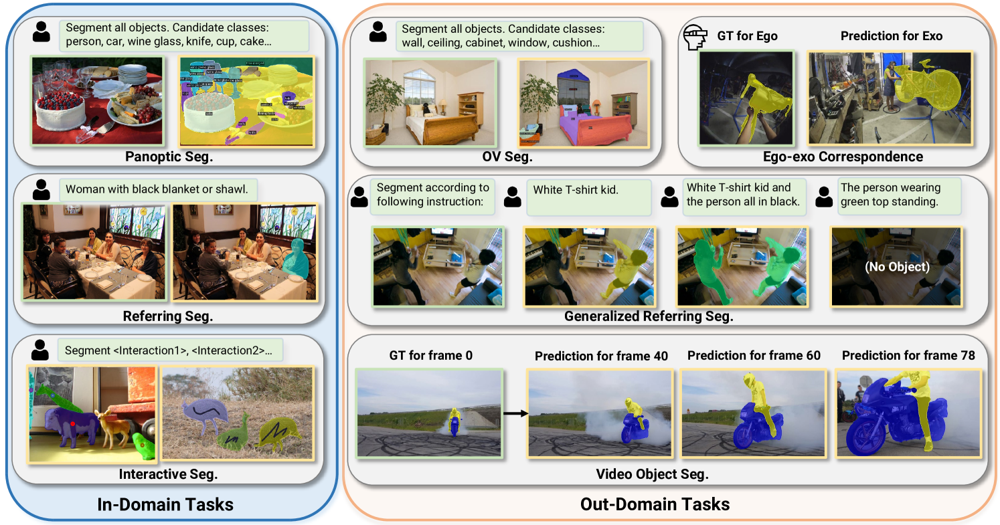
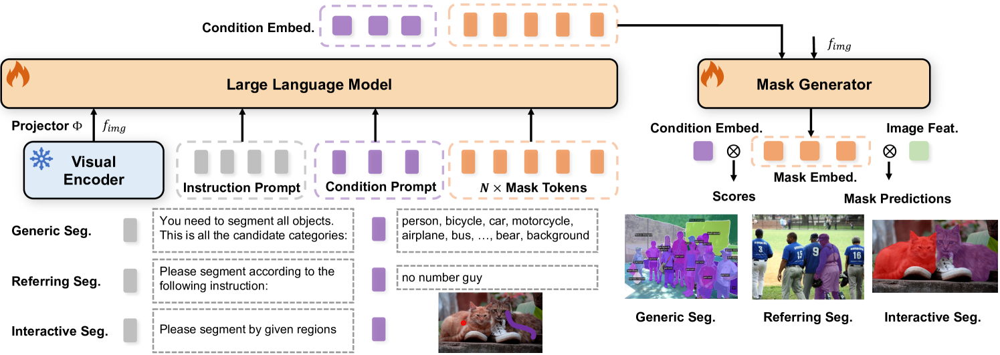
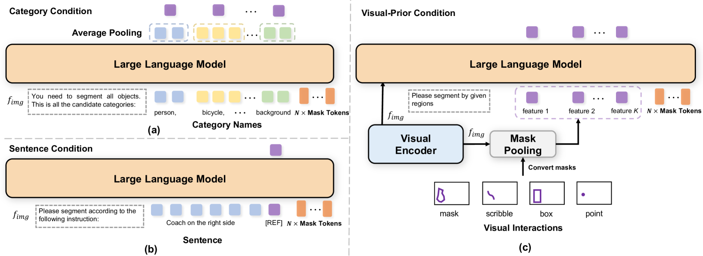

# PSALM，一项创新技术，利用强大的大型多模态模型实现像素级别的精确分割。

发布时间：2024年03月21日

`Agent` `计算机视觉` `图像分割`

> PSALM: Pixelwise SegmentAtion with Large Multi-Modal Model

> PSALM 是一种强大而灵活的拓展，针对大型多模态模型(LMM)，旨在解决分割任务难题。它通过整合掩码解码器与精心设计的输入方案，成功驾驭包括图像、任务指导、条件提示及掩码标记在内的多种元素，有效实现了分割掩码的生成与分类，一举突破了LMM只能输出文本的局限。PSALM 支持跨多数据集与任务的联合训练，显著提升性能并增强了任务泛化能力。在 RefCOCO 系列、COCO全景分割及COCO-Interactive等众多基准测试中，PSALM 表现优异，甚至能在开放词汇分割、通用指示表达分割及视频对象分割等未见过的任务上展示出零样本学习的能力，为计算机视觉领域带来了一次向GPT时刻迈进的重大飞跃。广泛的实验验证了 PSALM 利用LMM强大的视觉理解能力重塑图像分割疆域的巨大潜能。目前，相关代码和模型已公开，访问地址为https://github.com/zamling/PSALM。

> PSALM is a powerful extension of the Large Multi-modal Model (LMM) to address the segmentation task challenges. To overcome the limitation of the LMM being limited to textual output, PSALM incorporates a mask decoder and a well-designed input schema to handle a variety of segmentation tasks. This schema includes images, task instructions, conditional prompts, and mask tokens, which enable the model to generate and classify segmentation masks effectively. The flexible design of PSALM supports joint training across multiple datasets and tasks, leading to improved performance and task generalization. PSALM achieves superior results on several benchmarks, such as RefCOCO/RefCOCO+/RefCOCOg, COCO Panoptic Segmentation, and COCO-Interactive, and further exhibits zero-shot capabilities on unseen tasks, such as open-vocabulary segmentation, generalized referring expression segmentation and video object segmentation, making a significant step towards a GPT moment in computer vision. Through extensive experiments, PSALM demonstrates its potential to transform the domain of image segmentation, leveraging the robust visual understanding capabilities of LMMs as seen in natural language processing. Code and models are available at https://github.com/zamling/PSALM.

[Arxiv](https://arxiv.org/abs/2403.14598)