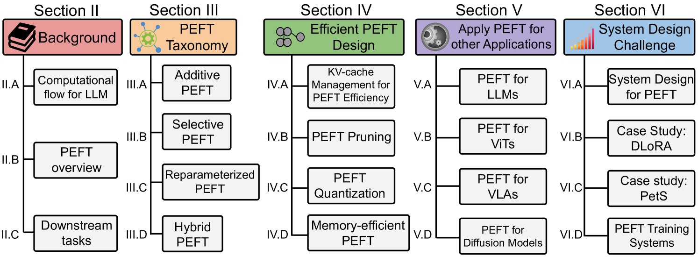
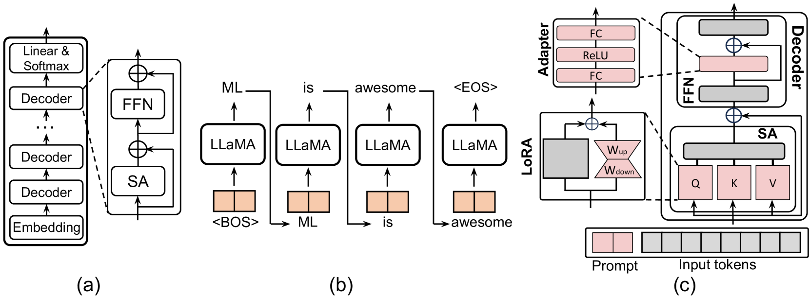
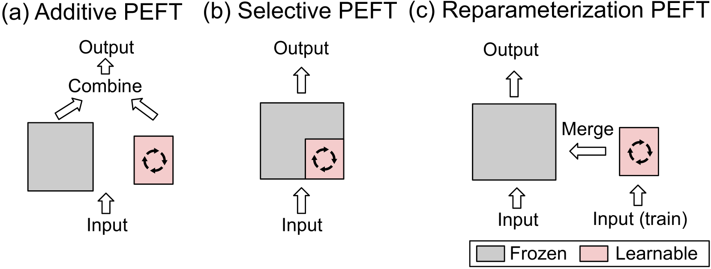
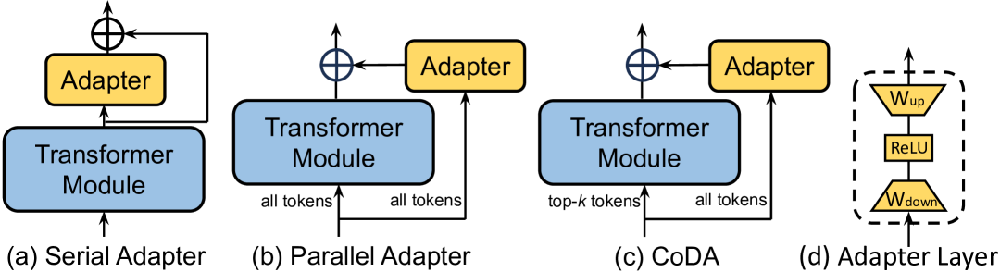
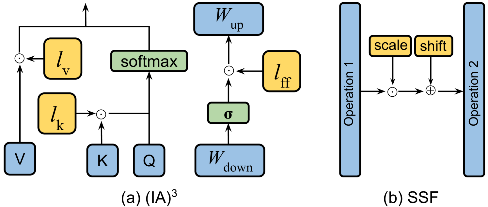
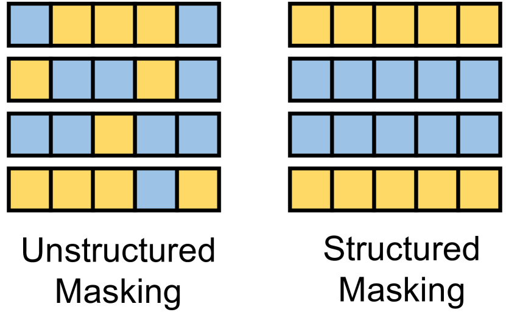
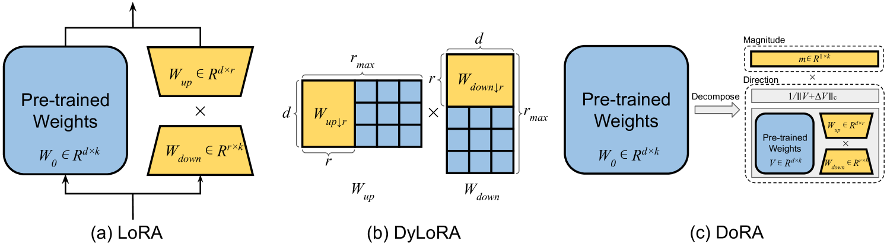
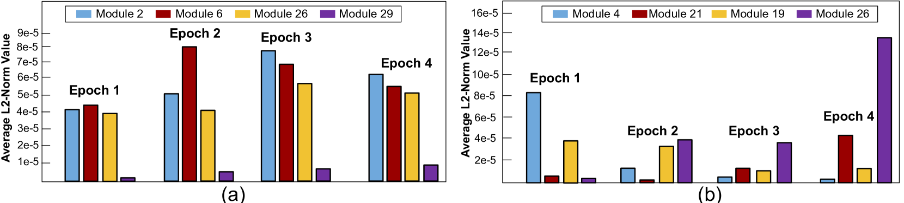
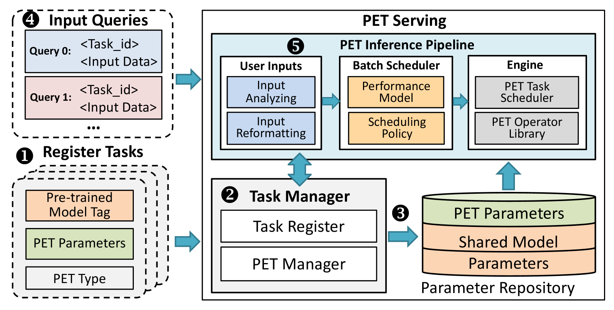
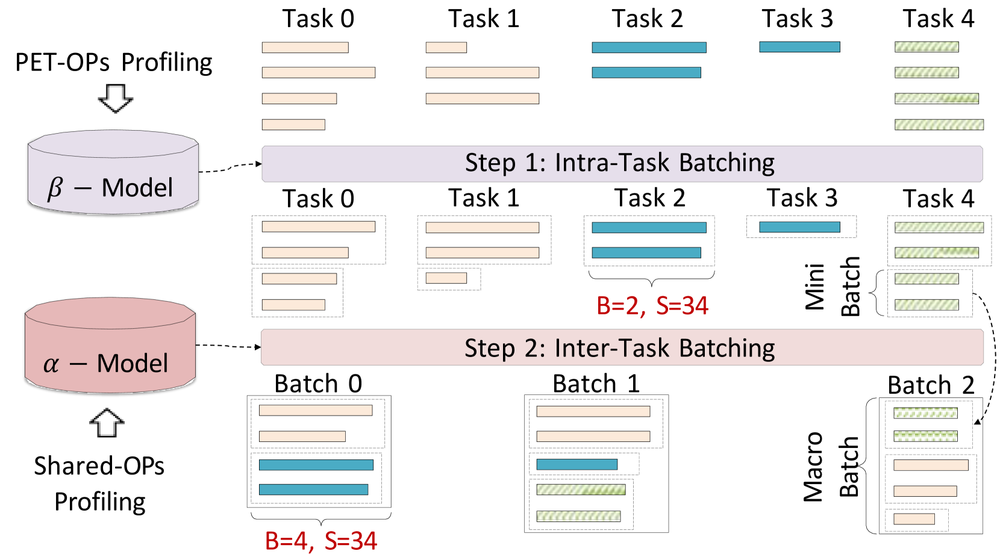

# 全面探讨大型模型参数高效微调技术

发布时间：2024年03月21日

`LLM应用` `模型优化`

> Parameter-Efficient Fine-Tuning for Large Models: A Comprehensive Survey

> 大规模模型在各领域展现出卓越突破，推动众多任务取得非凡成果，但其空前的规模也带来了显著的计算成本挑战。这些动辄包含数十亿参数的模型，在运行时需要海量计算资源，尤其在面对特定下游任务定制化需求时，尤其是在计算能力受限的硬件平台上，挑战尤为突出。参数高效微调（PEFT）技术应运而生，它能在多种下游任务上有效利用并调整大型预训练模型，同时尽可能减少新增参数量及计算资源需求。这一方法在面对参数数量庞大的大型语言模型时至关重要，因其从零开始微调可能耗资巨大且对系统资源需求严苛。本研究报告详尽梳理了各类PEFT算法，对其性能及计算开销进行了深入考察，并概览了运用不同PEFT算法开发的实际应用案例，以及常用于降低成本的通用技术手段。此外，我们还从系统设计层面出发，探究了不同PEFT算法在实际应用中的实施成本。此份综合调研报告为致力于理解PEFT算法及其系统实现的研究者们提供了宝贵的参考资源，详尽阐述了近期的创新进展及其实用应用场景。

> Large models represent a groundbreaking advancement in multiple application fields, enabling remarkable achievements across various tasks. However, their unprecedented scale comes with significant computational costs. These models, often consisting of billions of parameters, require vast amounts of computational resources for execution. Especially, the expansive scale and computational demands pose considerable challenges when customizing them for particular downstream tasks, particularly over the hardware platforms constrained by computational capabilities. Parameter Efficient Fine-Tuning (PEFT) provides a practical solution by efficiently adapt the large models over the various downstream tasks. In particular, PEFT refers to the process of adjusting the parameters of a pre-trained large models to adapt it to a specific task while minimizing the number of additional parameters introduced or computational resources required. This approach is particularly important when dealing with large language models with high parameter counts, as fine-tuning these models from scratch can be computationally expensive and resource-intensive, posing considerable challenges in the supporting system platform design. In this survey, we present comprehensive studies of various PEFT algorithms, examining their performance and computational overhead. Moreover, we provide an overview of applications developed using different PEFT algorithms and discuss common techniques employed to mitigate computation costs for PEFT. In addition to the algorithmic perspective, we overview various real-world system designs to investigate the implementation costs associated with different PEFT algorithms. This survey serves as an indispensable resource for researchers aiming to understand both the PEFT algorithm and its system implementation, offering detailed insights into recent advancements and practical applications.

[Arxiv](https://arxiv.org/abs/2403.14608)