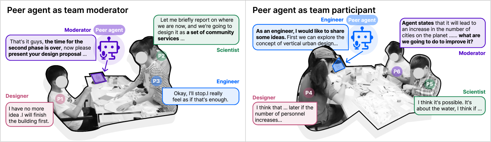
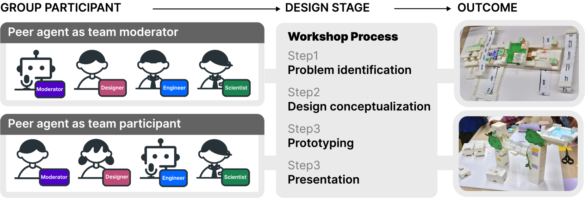
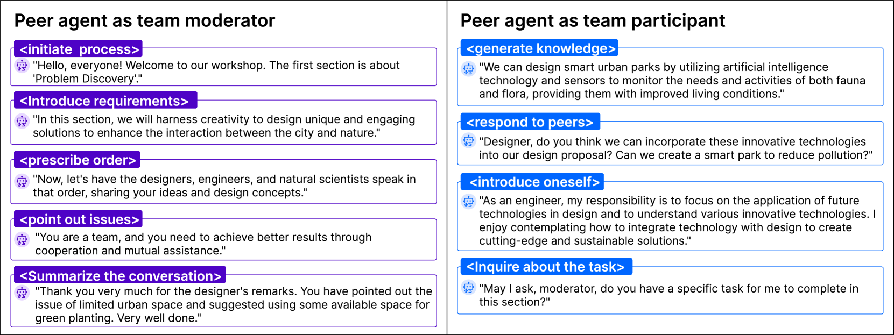
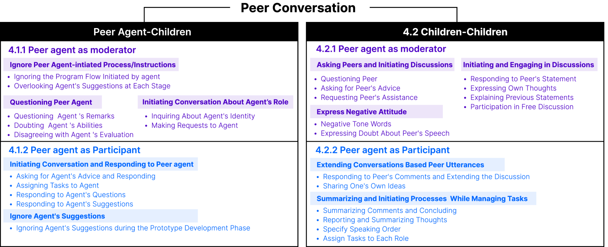
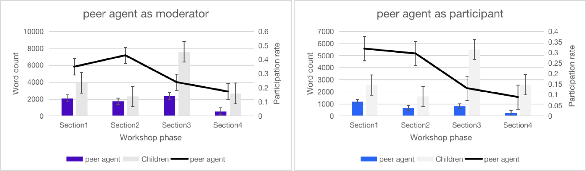

# PeerGPT项目专注于研究基于大型语言模型（LLM）的同伴智能体在儿童协作学习中的角色，探索其作为团队调解者和积极参与者对儿童合作学习的影响。

发布时间：2024年03月21日

`Agent` `人工智能`

> PeerGPT: Probing the Roles of LLM-based Peer Agents as Team Moderators and Participants in Children's Collaborative Learning

> 在儿童协作学习中，高效的同伴交流对提高合作效果至关重要。研究将大型语言模型（LLM）代理引入这一情境中，以新颖的同伴身份探讨其作为团队引导者和参与者的作用。我们在一次研讨会上邀请了两组参与者共同讨论并解决一个设计问题。通过对同伴交谈记录的主题性分析，我们揭示了尽管同伴代理作为团队主持时能有效地掌控讨论，但其指导有时会被忽略；而作为参与者时，虽能激发孩子们的创新思考，却不一定总能提供及时的反馈。这些发现为我们指出了改进同伴代理在两种角色中的设计方案以及需关注的问题。

> In children's collaborative learning, effective peer conversations can significantly enhance the quality of children's collaborative interactions. The integration of Large Language Model (LLM) agents into this setting explores their novel role as peers, assessing impacts as team moderators and participants. We invited two groups of participants to engage in a collaborative learning workshop, where they discussed and proposed conceptual solutions to a design problem. The peer conversation transcripts were analyzed using thematic analysis. We discovered that peer agents, while managing discussions effectively as team moderators, sometimes have their instructions disregarded. As participants, they foster children's creative thinking but may not consistently provide timely feedback. These findings highlight potential design improvements and considerations for peer agents in both roles.

[Arxiv](https://arxiv.org/abs/2403.14227)