# Pensieve 研究提出“先回顾后比较”的策略，有效缓解了视觉幻觉问题。

发布时间：2024年03月21日

`MLLM应用` `计算机视觉`

> Pensieve: Retrospect-then-Compare Mitigates Visual Hallucination

> MLLM 在各类跨模态任务上成绩斐然，但容易出现视觉幻觉，即生成的回答脱离实际图像。那么，MLLM 在“幻想”时是否真的无视准确的视觉线索呢？经过探究，我们发现即使在发生幻觉时，其视觉部分也可能同时支持真实与虚构的内容。为此，我们受此现象启发，提出了一种无需训练的方法——Pensieve。它基于这样的观察：具有相似语义和视觉特征的图像间可能存在类似的幻觉现象。在推理过程中，Pensieve 让 MLLM 能够回溯参考相关图像并与测试图像对比，从而帮助 MLLM 减少因视觉输入而错误强化的幻觉内容。实验证明，Pensieve 在Whoops、MME、POPE 和 LLaVA Bench 等基准上的表现优异，有效缓解了视觉幻觉问题，并且超越了其他高级解码策略。此外，Pensieve 还助力 MLLM 更精准地识别图像细节，提升图像描述的精细度。

> Multi-modal Large Language Models (MLLMs) demonstrate remarkable success across various vision-language tasks. However, they suffer from visual hallucination, where the generated responses diverge from the provided image. Are MLLMs completely oblivious to accurate visual cues when they hallucinate? Our investigation reveals that the visual branch may simultaneously advocate both accurate and non-existent content. To address this issue, we propose Pensieve, a training-free method inspired by our observation that analogous visual hallucinations can arise among images sharing common semantic and appearance characteristics. During inference, Pensieve enables MLLMs to retrospect relevant images as references and compare them with the test image. This paradigm assists MLLMs in downgrading hallucinatory content mistakenly supported by the visual input. Experiments on Whoops, MME, POPE, and LLaVA Bench demonstrate the efficacy of Pensieve in mitigating visual hallucination, surpassing other advanced decoding strategies. Additionally, Pensieve aids MLLMs in identifying details in the image and enhancing the specificity of image descriptions.

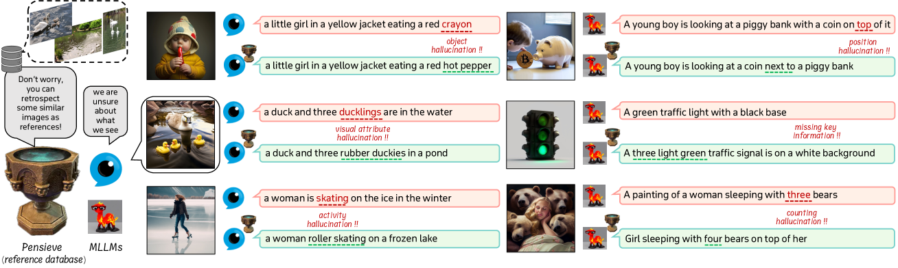

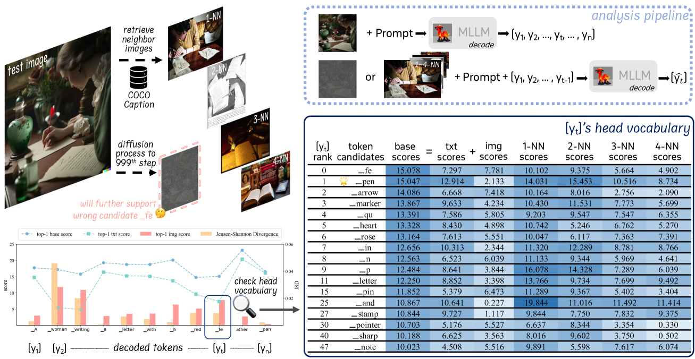

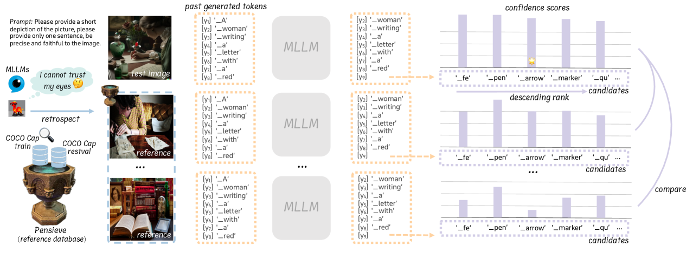

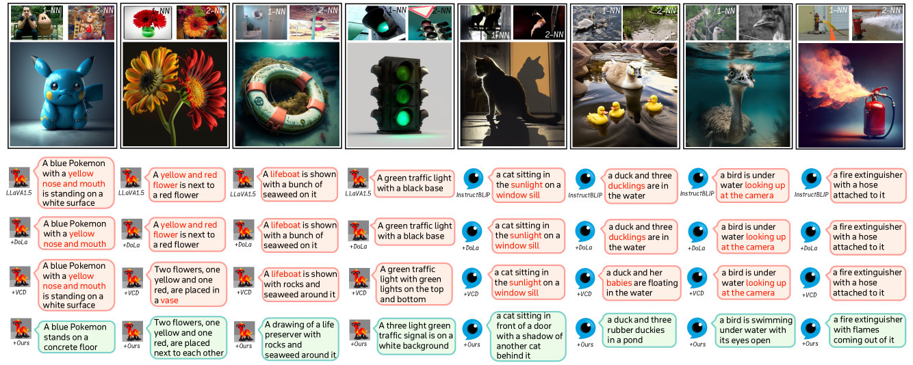

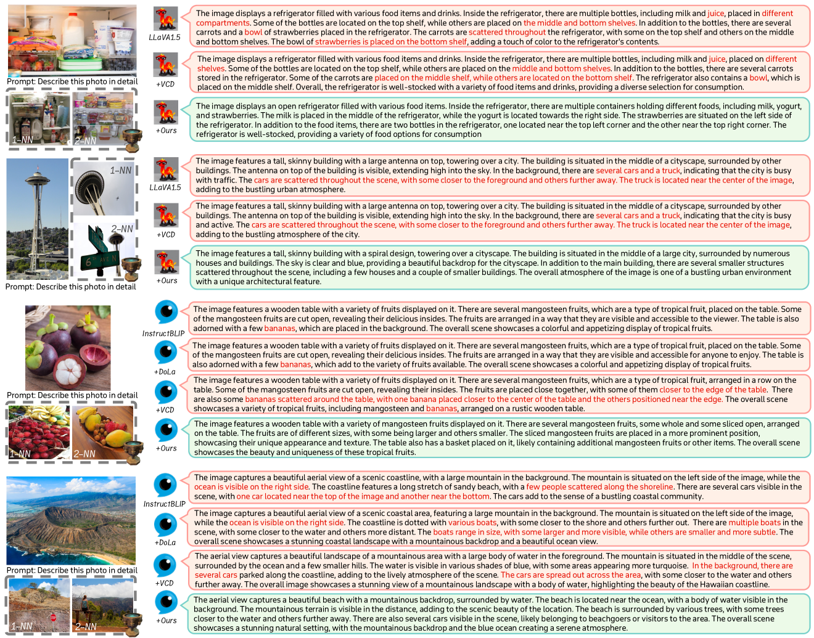

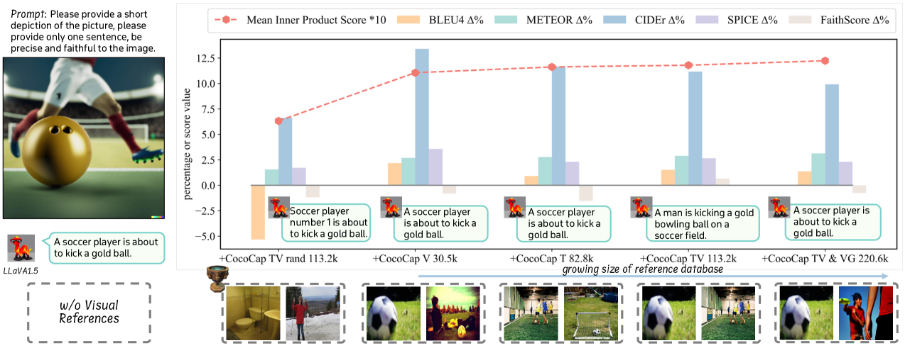

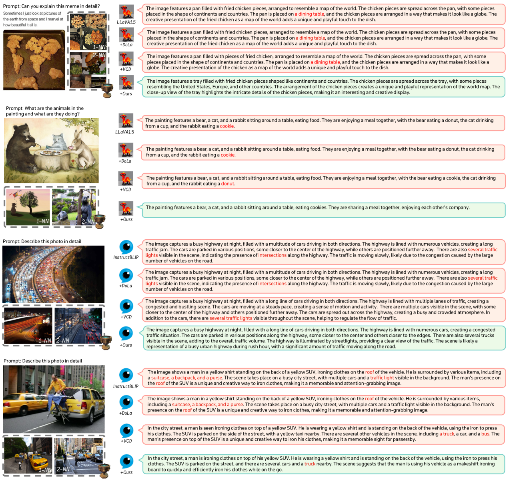

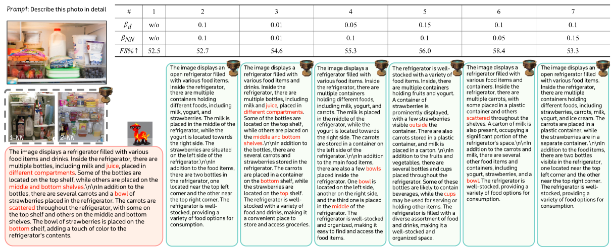

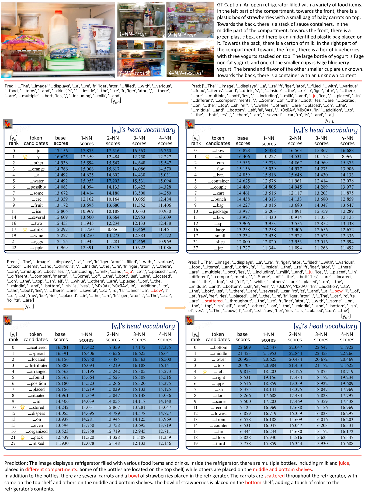

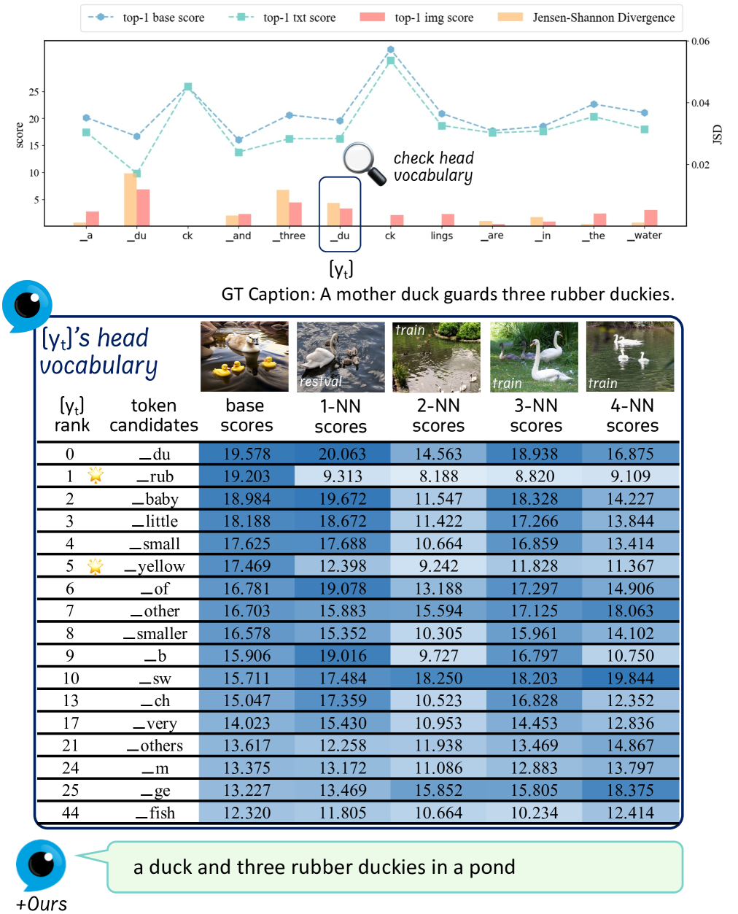

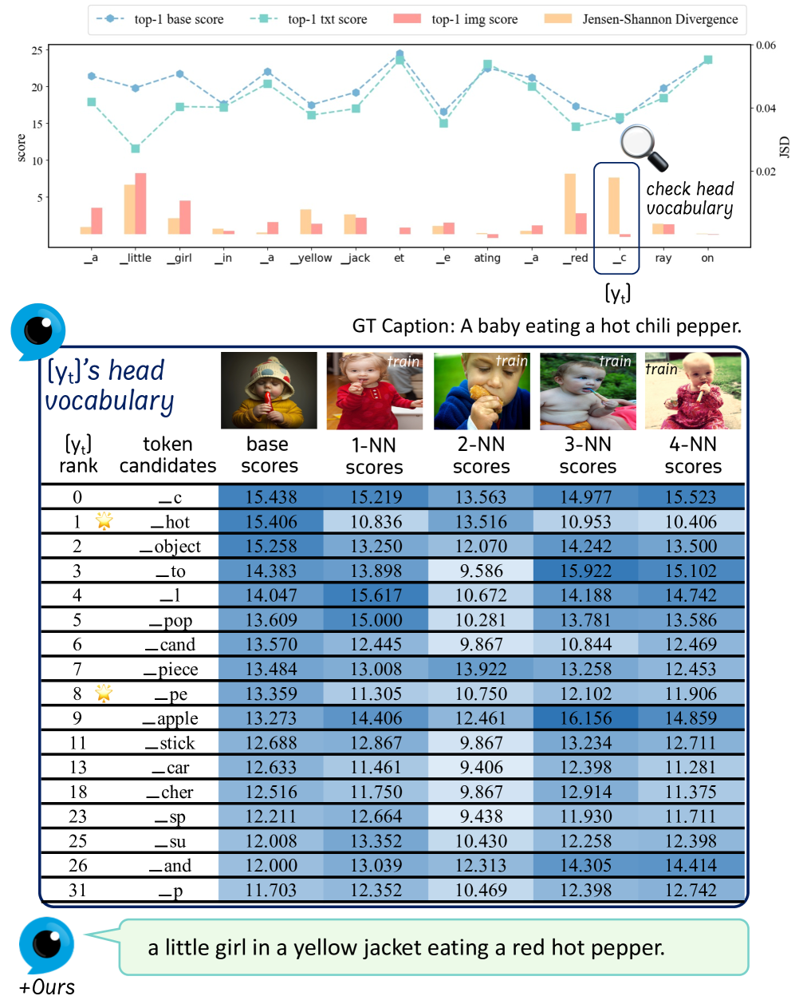

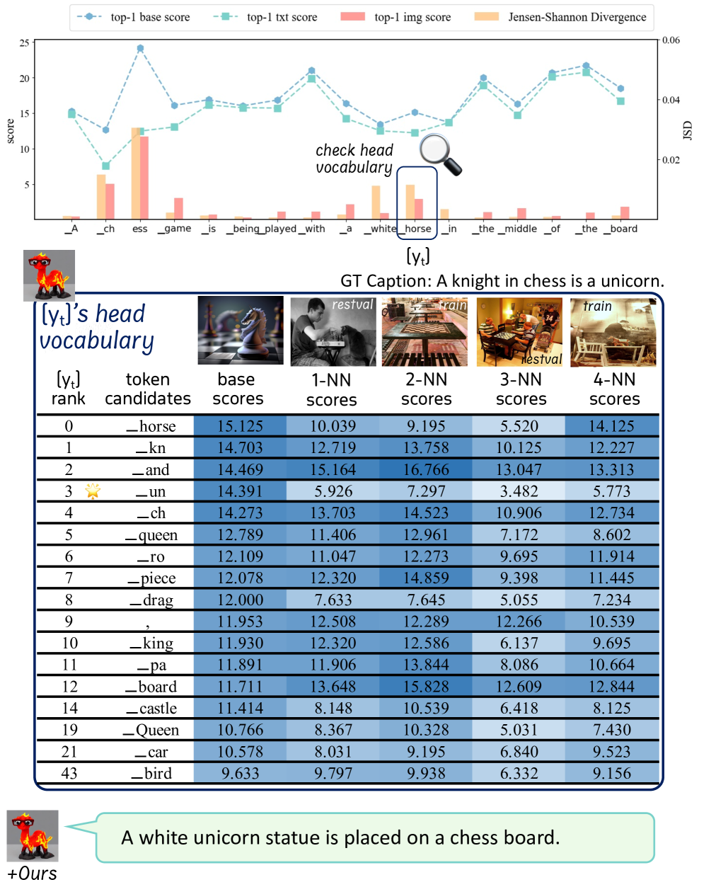

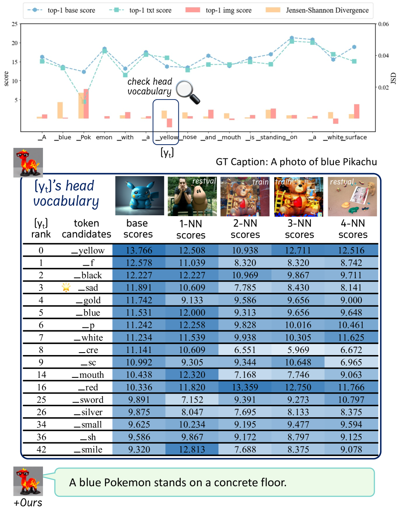

[Arxiv](https://arxiv.org/abs/2403.14401)