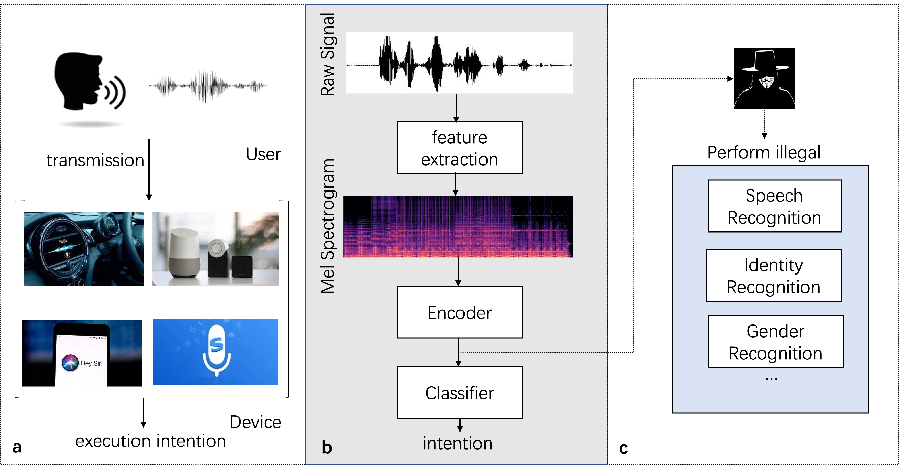
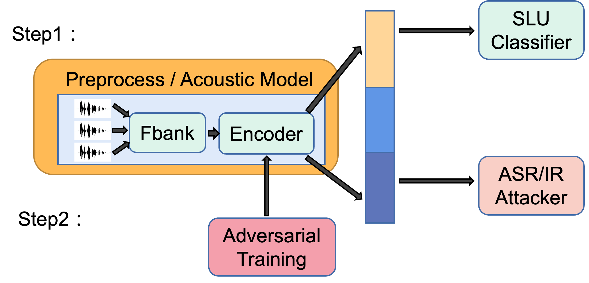
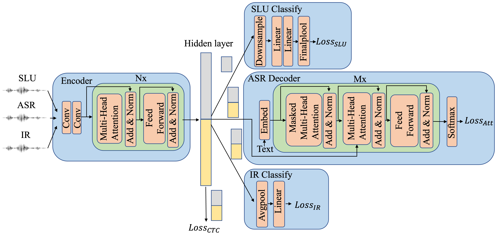
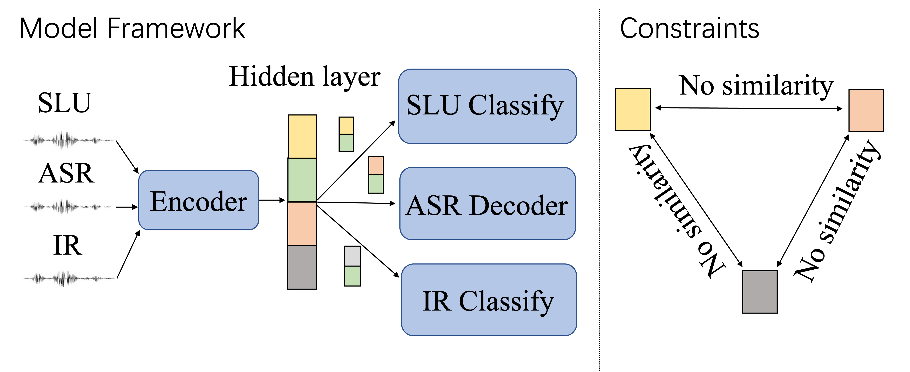
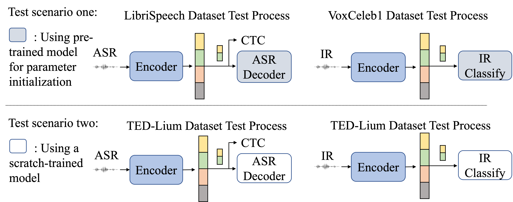

# 面向隐私保护的端到端口语理解方案

发布时间：2024年03月21日

`Agent` `物联网` `隐私保护`

> Privacy-Preserving End-to-End Spoken Language Understanding

> 作为物联网设备中构建人性化人机交互的重要技术，SLU 提供了便捷易用的界面，但其中蕴含的诸如性别、身份等用户敏感信息也可能成为新的安全隐患。面对这一挑战，本文提出一种新颖的 SLU 多任务隐私保护模型，旨在有效抵御 ASR（语音识别）和 IR（身份识别）攻击。该模型运用隐藏层分离技术，确保 SLU 信息仅限定在隐藏层的特定区域，其余两类敏感信息被剔除，从而形成隐私防护隐藏层。为了兼顾隐私保护与系统效率，我们引入了一种创新的预训练机制——联合对抗训练。实验证明，这种方法可在大幅降低 ASR 和 IR 攻击准确率至近乎随机猜测水平的同时，保证 SLU 准确性基本不受影响。

> Spoken language understanding (SLU), one of the key enabling technologies for human-computer interaction in IoT devices, provides an easy-to-use user interface. Human speech can contain a lot of user-sensitive information, such as gender, identity, and sensitive content. New types of security and privacy breaches have thus emerged. Users do not want to expose their personal sensitive information to malicious attacks by untrusted third parties. Thus, the SLU system needs to ensure that a potential malicious attacker cannot deduce the sensitive attributes of the users, while it should avoid greatly compromising the SLU accuracy. To address the above challenge, this paper proposes a novel SLU multi-task privacy-preserving model to prevent both the speech recognition (ASR) and identity recognition (IR) attacks. The model uses the hidden layer separation technique so that SLU information is distributed only in a specific portion of the hidden layer, and the other two types of information are removed to obtain a privacy-secure hidden layer. In order to achieve good balance between efficiency and privacy, we introduce a new mechanism of model pre-training, namely joint adversarial training, to further enhance the user privacy. Experiments over two SLU datasets show that the proposed method can reduce the accuracy of both the ASR and IR attacks close to that of a random guess, while leaving the SLU performance largely unaffected.

[Arxiv](https://arxiv.org/abs/2403.15510)