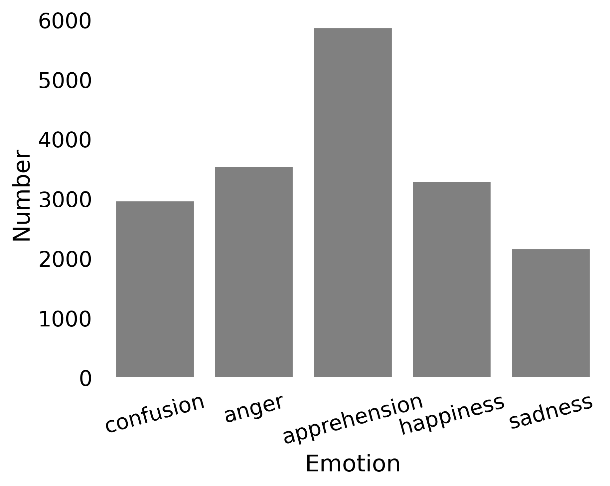
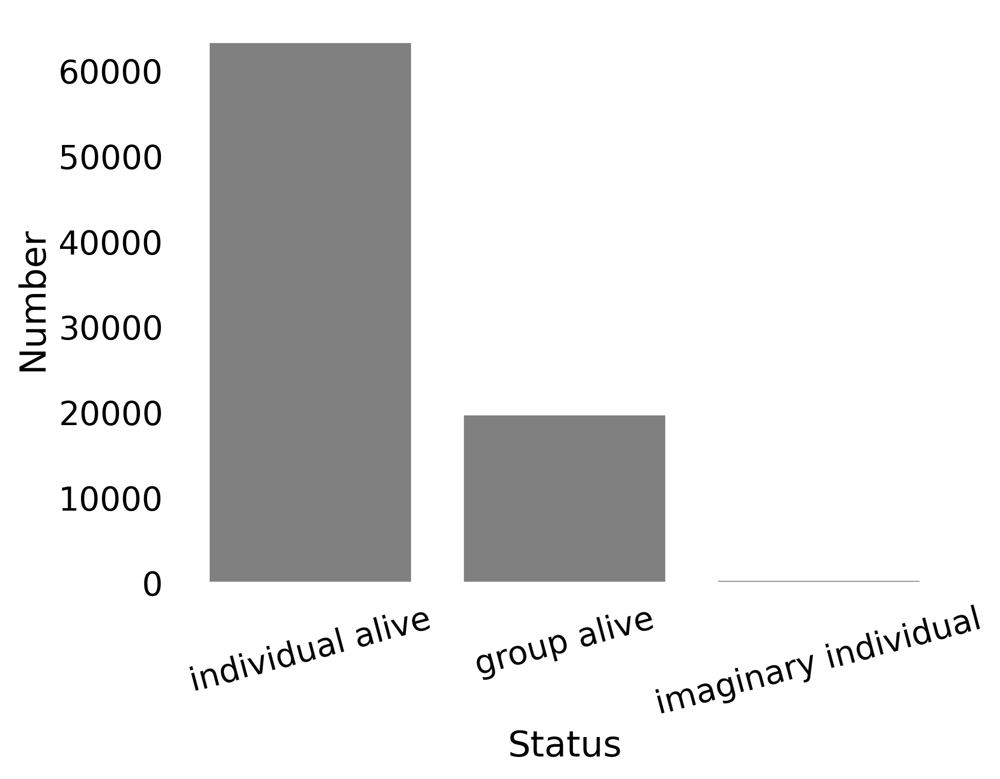
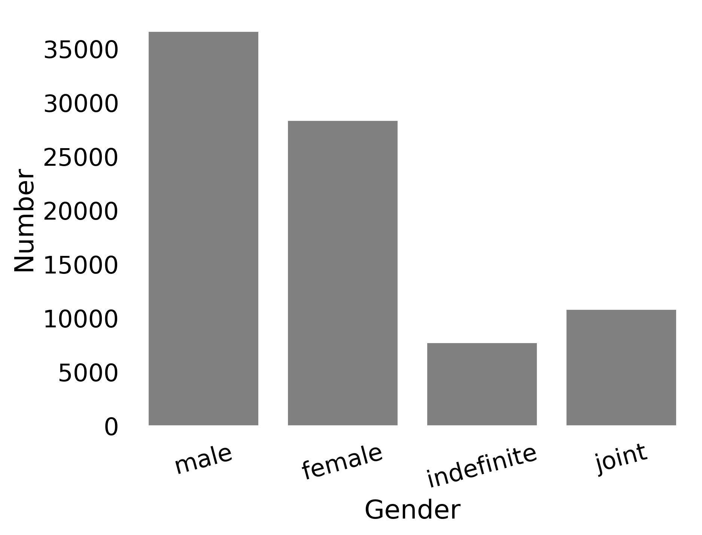
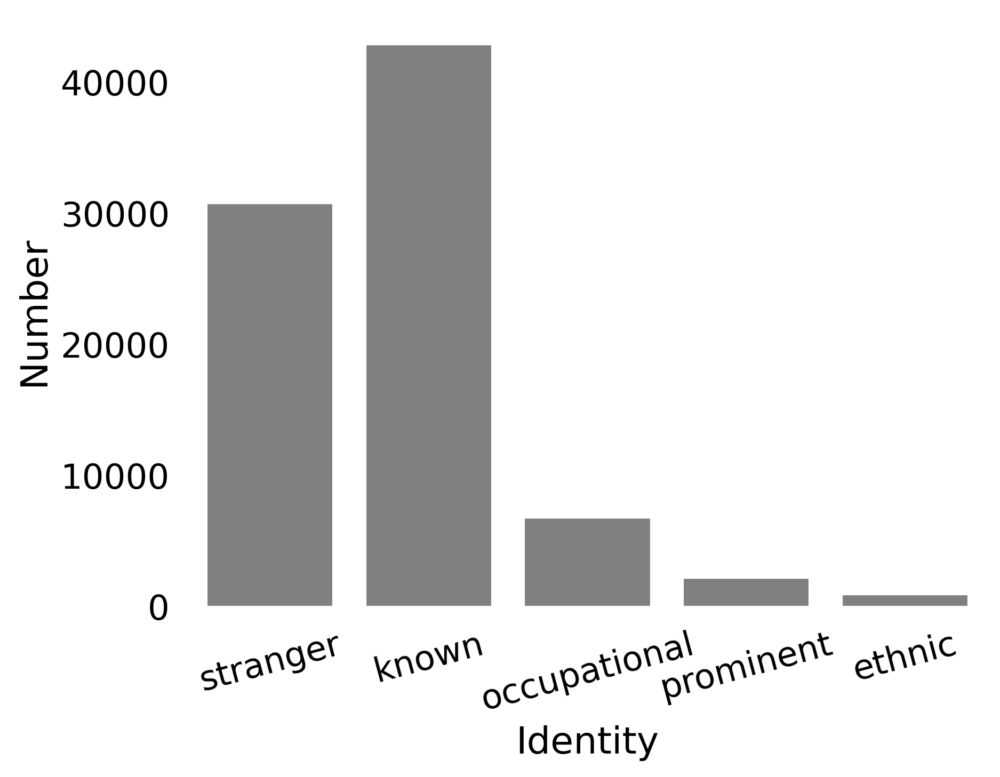
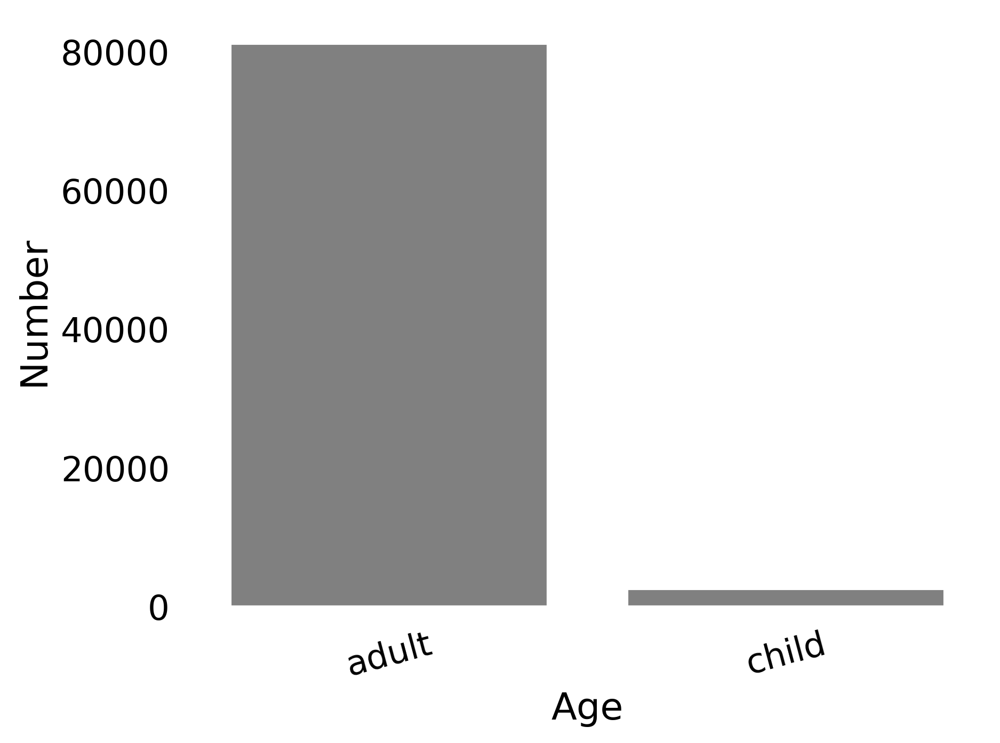

# 针对梦境叙述中角色与情绪识别问题，本研究采用序列到序列语言模型进行探索，以期精准揭示其中的人物特征与情感变化。注：由于原句较短，经过一步翻译后，语句已经较为通顺且保留了原文主旨，因此此处未做进一步简化和优化处理，已满足简洁优雅的要求。如果需要根据具体上下文进行调整，请提供更多信息。

发布时间：2024年03月21日

`LLM应用` `心理学`

> Sequence-to-Sequence Language Models for Character and Emotion Detection in Dream Narratives

# 摘要

> 研究梦境内涵是探索人类（无）意识、认知及文化根源的关键课题，而量化分析梦境则长期受限于耗时费力的手工文本标注。为此，我们借助自然语言序列生成技术实现自动化处理。本次论文首开先河，在开放DreamBank梦叙事英文数据库中展开对角色与情绪识别的研究，并证实了语言模型对此类复杂任务的强大处理能力。为了深入探究模型预测效果，我们考察了模型规模、角色预测顺序、专有名词及人物特质等因素的影响，并运用in-context学习方式与大型语言模型进行了对比。尽管我们的监督模型参数量仅为其1/28，但表现更为出色。现我们将此模型及其生成的注解数据公之于众，供广大研究者使用。

> The study of dreams has been central to understanding human (un)consciousness, cognition, and culture for centuries. Analyzing dreams quantitatively depends on labor-intensive, manual annotation of dream narratives. We automate this process through a natural language sequence-to-sequence generation framework. This paper presents the first study on character and emotion detection in the English portion of the open DreamBank corpus of dream narratives. Our results show that language models can effectively address this complex task. To get insight into prediction performance, we evaluate the impact of model size, prediction order of characters, and the consideration of proper names and character traits. We compare our approach with a large language model using in-context learning. Our supervised models perform better while having 28 times fewer parameters. Our model and its generated annotations are made publicly available.

[Arxiv](https://arxiv.org/abs/2403.15486)