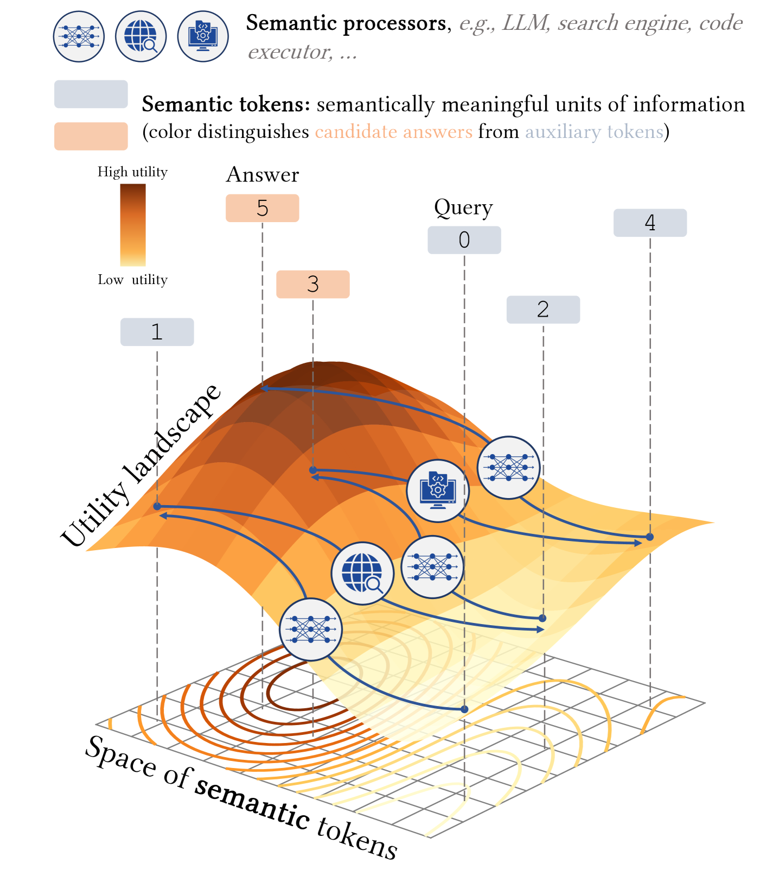
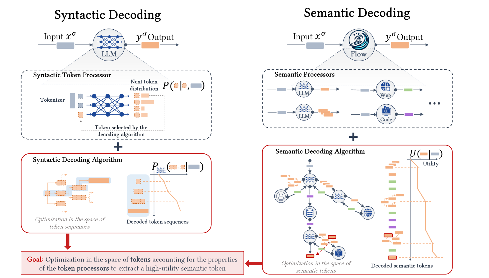
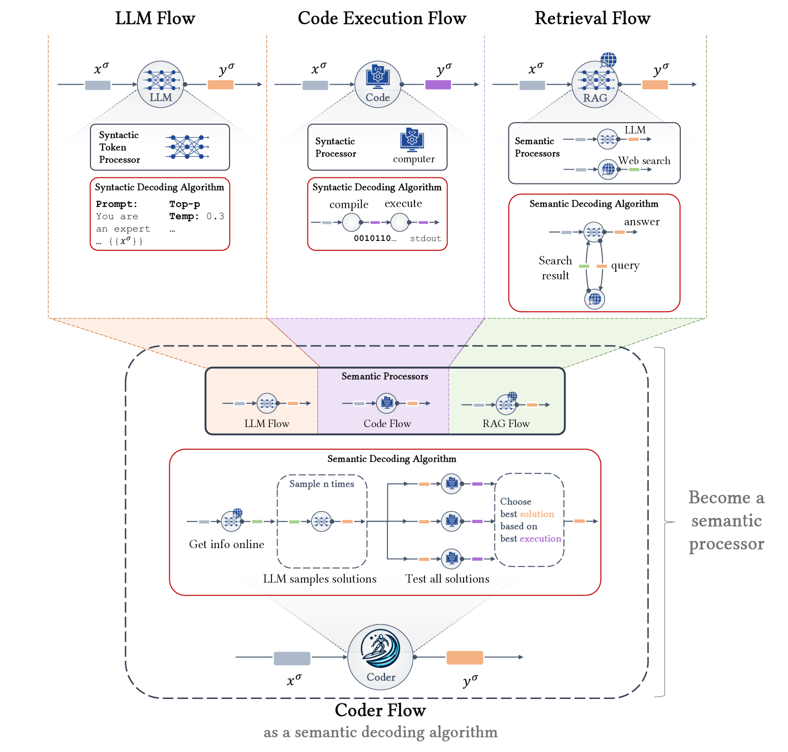

# 步入语义解码时代

发布时间：2024年03月21日

`LLM理论` `人工智能`

> The Era of Semantic Decoding

# 摘要

> 近期研究表明，协调LLMs、人类输入及各类工具的合作，以突破LLMs内在局限性的思路展现出巨大前景。我们提出了一种创新视角“语义解码”，将此类合作过程构想为在语义空间中的优化流程。形象地说，我们将LLMs看作操作着被称为“语义令牌”（已知思想）的有意义信息碎片的语义处理器，并将其置于包括人类、搜索引擎或代码执行器在内的多种语义处理器大家庭之中。这些处理器相互间动态交换语义令牌，共同逐层构建出高价值输出，这种有序且优化的过程，我们称之为“语义解码算法”。此概念与深入研究过的句法解码相呼应，只是后者聚焦于利用自回归语言模型抽取高价值句法令牌序列的算法设计。着眼于语义层次而忽视句法细枝末节，让我们对AI系统工程有了焕然一新的洞察力，进而预见到可设计出更为复杂且功能强大的系统。本文正式阐述了从句法令牌向语义令牌的转变，以及句法解码与语义解码之间的类比联系，继而探究如何在语义令牌空间内运用语义解码算法进行优化的可能性。最后，我们根据这一新颖视角梳理了一系列有待探索的研究机遇和问题。总之，“语义解码”视角为我们提供了一个强有力的抽象工具，它能够在意义概念空间中直接进行搜索和优化，而语义令牌则成为新型计算范式的基本构件。

> Recent work demonstrated great promise in the idea of orchestrating collaborations between LLMs, human input, and various tools to address the inherent limitations of LLMs. We propose a novel perspective called semantic decoding, which frames these collaborative processes as optimization procedures in semantic space. Specifically, we conceptualize LLMs as semantic processors that manipulate meaningful pieces of information that we call semantic tokens (known thoughts). LLMs are among a large pool of other semantic processors, including humans and tools, such as search engines or code executors. Collectively, semantic processors engage in dynamic exchanges of semantic tokens to progressively construct high-utility outputs. We refer to these orchestrated interactions among semantic processors, optimizing and searching in semantic space, as semantic decoding algorithms. This concept draws a direct parallel to the well-studied problem of syntactic decoding, which involves crafting algorithms to best exploit auto-regressive language models for extracting high-utility sequences of syntactic tokens. By focusing on the semantic level and disregarding syntactic details, we gain a fresh perspective on the engineering of AI systems, enabling us to imagine systems with much greater complexity and capabilities. In this position paper, we formalize the transition from syntactic to semantic tokens as well as the analogy between syntactic and semantic decoding. Subsequently, we explore the possibilities of optimizing within the space of semantic tokens via semantic decoding algorithms. We conclude with a list of research opportunities and questions arising from this fresh perspective. The semantic decoding perspective offers a powerful abstraction for search and optimization directly in the space of meaningful concepts, with semantic tokens as the fundamental units of a new type of computation.

[Arxiv](https://arxiv.org/abs/2403.14562)