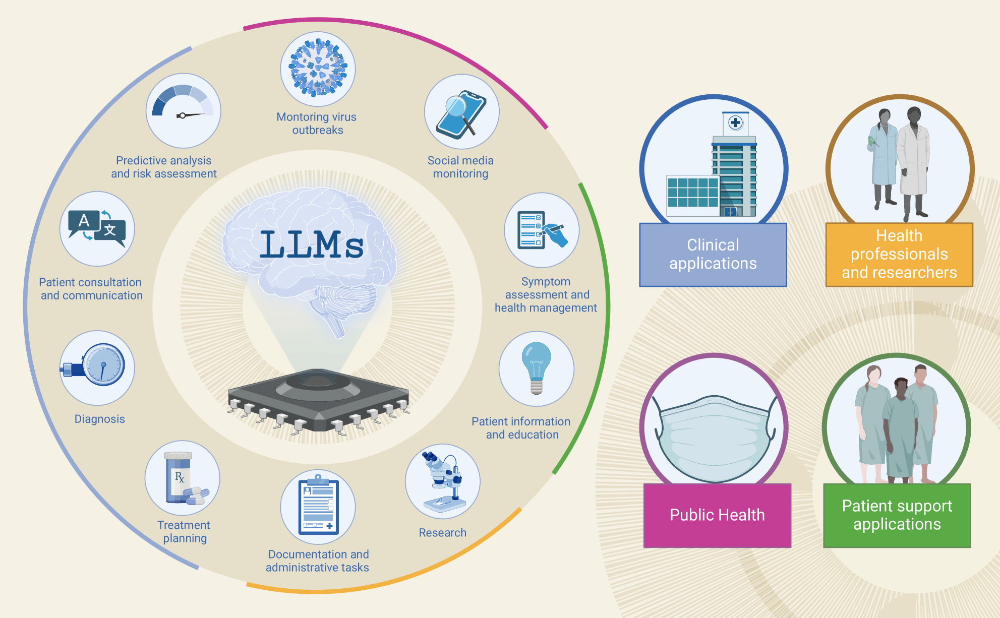
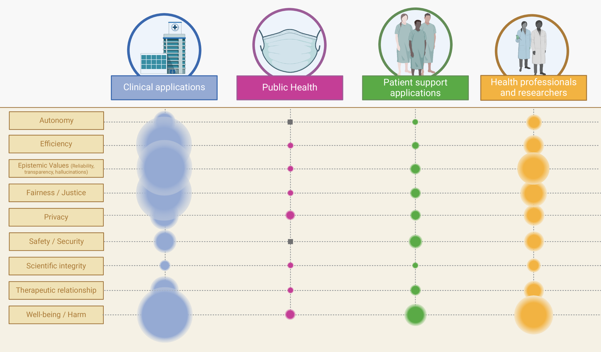

# 本研究通过系统性回顾，探讨了 ChatGPT 在医学和健康照护领域应用中所涉及的伦理议题，尤其聚焦于大型语言模型 LLMS。

发布时间：2024年03月21日

`LLM应用` `医疗健康` `伦理学`

> The Ethics of ChatGPT in Medicine and Healthcare: A Systematic Review on Large Language Models (LLMs)

# 摘要

> 随着ChatGPT的登场，LLMs在医疗健康领域的热度飙升。尽管它们蕴含诸多潜力优势，但研究人员已指出一系列伦理隐忧。尽管针对个案的研究引发了大量关注，目前关于实际应用及其关联伦理问题的探讨仍缺乏系统全面的梳理。为此，这项研究致力于梳理LLMs在医疗与健康领域当前应用阶段所面临的伦理挑战全景。我们广泛检索了电子数据库和预印服务器，并采用改进后的快速评审法筛选和提取相关研究内容，同时运用混合方法评价研究方法的质量。通过对53项文献进行元聚合整合分析，提炼出四大应用领域，生动揭示了当前LLMs应用正处于积极探索阶段。LLMs在数据分析、个性化信息服务、辅助决策制定、减轻信息损耗及提升信息获取便捷性等方面的优越表现备受赞誉。不过，我们同时也揭示了一系列反复出现的伦理难题，包括公平性、偏见、避免伤害原则、透明度和隐私保护等。尤其值得关注的是，LLMs有可能生成误导性的有害信息或极具说服力但却不准确的内容。对此，业界普遍呼吁加强伦理指导和人为监管。鉴于LLMs在各应用场景中的多样性，建议将伦理引导讨论重新定位，专注于定义适用于各类应用范围内的合理人为监管标准，这需要权衡多种场景需求、差异化的潜在危害风险以及医疗保健领域内对性能可靠性和确定性的不同接受度阈值。此外，亟需深入探究当前LLMs实验性使用的必要性和合理性程度。

> With the introduction of ChatGPT, Large Language Models (LLMs) have received enormous attention in healthcare. Despite their potential benefits, researchers have underscored various ethical implications. While individual instances have drawn much attention, the debate lacks a systematic overview of practical applications currently researched and ethical issues connected to them. Against this background, this work aims to map the ethical landscape surrounding the current stage of deployment of LLMs in medicine and healthcare. Electronic databases and preprint servers were queried using a comprehensive search strategy. Studies were screened and extracted following a modified rapid review approach. Methodological quality was assessed using a hybrid approach. For 53 records, a meta-aggregative synthesis was performed. Four fields of applications emerged and testify to a vivid exploration phase. Advantages of using LLMs are attributed to their capacity in data analysis, personalized information provisioning, support in decision-making, mitigating information loss and enhancing information accessibility. However, we also identifies recurrent ethical concerns connected to fairness, bias, non-maleficence, transparency, and privacy. A distinctive concern is the tendency to produce harmful misinformation or convincingly but inaccurate content. A recurrent plea for ethical guidance and human oversight is evident. Given the variety of use cases, it is suggested that the ethical guidance debate be reframed to focus on defining what constitutes acceptable human oversight across the spectrum of applications. This involves considering diverse settings, varying potentials for harm, and different acceptable thresholds for performance and certainty in healthcare. In addition, a critical inquiry is necessary to determine the extent to which the current experimental use of LLMs is necessary and justified.

[Arxiv](https://arxiv.org/abs/2403.14473)