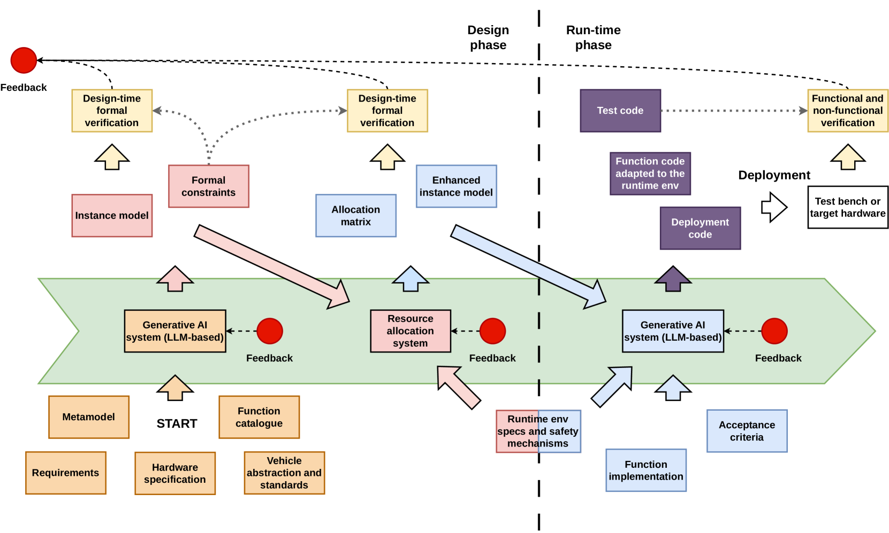

# 致力于实现软件定义车辆的单体系统化体验，借助自动化与人工智能赋能工作流程，旨在营造一体化的智能操作环境。

发布时间：2024年03月21日

`LLM应用` `车辆工程` `软件开发`

> Towards Single-System Illusion in Software-Defined Vehicles -- Automated, AI-Powered Workflow

> 我们创新性地提出了利用模型和特征方法开发车辆软件系统的新途径，在此过程中并不预先设定最终架构，而是根据一系列条件、需求及硬件架构，在保持“单一系统一致性”（即应用在逻辑上一致的环境中运行）的同时，通过迭代搜索和优化来逐步形成架构。本方法的一大亮点是将现代强大的生成式AI技术——尤其是大型语言模型（LLMs）——融入其中。随着该领域近期的技术突破，我们预期LLMs将在处理需求分析、构建形式化的系统模型，乃至生成软件部署规格和测试代码等方面发挥辅助作用。整个流程已实现高度自动化，每一步骤均有相应的反馈生成。

> We propose a novel model- and feature-based approach to development of vehicle software systems, where the end architecture is not explicitly defined. Instead, it emerges from an iterative process of search and optimization given certain constraints, requirements and hardware architecture, while retaining the property of single-system illusion, where applications run in a logically uniform environment. One of the key points of the presented approach is the inclusion of modern generative AI, specifically Large Language Models (LLMs), in the loop. With the recent advances in the field, we expect that the LLMs will be able to assist in processing of requirements, generation of formal system models, as well as generation of software deployment specification and test code. The resulting pipeline is automated to a large extent, with feedback being generated at each step.

[Arxiv](https://arxiv.org/abs/2403.14460)