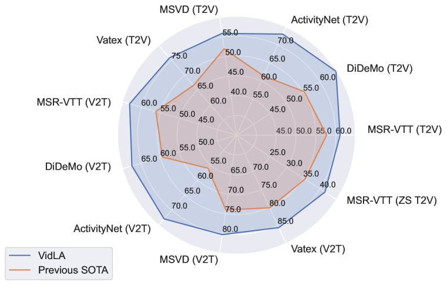
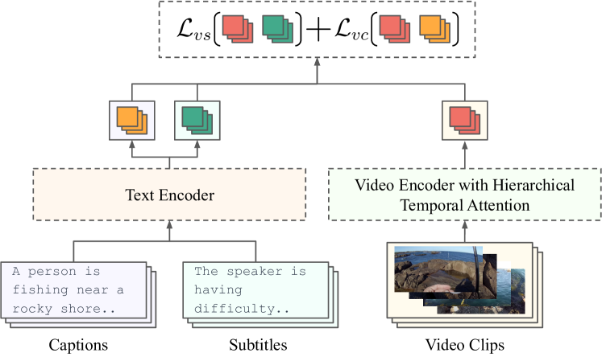
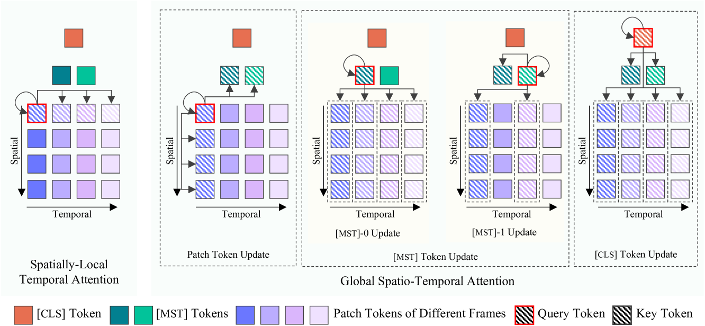
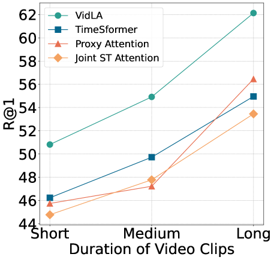
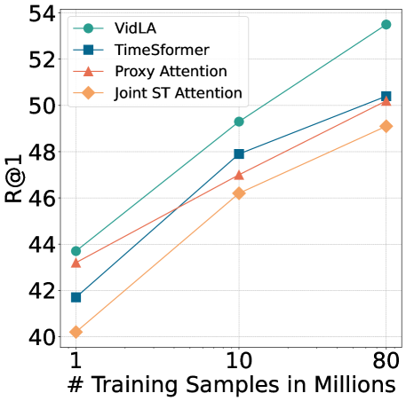
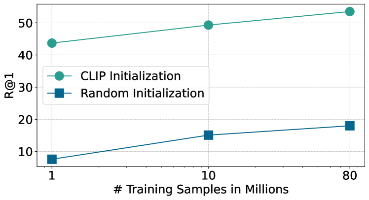

# VidLA 是一种针对大规模视频与语言深度对齐的技术。

发布时间：2024年03月21日

`Agent` `视频理解`

> VidLA: Video-Language Alignment at Scale

> 在这篇论文中，我们创新性地提出了一种名为VidLA的大规模视频与语言对齐方案。针对先前方法无法兼顾短时序和长时序依赖关系、且架构复杂不易融入预训练图像-文本模型的问题，我们简化网络架构，采用一套按层次处理不同时间分辨率数据令牌的方法，贴合视频内在的时间层级特性。通过使用简洁的双塔式架构，我们成功地利用预训练的图像-文本模型初始化视频-语言模型，进而显著提升性能。其次，鉴于当前视频-语言对齐技术受限于缺乏高质量、大规模的语义对齐训练数据，我们运用最新的大型语言模型，精心打造迄今为止最大且具备更好视觉锚定能力的视频-语言数据集。并且，不同于仅包含短视频片段的传统数据集，我们的数据集包含丰富多样的时长视频片段，助力时序层次数据令牌在不同时间尺度下抽取更优的特征表示。综合实验结果表明，我们的新方法在多项检索基准测试中取得突破性进展，尤其在处理较长视频时效果显著，并在分类基准测试中展现出了强劲的竞争实力。

> In this paper, we propose VidLA, an approach for video-language alignment at scale. There are two major limitations of previous video-language alignment approaches. First, they do not capture both short-range and long-range temporal dependencies and typically employ complex hierarchical deep network architectures that are hard to integrate with existing pretrained image-text foundation models. To effectively address this limitation, we instead keep the network architecture simple and use a set of data tokens that operate at different temporal resolutions in a hierarchical manner, accounting for the temporally hierarchical nature of videos. By employing a simple two-tower architecture, we are able to initialize our video-language model with pretrained image-text foundation models, thereby boosting the final performance. Second, existing video-language alignment works struggle due to the lack of semantically aligned large-scale training data. To overcome it, we leverage recent LLMs to curate the largest video-language dataset to date with better visual grounding. Furthermore, unlike existing video-text datasets which only contain short clips, our dataset is enriched with video clips of varying durations to aid our temporally hierarchical data tokens in extracting better representations at varying temporal scales. Overall, empirical results show that our proposed approach surpasses state-of-the-art methods on multiple retrieval benchmarks, especially on longer videos, and performs competitively on classification benchmarks.

[Arxiv](https://arxiv.org/abs/2403.14870)