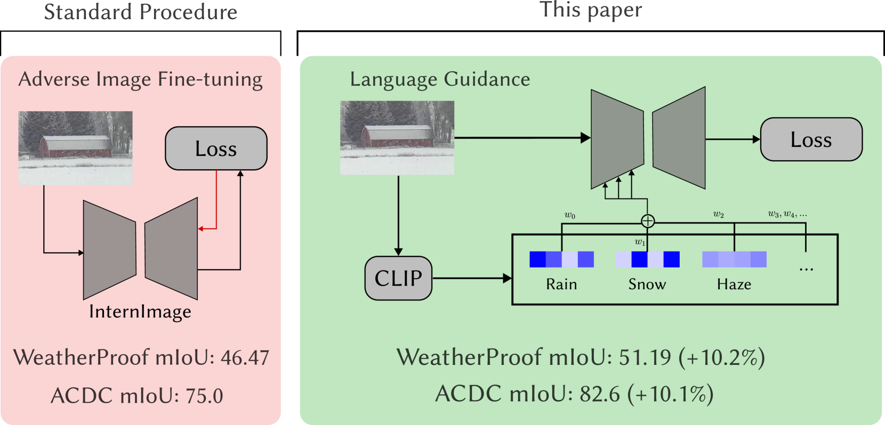
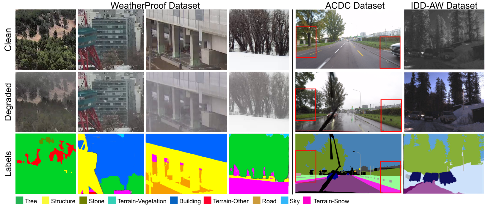
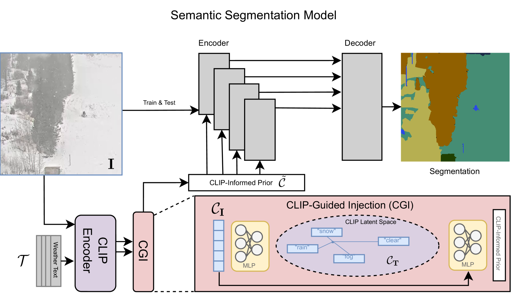
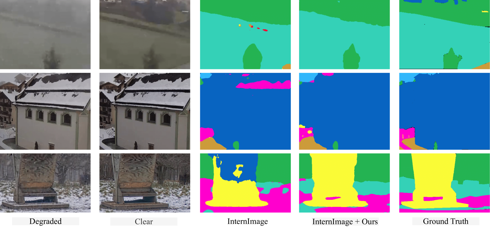

# WeatherProof——借力语言引导优化恶劣天气下的语义分割能力

发布时间：2024年03月21日

`Agent` `图像处理` `气象学`

> WeatherProof: Leveraging Language Guidance for Semantic Segmentation in Adverse Weather

# 摘要

> 本文提出一种针对恶劣天气环境下图像生成语义分割图的新方法。我们在雨、雾、雪等恶劣气候影响下的图像上考察现有模型，发现其性能明显低于晴朗天气下的表现。为此，我们创建了首个具有精准匹配的晴天与恶劣天气图像对的语义分割数据集——WeatherProof，确保场景结构一致。通过对该数据集的研究，我们揭示了现有模型在应对复杂天气效应时的失效模式。为增强模型对恶劣天气的适应性，我们创新性地引入语言引导策略，识别并以“附加信息”的形式注入恶劣天气条件的影响。采用此语言引导训练的模型在WeatherProof数据集上mIoU指标提升高达10.2%，在广泛应用的ACDC数据集上，相比传统训练方法mIoU提高了最多8.44%，相较于先前最先进的方法在ACDC数据集上的mIoU也提升了最高6.21%。

> We propose a method to infer semantic segmentation maps from images captured under adverse weather conditions. We begin by examining existing models on images degraded by weather conditions such as rain, fog, or snow, and found that they exhibit a large performance drop as compared to those captured under clear weather. To control for changes in scene structures, we propose WeatherProof, the first semantic segmentation dataset with accurate clear and adverse weather image pairs that share an underlying scene. Through this dataset, we analyze the error modes in existing models and found that they were sensitive to the highly complex combination of different weather effects induced on the image during capture. To improve robustness, we propose a way to use language as guidance by identifying contributions of adverse weather conditions and injecting that as "side information". Models trained using our language guidance exhibit performance gains by up to 10.2% in mIoU on WeatherProof, up to 8.44% in mIoU on the widely used ACDC dataset compared to standard training techniques, and up to 6.21% in mIoU on the ACDC dataset as compared to previous SOTA methods.

[Arxiv](https://arxiv.org/abs/2403.14874)