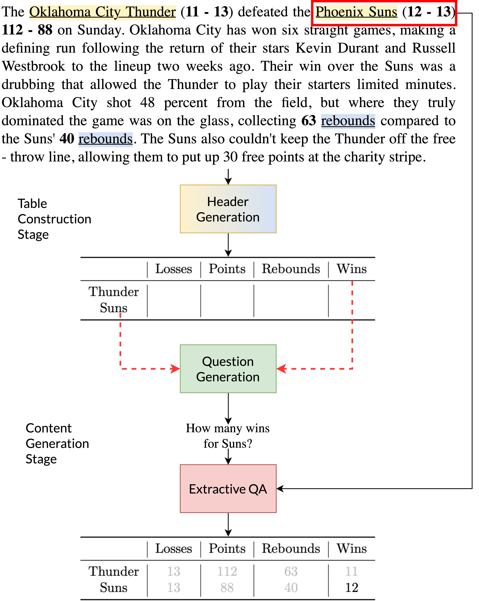

# gTBLS 是一种利用条件问题回答技术，从文本中自动生成表格的方法。

发布时间：2024年03月21日

`LLM应用` `文本处理` `表格生成`

> gTBLS: Generating Tables from Text by Conditional Question Answering

> 将海量非结构化文本提炼成结构紧凑的表格，是一道待解的科研难题。以往方法在自动生成表格时，会面临确保表格语法合法性的重大挑战，它们通常通过在Transformer注意力机制中增加参数来聚焦特定行和列标题。不同于这类单一阶段手段，本篇论文提出了一种双阶段方法——生成式表格模型(gTBLS)。首先，它从文本中推断出表格的结构信息（包括行标题和列标题）；其次，利用这些标题构建问题，并对因果语言模型进行精细化调整以解答问题。值得一提的是，gTBLS方法还能够接纳预训练的大规模语言模型，在零样本设置下发挥效用，为不宜微调场景下的表格生成提供了一个解决方案。实验证明，在E2E、WikiTableText、WikiBio及RotoWire数据集上的表格构建任务中，gTBLS较前人方法提升了最高达10%的BERTScore指标，在表格内容生成任务上则实现了高达20%的提升。

> Distilling large, unstructured text into a structured, condensed form such as tables is an open research problem. One of the primary challenges in automatically generating tables is ensuring their syntactic validity. Prior approaches address this challenge by including additional parameters in the Transformer's attention mechanism to attend to specific rows and column headers. In contrast to this single-stage method, this paper presents a two-stage approach called Generative Tables (gTBLS). The first stage infers table structure (row and column headers) from the text. The second stage formulates questions using these headers and fine-tunes a causal language model to answer them. Furthermore, the gTBLS approach is amenable to the utilization of pre-trained Large Language Models in a zero-shot configuration, presenting a solution for table generation in situations where fine-tuning is not feasible. gTBLS improves prior approaches by up to 10% in BERTScore on the table construction task and up to 20% on the table content generation task of the E2E, WikiTableText, WikiBio, and RotoWire datasets.

[Arxiv](https://arxiv.org/abs/2403.14457)