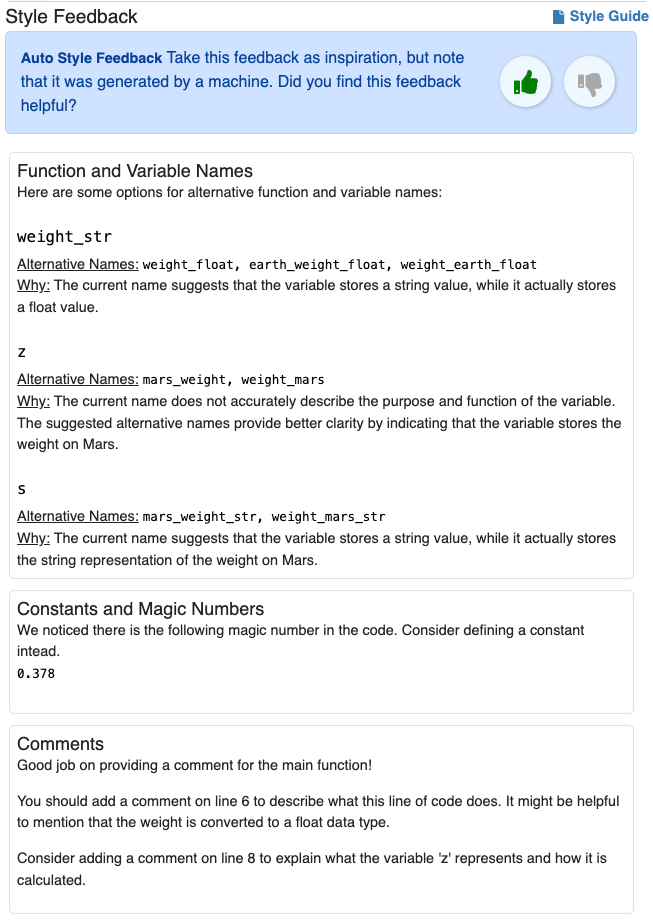
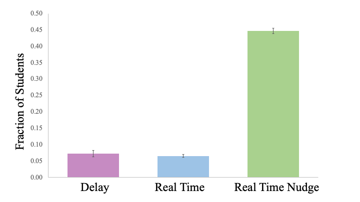
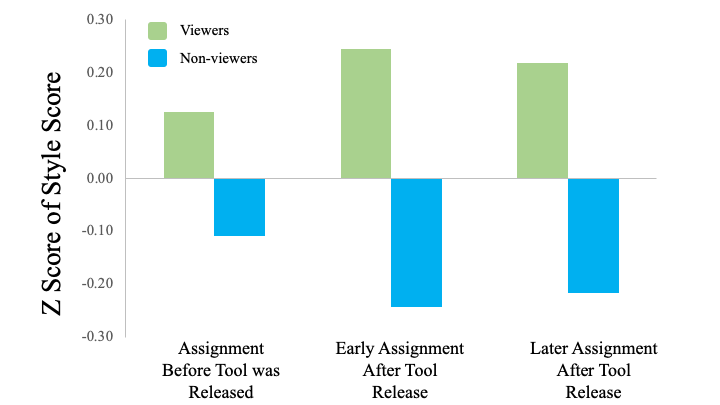
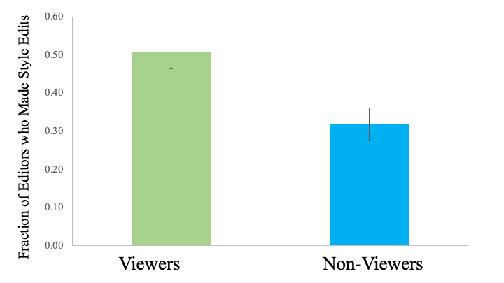
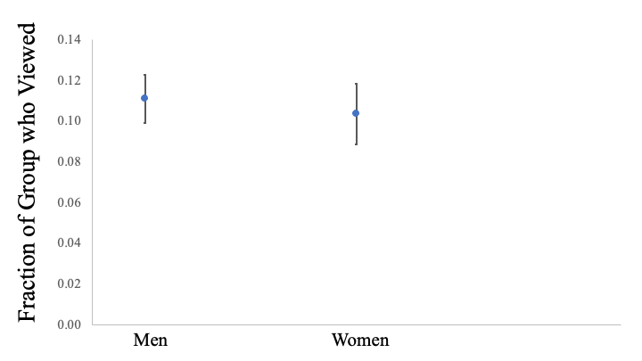
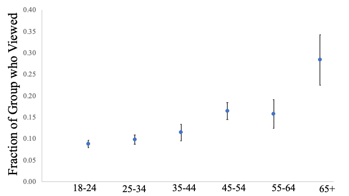
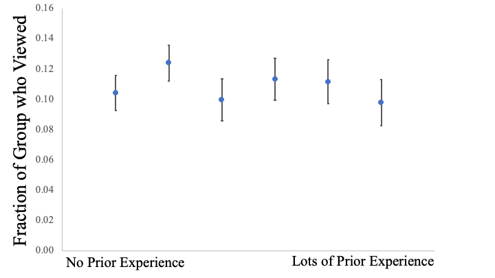

# 在一项全球课程中，AI 教授如何实现优雅编码，通过适时、公正且具有建设性的风格反馈，提升学员编程水平。（注：由于原句较短，已一步到位进行生动活泼、简洁优雅的翻译，无需额外步骤。）

发布时间：2024年03月22日

`LLM应用` `编程教育`

> AI Teaches the Art of Elegant Coding: Timely, Fair, and Helpful Style Feedback in a Global Course

> 在CS1教学中，培养学生编写优雅、可复用且易懂的代码至关重要，但如何及时有效地提供“代码风格反馈”却是一项难以规模化解决的问题。本文分享了我们在大型在线CS1课程“Code in Place”中运用一款基于最新LLMs技术的实时风格反馈工具的经验。该工具不仅安全可靠，而且专为满足学生需求而精心设计。我们在一项涵盖了8000多名全球各地学生的课堂上应用了这款实时风格反馈工具RTSF，并进行了随机对照实验以揭示其优势。实验表明，实时获得风格反馈的学生比延迟获取反馈的学生查看和参与反馈的可能性高出五倍；不仅如此，查看反馈的学生中有超过79%的人会根据反馈意见对代码进行显著的风格改进。同时，我们也深入探讨了LLM驱动的反馈工具在实际应用中的可行性和潜在隐患，包括反馈质量、LLM技术的局限、如何实现一致性、标准化及防止出现人口统计学偏差等问题，这些均为构建适用于学生群体的高效工具所不可或缺的关注点。

> Teaching students how to write code that is elegant, reusable, and comprehensible is a fundamental part of CS1 education. However, providing this "style feedback" in a timely manner has proven difficult to scale. In this paper, we present our experience deploying a novel, real-time style feedback tool in Code in Place, a large-scale online CS1 course. Our tool is based on the latest breakthroughs in large-language models (LLMs) and was carefully designed to be safe and helpful for students. We used our Real-Time Style Feedback tool (RTSF) in a class with over 8,000 diverse students from across the globe and ran a randomized control trial to understand its benefits. We show that students who received style feedback in real-time were five times more likely to view and engage with their feedback compared to students who received delayed feedback. Moreover, those who viewed feedback were more likely to make significant style-related edits to their code, with over 79% of these edits directly incorporating their feedback. We also discuss the practicality and dangers of LLM-based tools for feedback, investigating the quality of the feedback generated, LLM limitations, and techniques for consistency, standardization, and safeguarding against demographic bias, all of which are crucial for a tool utilized by students.

[Arxiv](https://arxiv.org/abs/2403.14986)