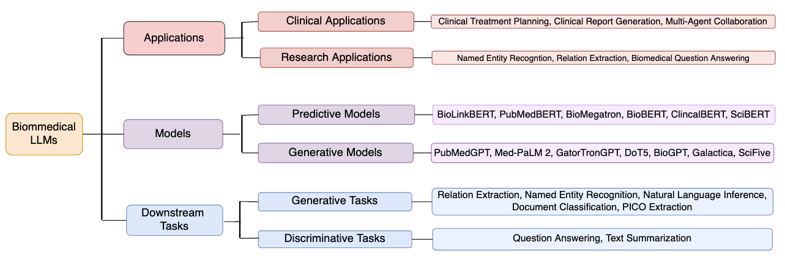
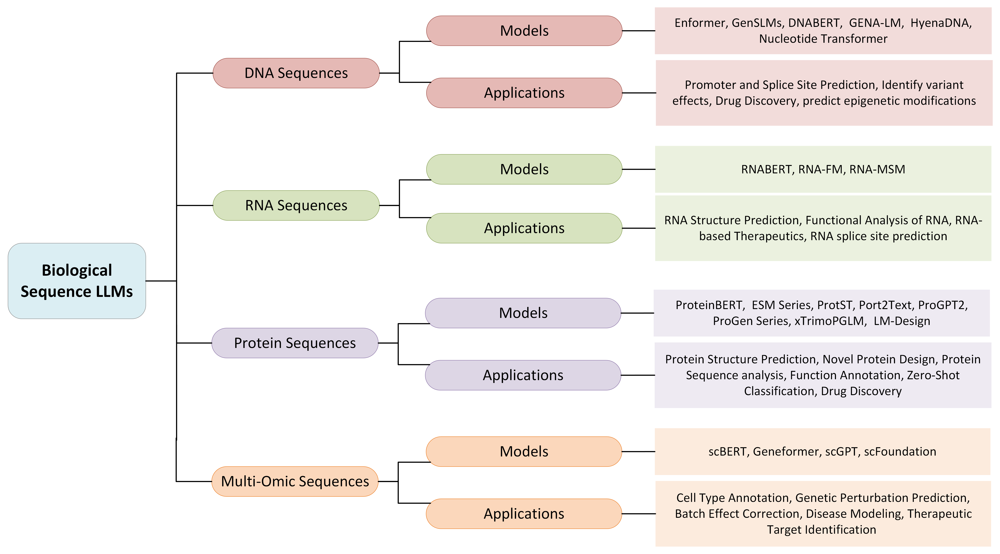
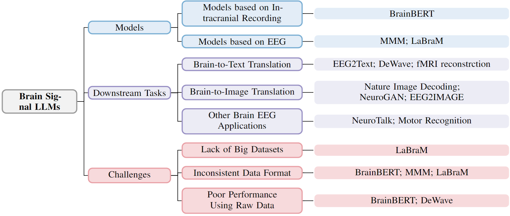

# 大型语言模型时代的生物医学AI前沿探索

发布时间：2024年03月22日

`LLM应用` `生物医学`

> AI for Biomedicine in the Era of Large Language Models

# 摘要

> 人工智能在生物医学领域的应用广泛而深入，既能在原子级别解构量子系统，又能在分子级别预测化学物质及蛋白质结构，甚至能对传染病等社会现象进行预测。近年来，如ChatGPT这样的大型语言模型在处理自然语言任务（如翻译、聊天机器人搭建及问答系统）时展现出强大的实力。当我们将目光投向生物医学数据时，不难发现它们与自然语言在序列特性上有异曲同工之妙——例如文本形式的医学文献和病历记录、有序排列的生物序列和测序数据，以及时间序列的脑电波信号等。那么，是否可以借助新型大型语言模型的力量驱动生物医学知识的创新发现呢？在这篇综述中，我们将聚焦大型语言模型在三大类生物医学数据——文本信息、生物序列以及脑信号——上的应用探索，并进一步剖析其在生物医学研究中面临的挑战，包括如何确保模型的可靠性、实现个性化定制以及适应多模态数据的表征方式。

> The capabilities of AI for biomedicine span a wide spectrum, from the atomic level, where it solves partial differential equations for quantum systems, to the molecular level, predicting chemical or protein structures, and further extending to societal predictions like infectious disease outbreaks. Recent advancements in large language models, exemplified by models like ChatGPT, have showcased significant prowess in natural language tasks, such as translating languages, constructing chatbots, and answering questions. When we consider biomedical data, we observe a resemblance to natural language in terms of sequences: biomedical literature and health records presented as text, biological sequences or sequencing data arranged in sequences, or sensor data like brain signals as time series. The question arises: Can we harness the potential of recent large language models to drive biomedical knowledge discoveries? In this survey, we will explore the application of large language models to three crucial categories of biomedical data: 1) textual data, 2) biological sequences, and 3) brain signals. Furthermore, we will delve into large language model challenges in biomedical research, including ensuring trustworthiness, achieving personalization, and adapting to multi-modal data representation

[Arxiv](https://arxiv.org/abs/2403.15673)