# 【AllHands 环节】借助大型语言模型，探讨大规模逐字反馈相关问题，欢迎提出您的任何疑问！

发布时间：2024年03月22日

`LLM应用` `软件开发`

> AllHands: Ask Me Anything on Large-scale Verbatim Feedback via Large Language Models

> 原文反馈是软件开发不可或缺的宝贵资源，但从中提炼有价值见解却颇具挑战。本文推出 Allhands，一款创新的分析框架，借助大型语言模型（LLMs）的力量，通过自然语言界面实现大规模反馈的深度分析。Allhands 沿袭标准反馈分析流程，先运用分类和主题建模技术将反馈转化为结构化增强形式，通过整合 LLMs 提升分析的精确性、稳定性、普适性和用户体验。然后，利用 LLM 代理智能解析用户用自然语言提出的各类反馈相关问题，并转换为可执行的 Python 代码，最终输出包含文字、代码、表格和图片在内的丰富多模态回复。我们在三个各具特色的反馈数据集中对 Allhands 进行了全面评估，实验结果显示 Allhands 在整个分析过程中，无论是分类还是主题建模阶段，都能取得显著效果，并成功为用户提供“一问便答”的全方位、准确且易读的答案服务。目前，我们所知的 Allhands 是首款能够通过自然语言界面满足多元化与个性化需求的综合反馈分析框架，致力于深入挖掘反馈中的真知灼见。

> Verbatim feedback constitutes a valuable repository of user experiences, opinions, and requirements essential for software development. Effectively and efficiently extracting valuable insights from such data poses a challenging task. This paper introduces Allhands , an innovative analytic framework designed for large-scale feedback analysis through a natural language interface, leveraging large language models (LLMs). Allhands adheres to a conventional feedback analytic workflow, initially conducting classification and topic modeling on the feedback to convert them into a structurally augmented format, incorporating LLMs to enhance accuracy, robustness, generalization, and user-friendliness. Subsequently, an LLM agent is employed to interpret users' diverse questions in natural language on feedback, translating them into Python code for execution, and delivering comprehensive multi-modal responses, including text, code, tables, and images.
  We evaluate Allhands across three diverse feedback datasets. The experiments demonstrate that Allhands achieves superior efficacy at all stages of analysis, including classification and topic modeling, eventually providing users with an ``ask me anything'' experience with comprehensive, correct and human-readable response. To the best of our knowledge, Allhands stands as the first comprehensive feedback analysis framework that supports diverse and customized requirements for insight extraction through a natural language interface.

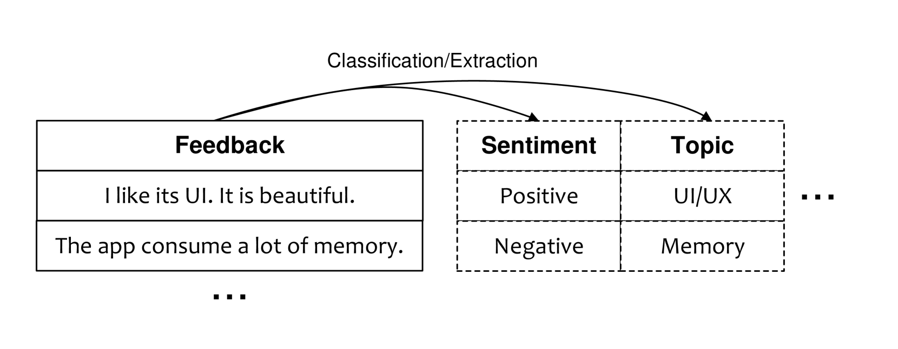

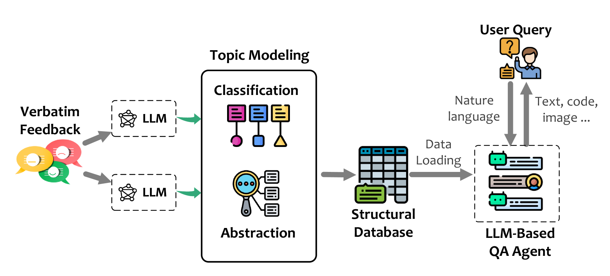

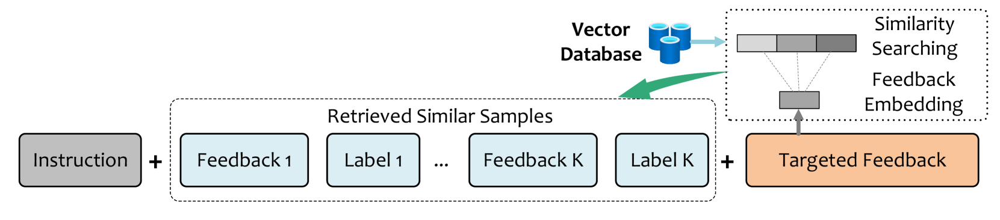

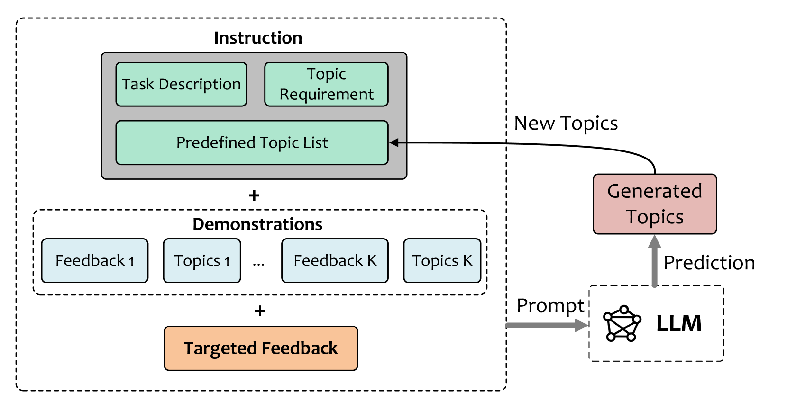

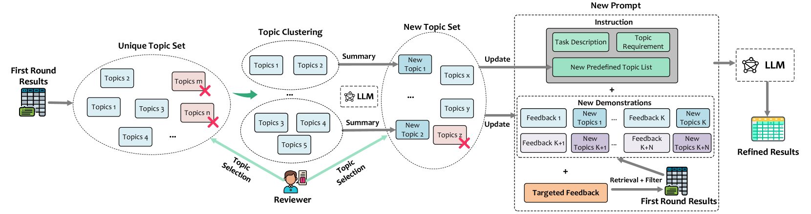

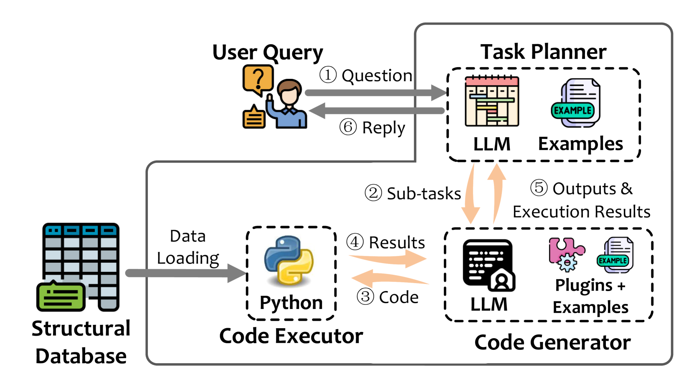

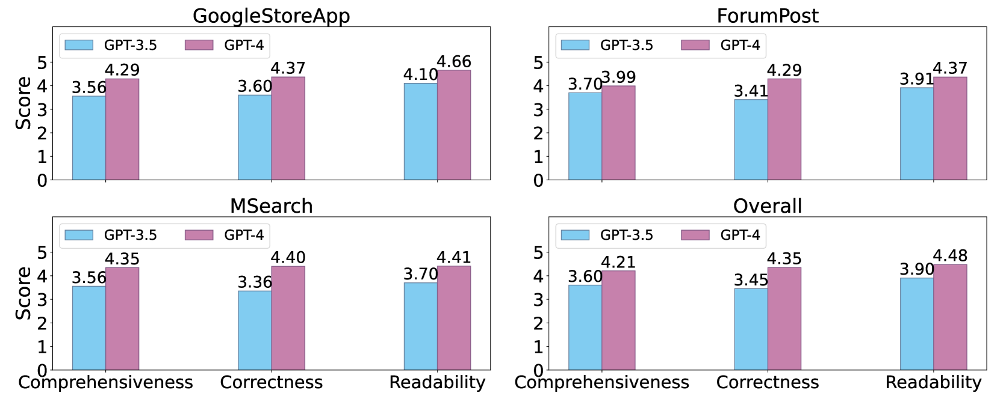

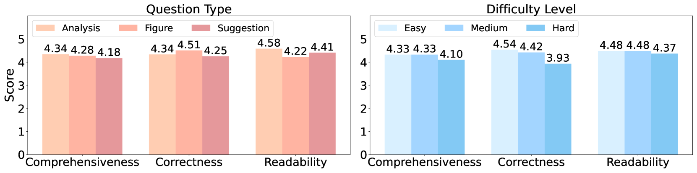

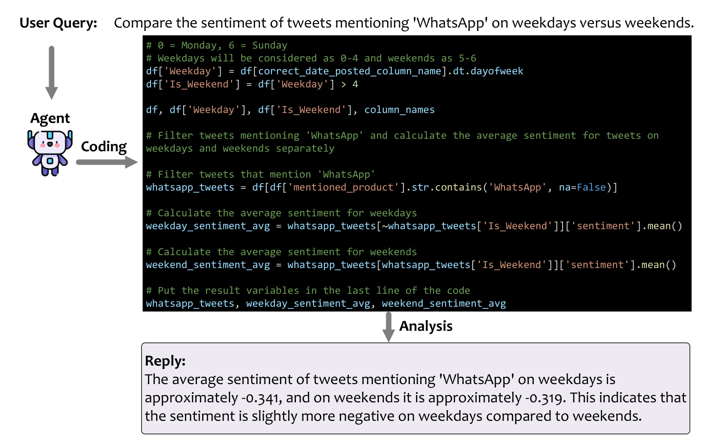

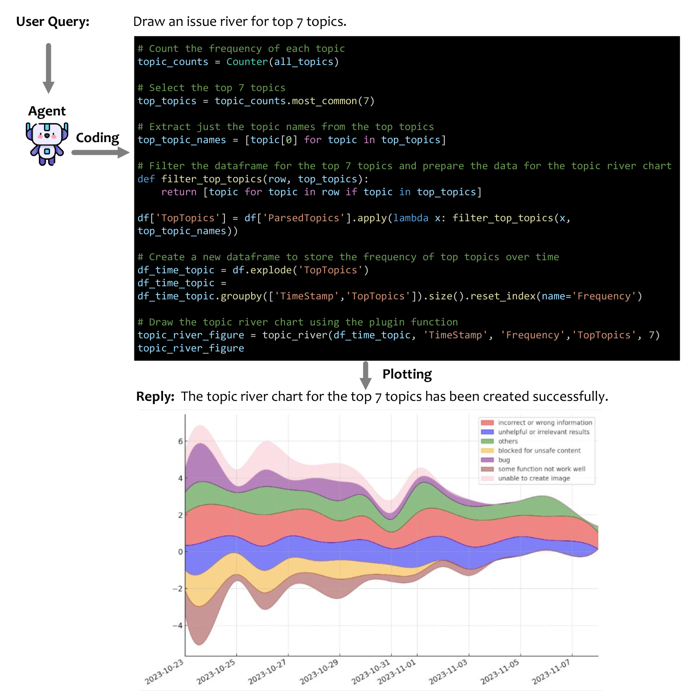

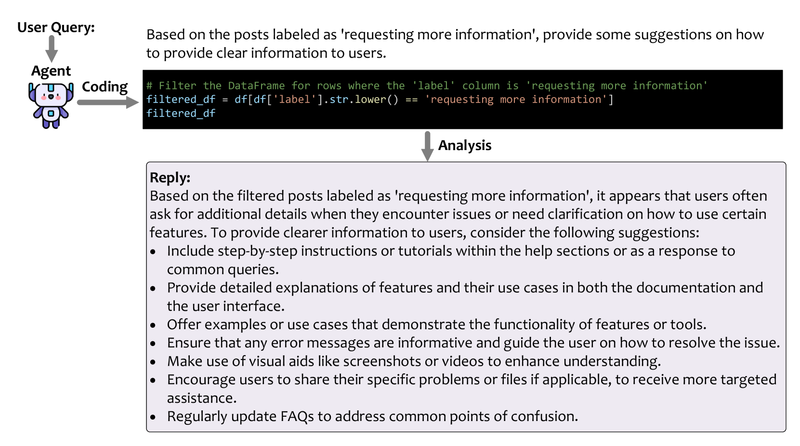

[Arxiv](https://arxiv.org/abs/2403.15157)