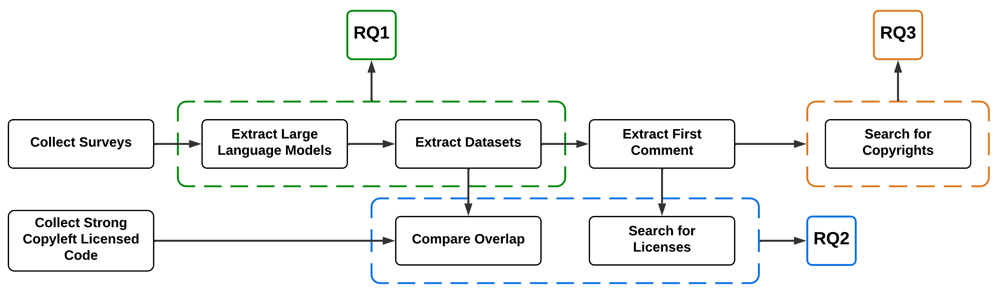
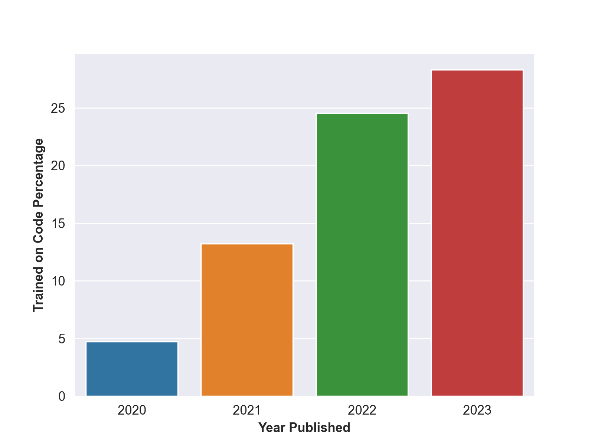
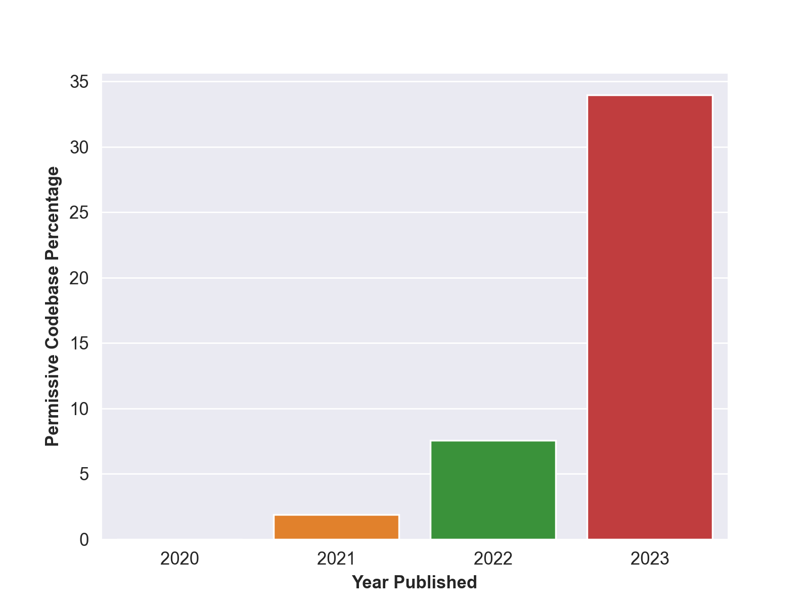

# 针对大型语言模型训练数据集中代码许可侵权现象的探索性研究

发布时间：2024年03月22日

`LLM应用` `软件开发` `法律合规`

> An Exploratory Investigation into Code License Infringements in Large Language Model Training Datasets

> 针对大型语言模型训练是否会触犯代码授权的问题，以及是否存在可安全用于训练且不违规的数据集，我们的研究深入探讨了这一现状及将代码融入大型语言模型训练的重要性。我们收集了53个基于文件级代码训练的大规模语言模型，并对其使用的数据集进行了分析，特别是考察了它们与一个完全由强copyleft代码组成的数据集的重叠程度。结果显示，即使是从具有相应仓库授权的数据集中筛选出的数据集，也无一例外地存在许可不一致的问题。在总计5.14亿份代码文件中，我们发现了3800万份与强copyleft数据集中的完全相同重复文件。同时，在1.71亿个文件头部注释中，我们鉴别出1600万份含有强copyleft授权，另有1100万份虽然未明示授权但却表达了不鼓励复制的注释。鉴于我们的研究揭示了基于代码训练的大型语言模型普遍存在许可不一致问题，我们建议研究者和整个社区应优先制定并采纳最佳的数据集创建与管理实践。

> Does the training of large language models potentially infringe upon code licenses? Furthermore, are there any datasets available that can be safely used for training these models without violating such licenses? In our study, we assess the current trends in the field and the importance of incorporating code into the training of large language models. Additionally, we examine publicly available datasets to see whether these models can be trained on them without the risk of legal issues in the future. To accomplish this, we compiled a list of 53 large language models trained on file-level code. We then extracted their datasets and analyzed how much they overlap with a dataset we created, consisting exclusively of strong copyleft code.
  Our analysis revealed that every dataset we examined contained license inconsistencies, despite being selected based on their associated repository licenses. We analyzed a total of 514 million code files, discovering 38 million exact duplicates present in our strong copyleft dataset. Additionally, we examined 171 million file-leading comments, identifying 16 million with strong copyleft licenses and another 11 million comments that discouraged copying without explicitly mentioning a license. Based on the findings of our study, which highlights the pervasive issue of license inconsistencies in large language models trained on code, our recommendation for both researchers and the community is to prioritize the development and adoption of best practices for dataset creation and management.

[Arxiv](https://arxiv.org/abs/2403.15230)