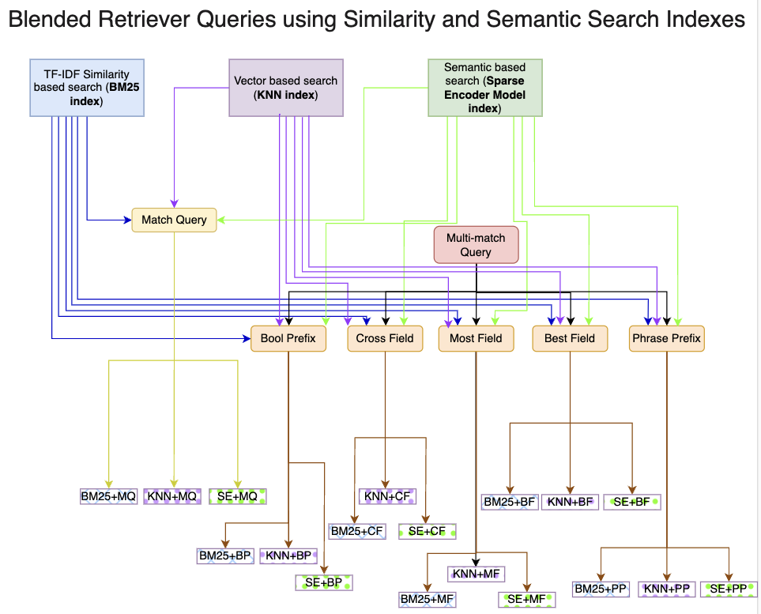
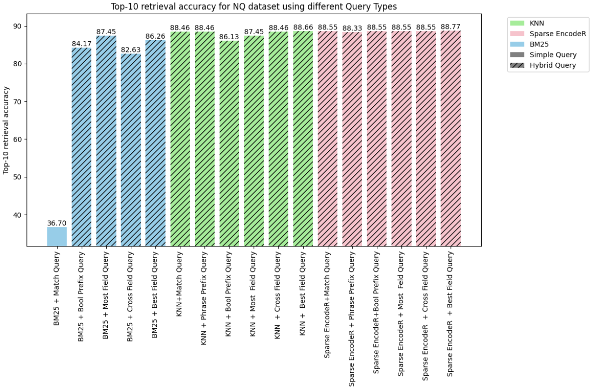
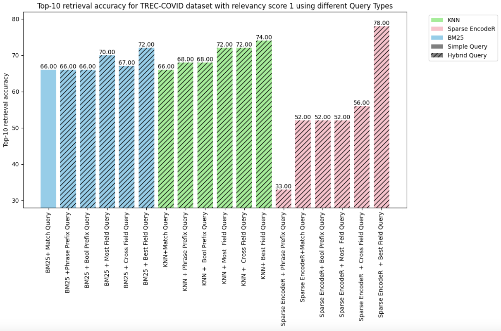
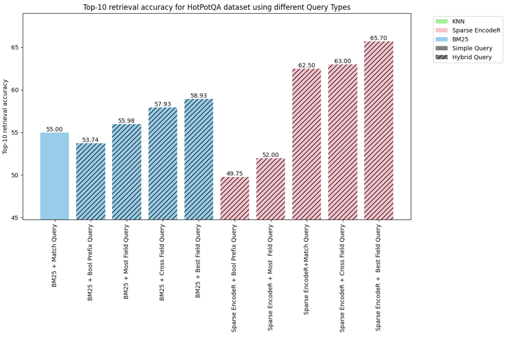
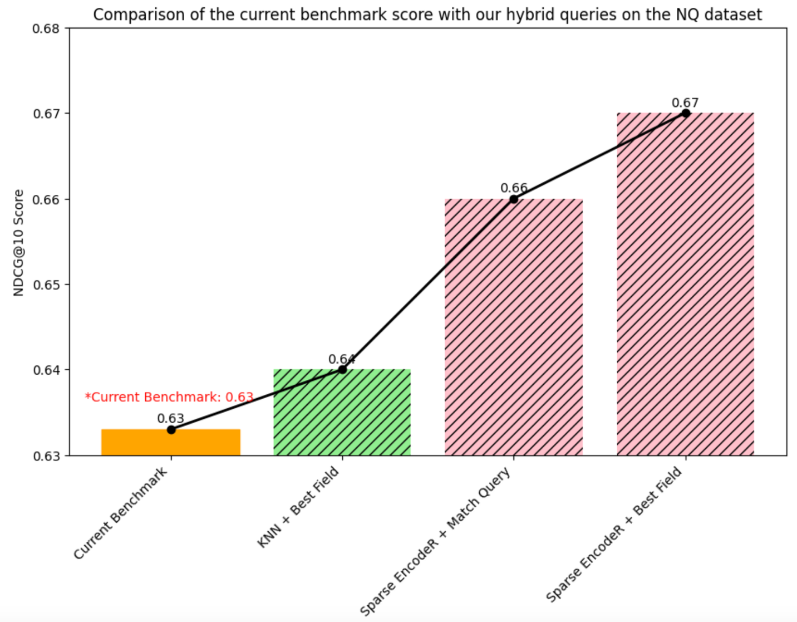
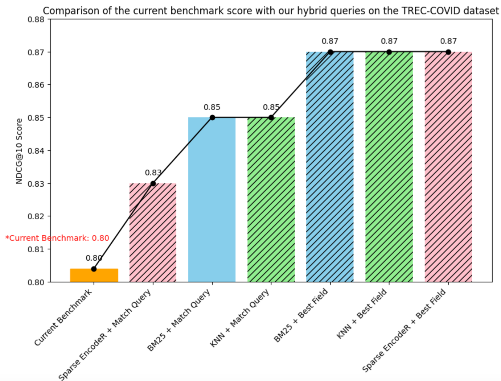
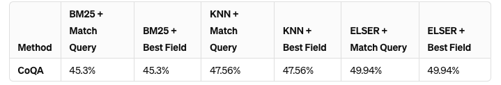
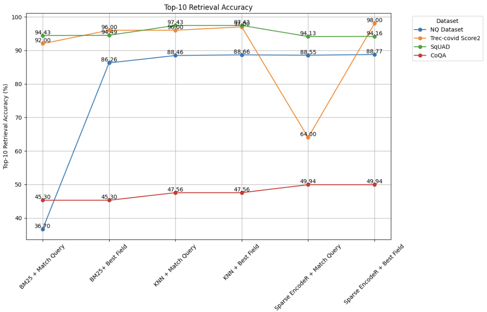
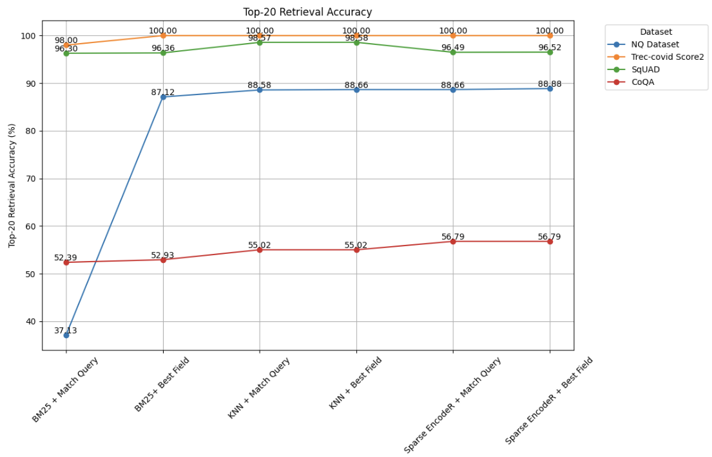

# Blended RAG：融合语义搜索与混合型查询检索，精进RAG技术的准确度

发布时间：2024年03月22日

`RAG` `问答系统` `信息检索`

> Blended RAG: Improving RAG (Retriever-Augmented Generation) Accuracy with Semantic Search and Hybrid Query-Based Retrievers

# 摘要

> 检索增强生成（RAG）技术通过结合大型语言模型（LLM）和私有文档知识库，广泛应用于构建生成式问答系统。但随着文档库规模的增长，提高RAG的准确度变得愈发困难，检索器在其中扮演关键角色，负责从文档库中筛选出最相关的信息来为LLM提供参考。本文提出了一种“混合RAG”新方法，结合了密集向量索引、稀疏编码器索引等语义搜索技术，并采用混合查询策略。研究取得了更佳的检索效果，并在NQ和TREC-COVID等信息检索数据集上创造了新的记录。此外，我们将这种“混合检索器”应用于RAG系统，使得在SQUAD等生成式问答数据集上的表现大幅超越了传统的细调方法。

> Retrieval-Augmented Generation (RAG) is a prevalent approach to infuse a private knowledge base of documents with Large Language Models (LLM) to build Generative Q\&A (Question-Answering) systems. However, RAG accuracy becomes increasingly challenging as the corpus of documents scales up, with Retrievers playing an outsized role in the overall RAG accuracy by extracting the most relevant document from the corpus to provide context to the LLM. In this paper, we propose the 'Blended RAG' method of leveraging semantic search techniques, such as Dense Vector indexes and Sparse Encoder indexes, blended with hybrid query strategies. Our study achieves better retrieval results and sets new benchmarks for IR (Information Retrieval) datasets like NQ and TREC-COVID datasets. We further extend such a 'Blended Retriever' to the RAG system to demonstrate far superior results on Generative Q\&A datasets like SQUAD, even surpassing fine-tuning performance.

[Arxiv](https://arxiv.org/abs/2404.07220)