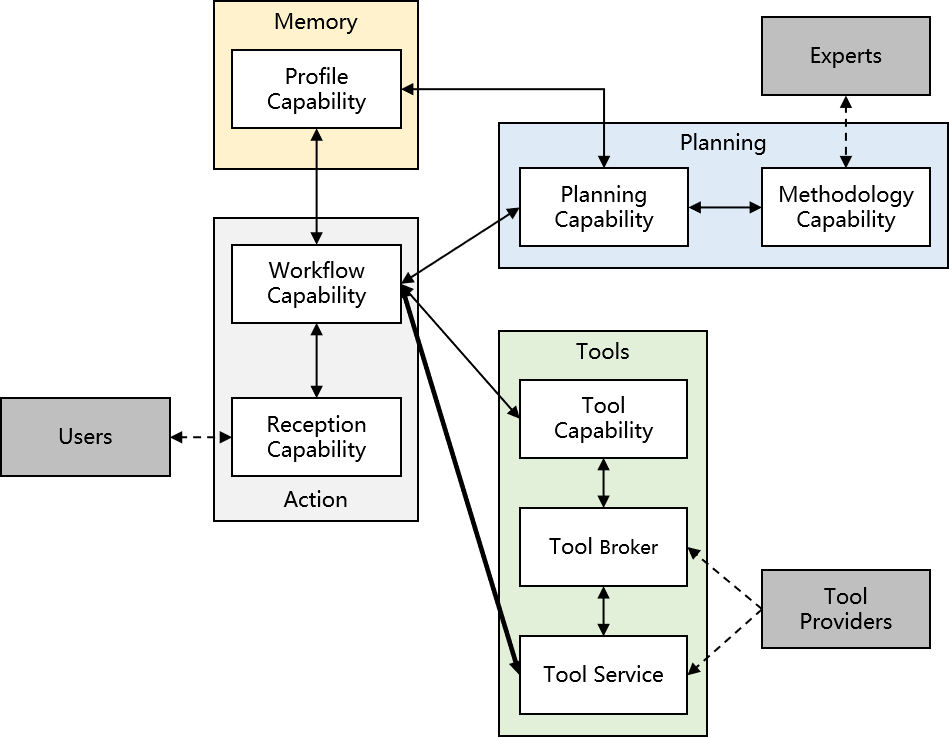
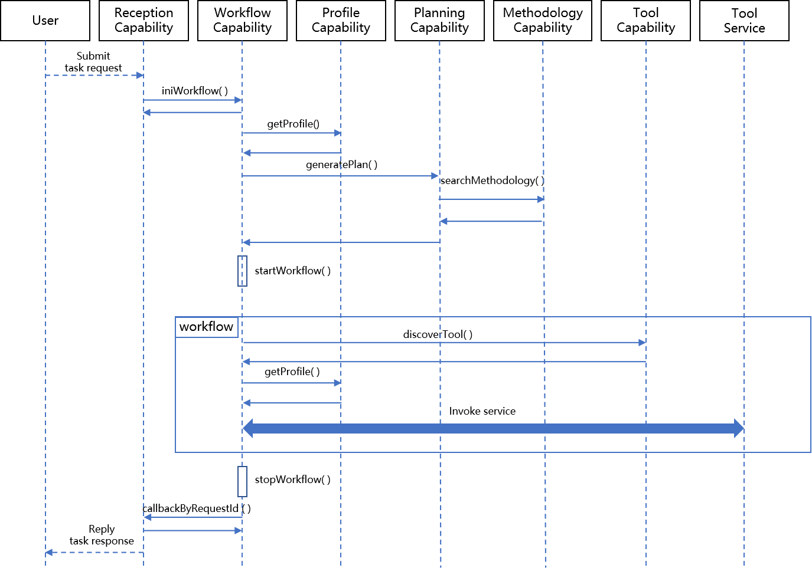
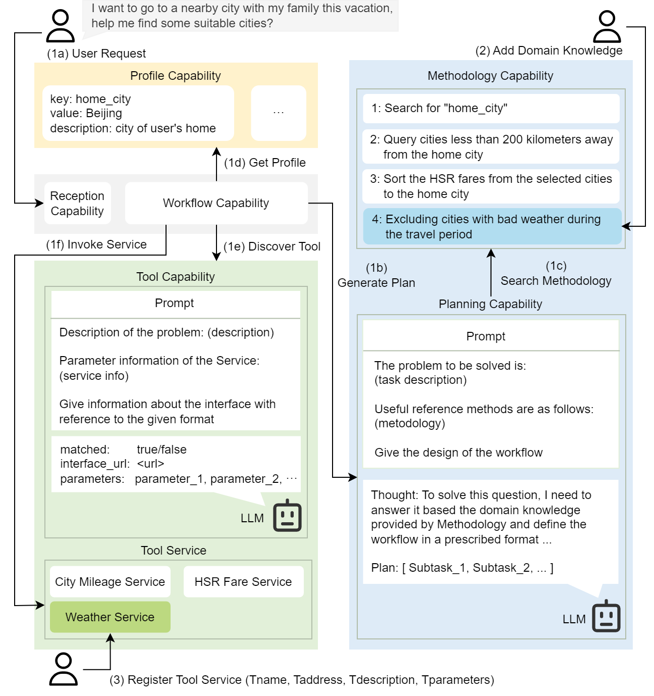

# CACA 代理是一种基于能力协作的人工智能代理，它通过整合多种技能和功能以实现高效的任务执行和智能决策。

发布时间：2024年03月22日

`Agent` `人工智能` `服务计算`

> CACA Agent: Capability Collaboration based AI Agent

> 随着LLMs驱动的AI代理在多元领域展现广泛应用潜力，快速部署与便捷拓展应用场景成为一个亟待解决的问题。过往研究倾向于在一个单一大型模型内部打包所有AI代理的推理功能，导致模型结构复杂化，且限制了功能扩展性。为此，本文提出CACA Agent（基于能力协同的AI代理），借鉴服务计算的开放架构思想。CACA Agent整合一套协作能力组件来构建AI代理，既降低了对单一LLM的依赖度，又提升了AI代理的规划能力和配套工具的延展性。通过演示实例，我们展示了CACA Agent的实际运作及其应用场景灵活扩展的优势。

> As AI Agents based on Large Language Models (LLMs) have shown potential in practical applications across various fields, how to quickly deploy an AI agent and how to conveniently expand the application scenario of AI agents has become a challenge. Previous studies mainly focused on implementing all the reasoning capabilities of AI agents within a single LLM, which often makes the model more complex and also reduces the extensibility of AI agent functionality. In this paper, we propose CACA Agent (Capability Collaboration based AI Agent), using an open architecture inspired by service computing. CACA Agent integrates a set of collaborative capabilities to implement AI Agents, not only reducing the dependence on a single LLM, but also enhancing the extensibility of both the planning abilities and the tools available to AI agents. Utilizing the proposed system, we present a demo to illustrate the operation and the application scenario extension of CACA Agent.

[Arxiv](https://arxiv.org/abs/2403.15137)