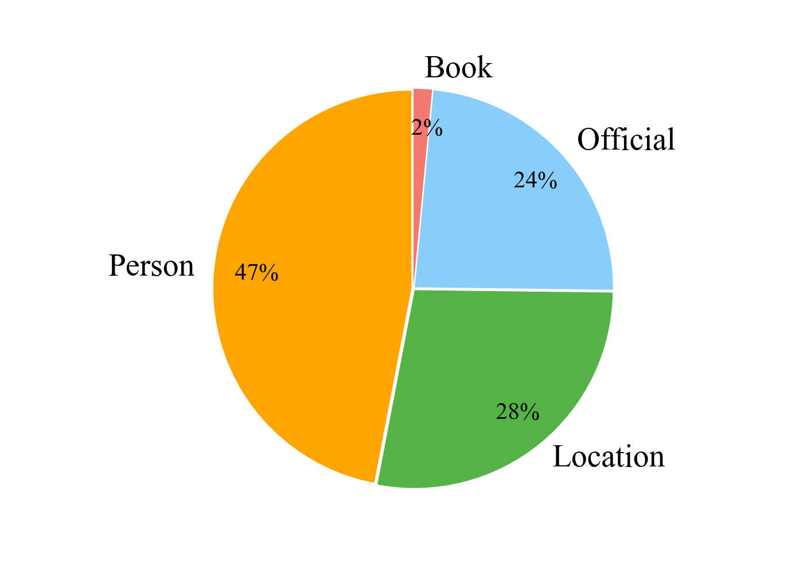
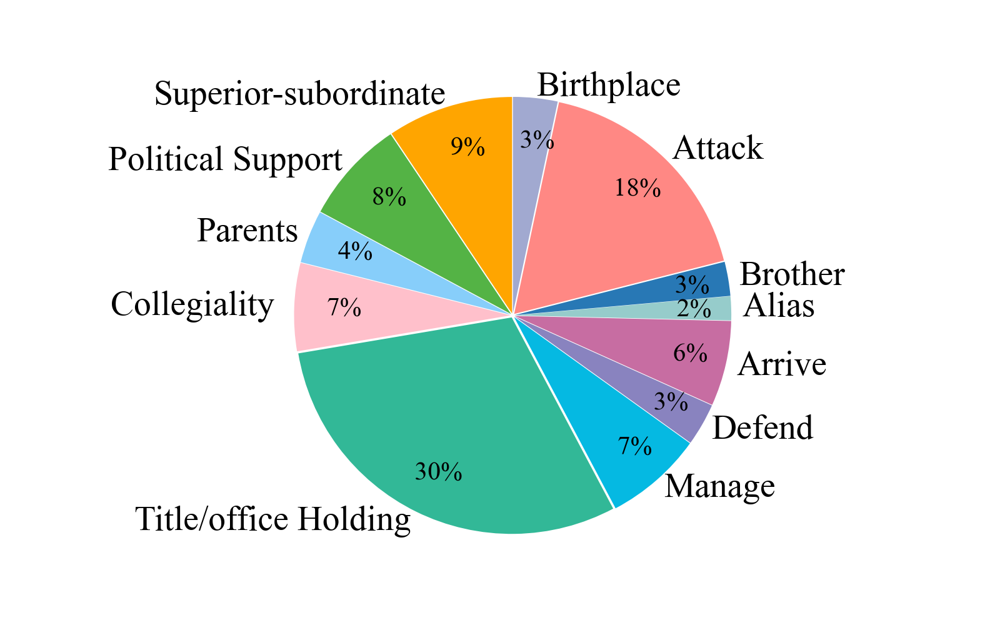
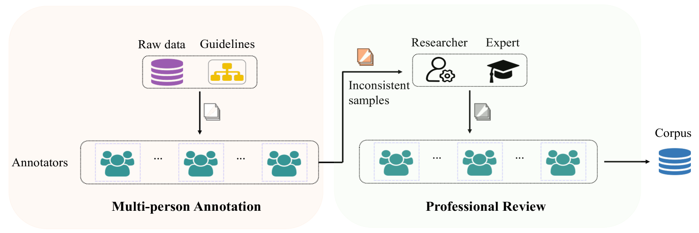
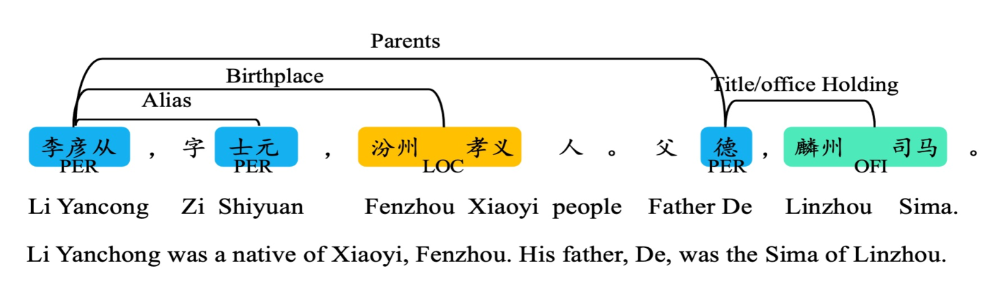

# CHisIEC 是专为古代中国历史打造的信息抽取语料库，旨在服务于对中国古代文献中丰富历史信息的精准抽取与分析。

发布时间：2024年03月22日

`LLM应用` `数字人文科学` `历史文化`

> CHisIEC: An Information Extraction Corpus for Ancient Chinese History

# 摘要

> 在数字人文科学领域，NLP担当重要角色，尤其在推进历史文化遗产文本的结构分析上，如NER和RE等关键技术。为助力古代历史文化的深入探索，我们精心打造并推出了“中国历史信息抽取语料库”（CHisIEC）。此数据集详实丰富，涵盖了自13个朝代跨越1830多年的中国历史跨度，真实展现了历史文献的时间深度和内容多样性。它专注于构建并验证NER和RE任务，含有4种不同实体类型及12种关系类型，总计包含14,194个精细标注的实体和8,609个关系。为了证明我们的数据集兼具可靠性和普适性，我们运用了多种大小与架构的模型进行综合实验，并进一步探究了LLMs在中国古代历史文化相关任务上的应用潜力。您可访问网址\url{https://github.com/tangxuemei1995/CHisIEC}获取该数据集及相关代码。

> Natural Language Processing (NLP) plays a pivotal role in the realm of Digital Humanities (DH) and serves as the cornerstone for advancing the structural analysis of historical and cultural heritage texts. This is particularly true for the domains of named entity recognition (NER) and relation extraction (RE). In our commitment to expediting ancient history and culture, we present the ``Chinese Historical Information Extraction Corpus''(CHisIEC). CHisIEC is a meticulously curated dataset designed to develop and evaluate NER and RE tasks, offering a resource to facilitate research in the field. Spanning a remarkable historical timeline encompassing data from 13 dynasties spanning over 1830 years, CHisIEC epitomizes the extensive temporal range and text heterogeneity inherent in Chinese historical documents. The dataset encompasses four distinct entity types and twelve relation types, resulting in a meticulously labeled dataset comprising 14,194 entities and 8,609 relations. To establish the robustness and versatility of our dataset, we have undertaken comprehensive experimentation involving models of various sizes and paradigms. Additionally, we have evaluated the capabilities of Large Language Models (LLMs) in the context of tasks related to ancient Chinese history. The dataset and code are available at \url{https://github.com/tangxuemei1995/CHisIEC}.

[Arxiv](https://arxiv.org/abs/2403.15088)