# 大型语言模型能否深入探究并运用上下文学习机制呢？

发布时间：2024年03月22日

`Agent` `决策制定`

> Can large language models explore in-context?

# 摘要

> 本次研究探讨当今大型语言模型（LLMs）在强化学习与决策制定的关键能力——探索行为上能达到何种程度，且重点在于未经训练干预时LLMs的原始性能。我们将LLMs置于简单的多臂老虎机环境中作为智能体，仅通过上下文方式提供环境描述及互动历史，即嵌入到LLM的提示信息中。我们采用了多种提示设计方案，对GPT-3.5、GPT-4以及Llama2等模型进行了实验，结果显示若无实质性干预，模型难以稳定展现出探索行为：i)在所有实验中，只有GPT-4配合链式思考推理并辅以外部总结的交互历史（以充分统计形式展现）这一特定配置实现了令人满意的探索表现；ii)其余配置均未能稳定表现出探索行为，即使包含链式思考推理但在历史记录处理上未经总结的情况也不例外。尽管上述发现可被视为积极迹象，但也揭示出在复杂场景下可能难以实施的外部总结对于引导LLM智能体展现理想行为的重要性。因此，我们总结认为，在复杂环境中要赋能基于LLM的决策制定智能体，可能需要借助微调或数据集精选等非琐碎的算法干预手段。

> We investigate the extent to which contemporary Large Language Models (LLMs) can engage in exploration, a core capability in reinforcement learning and decision making. We focus on native performance of existing LLMs, without training interventions. We deploy LLMs as agents in simple multi-armed bandit environments, specifying the environment description and interaction history entirely in-context, i.e., within the LLM prompt. We experiment with GPT-3.5, GPT-4, and Llama2, using a variety of prompt designs, and find that the models do not robustly engage in exploration without substantial interventions: i) Across all of our experiments, only one configuration resulted in satisfactory exploratory behavior: GPT-4 with chain-of-thought reasoning and an externally summarized interaction history, presented as sufficient statistics; ii) All other configurations did not result in robust exploratory behavior, including those with chain-of-thought reasoning but unsummarized history. Although these findings can be interpreted positively, they suggest that external summarization -- which may not be possible in more complex settings -- is important for obtaining desirable behavior from LLM agents. We conclude that non-trivial algorithmic interventions, such as fine-tuning or dataset curation, may be required to empower LLM-based decision making agents in complex settings.

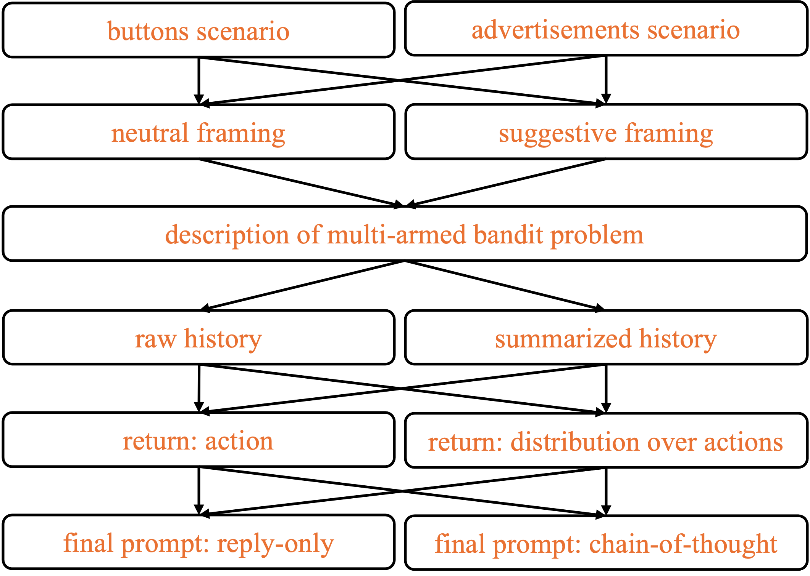

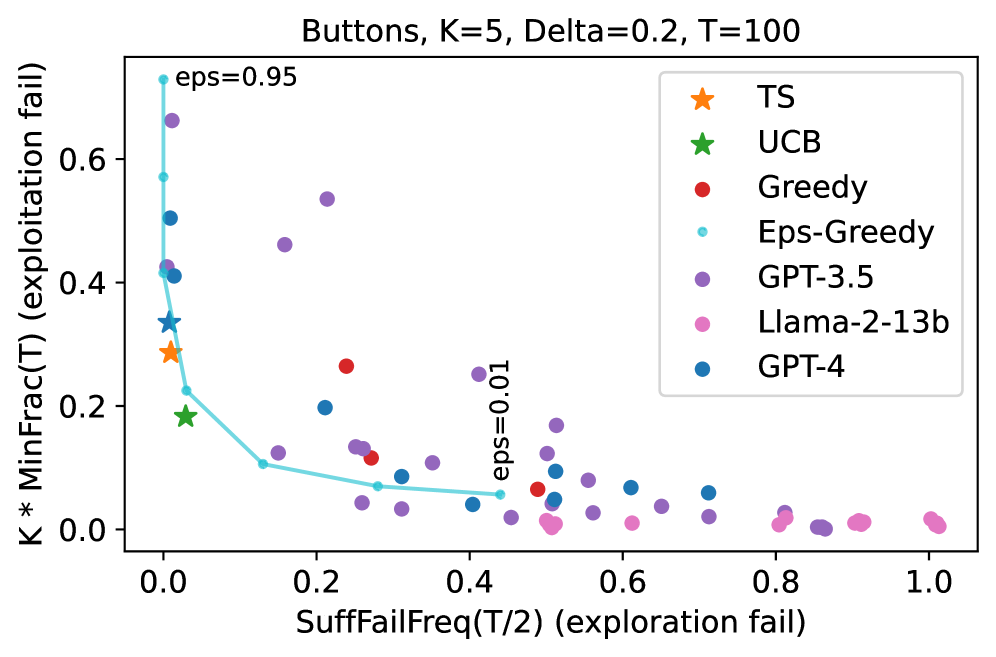

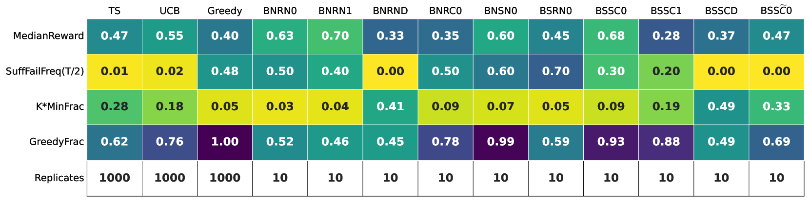

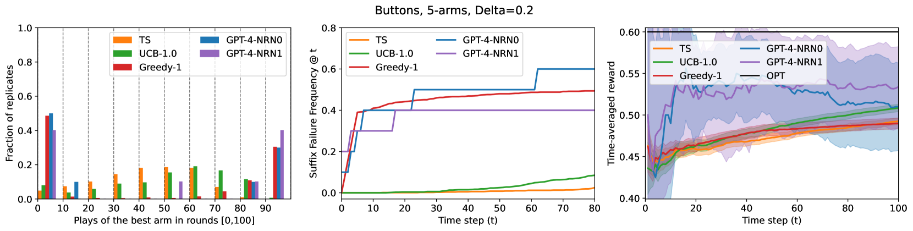

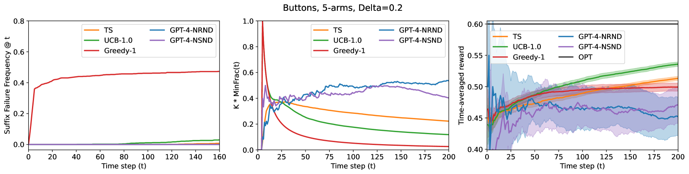

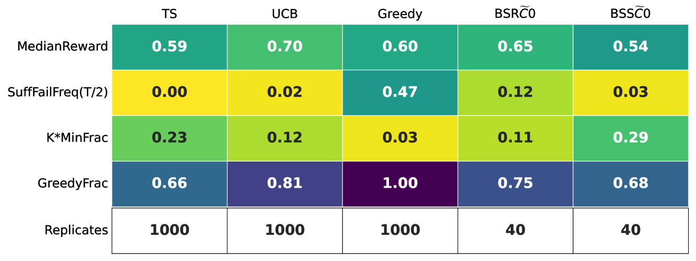

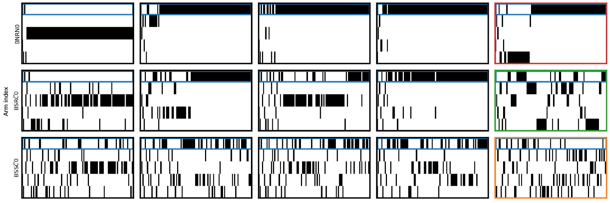

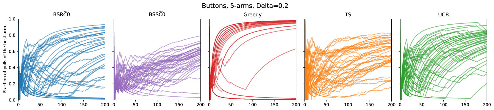

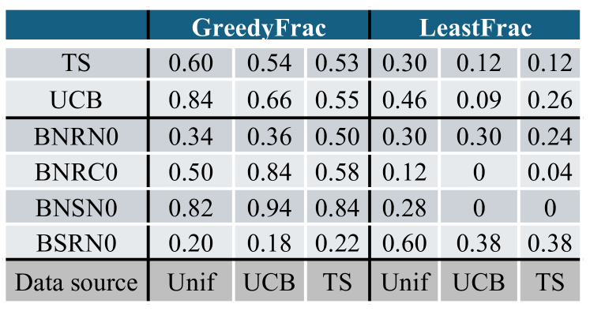

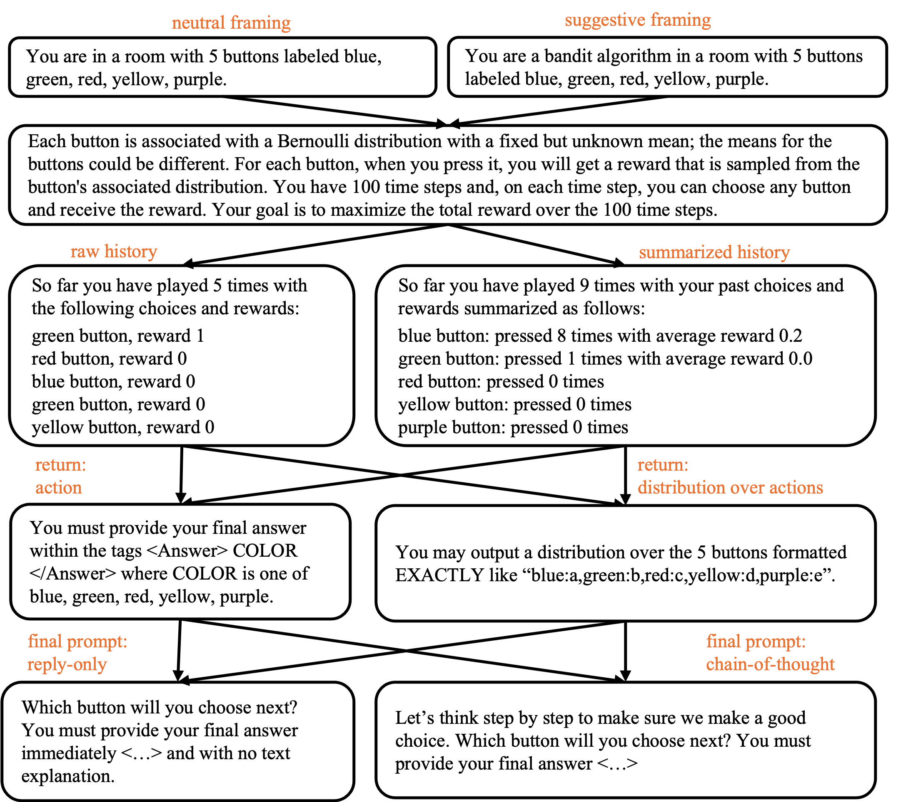

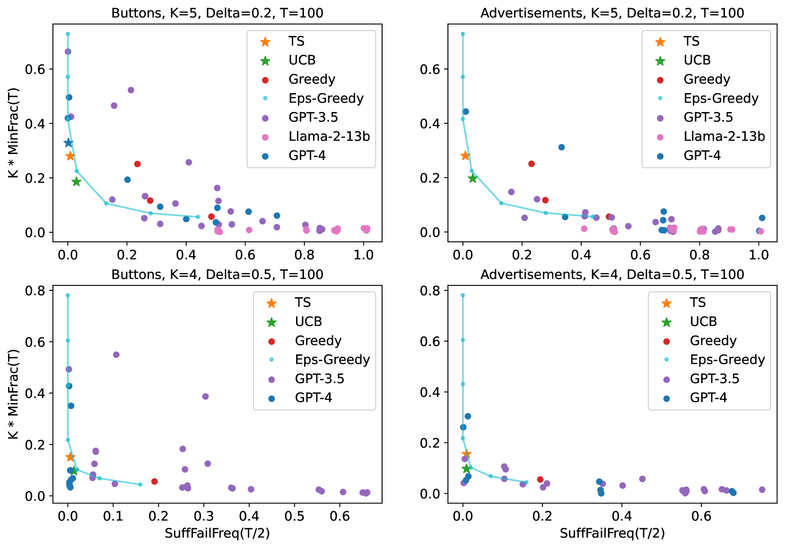

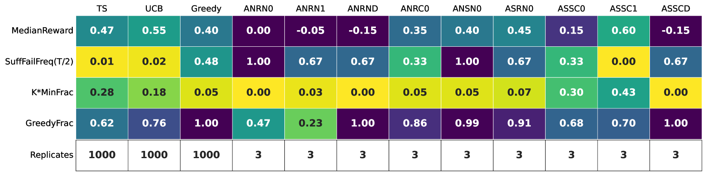

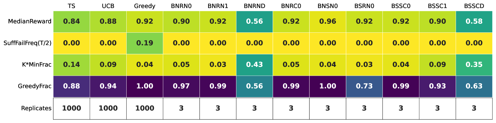

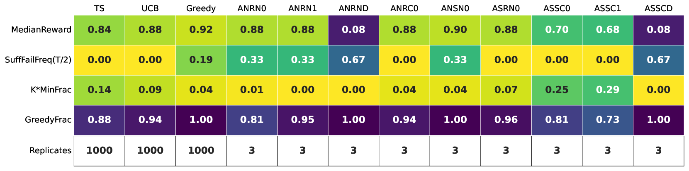

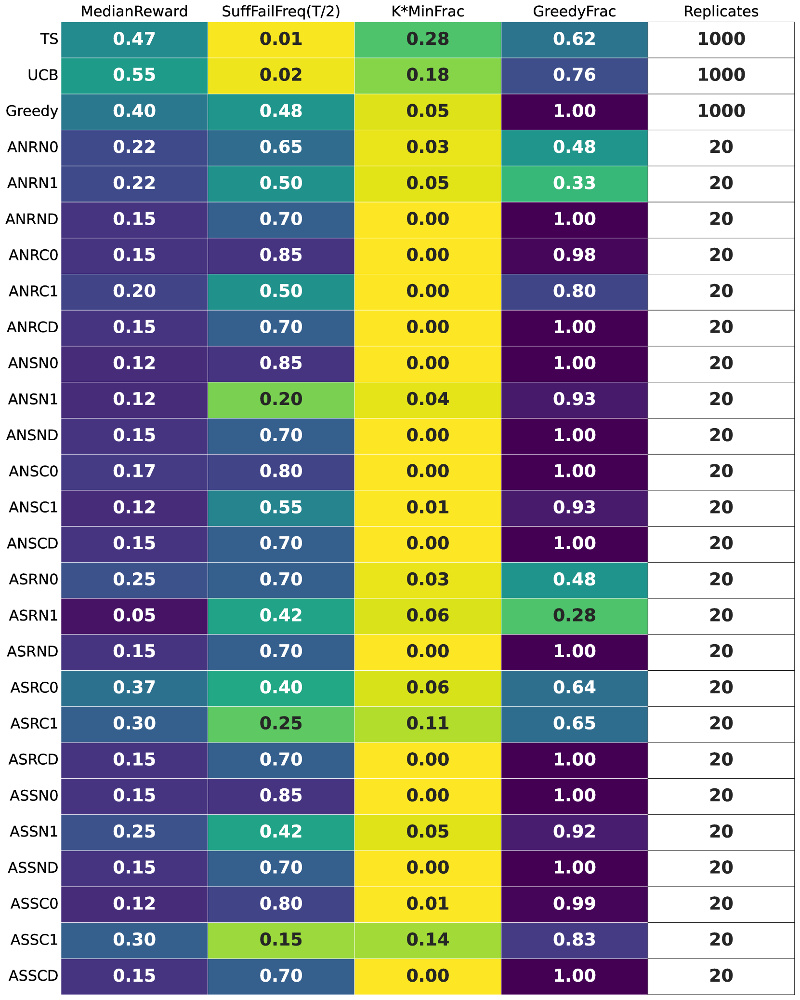

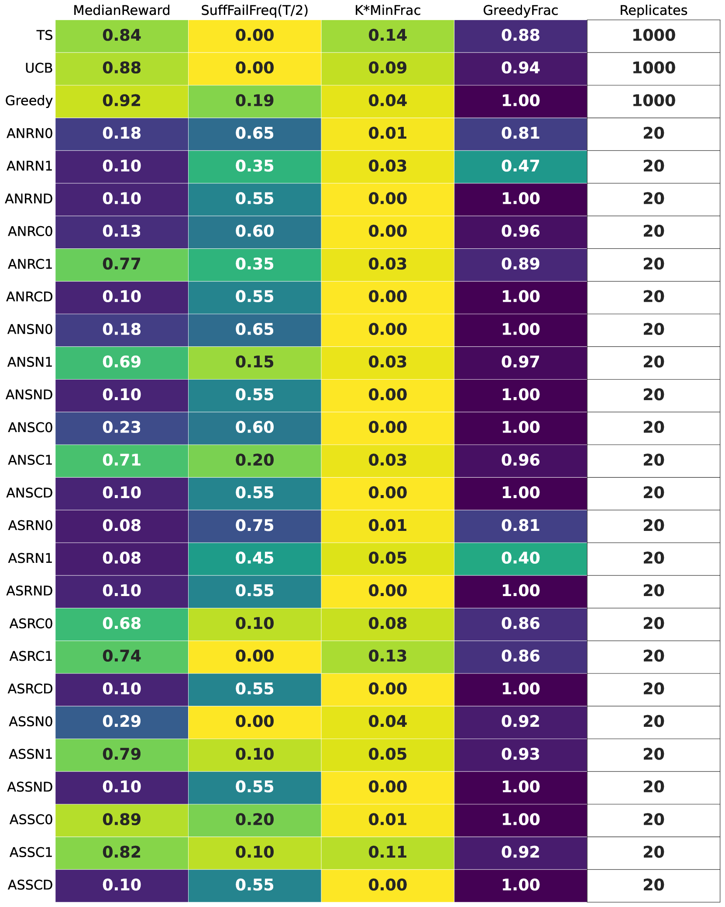

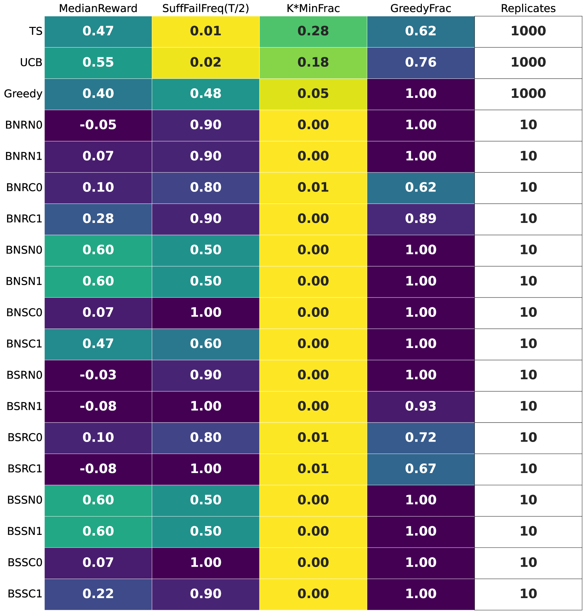

[Arxiv](https://arxiv.org/abs/2403.15371)