# 面向姿态感知的上下文视觉学习应用于卡通幻觉检测技术，旨在通过深入理解图像中对象的姿势信息，有效识别并检测出卡通图像中的幻觉内容。

发布时间：2024年03月22日

`无法确定

根据给出的论文摘要，由于未提及具体的关键词如“Agent”、“RAG”或明确指出与“LLM理论”的相关性，这篇论文似乎探讨的是大规模TTI模型在生成卡通角色图像时的视觉幻觉检测系统，而非直接与LLM的应用或理论相关，因此无法准确将其分类至上述四类之一。如果要强行归类，可以考虑将其放在“AI应用”或者“深度学习应用”等相关类别中，但由于给定的分类标签中并未包含这类选项，故在此情况下无法进行有效分类。` `视觉检测`

> Cartoon Hallucinations Detection: Pose-aware In Context Visual Learning

# 摘要

> 如今，大规模TTI模型广泛应用于各类生成场景的数据生成，但其中涉及的视觉幻觉问题（尤其是在卡通角色等非写实风格中所表现出的关键感知缺陷）仍是一大难题。我们创新性地设计了一套针对TTI模型生成的卡通角色图像的视觉幻觉检测系统，该系统集成了PA-ICVL技术与VLMs，同时运用RGB图像和姿态信息进行分析。通过融合经过微调的姿态估计算法提供的姿态指导，VLMs得以实现更精准的判断。实验结果表明，相较于仅基于RGB图像的传统基准方法，新提出的方案在视觉幻觉识别上有显著提升。此项研究通过有效抑制视觉幻觉，推动了TTI模型的进步，使其在非写实领域展现出更大的应用前景。

> Large-scale Text-to-Image (TTI) models have become a common approach for generating training data in various generative fields. However, visual hallucinations, which contain perceptually critical defects, remain a concern, especially in non-photorealistic styles like cartoon characters. We propose a novel visual hallucination detection system for cartoon character images generated by TTI models. Our approach leverages pose-aware in-context visual learning (PA-ICVL) with Vision-Language Models (VLMs), utilizing both RGB images and pose information. By incorporating pose guidance from a fine-tuned pose estimator, we enable VLMs to make more accurate decisions. Experimental results demonstrate significant improvements in identifying visual hallucinations compared to baseline methods relying solely on RGB images. This research advances TTI models by mitigating visual hallucinations, expanding their potential in non-photorealistic domains.

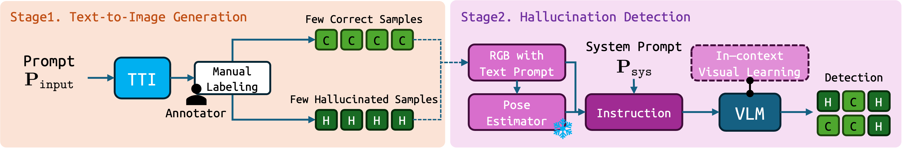

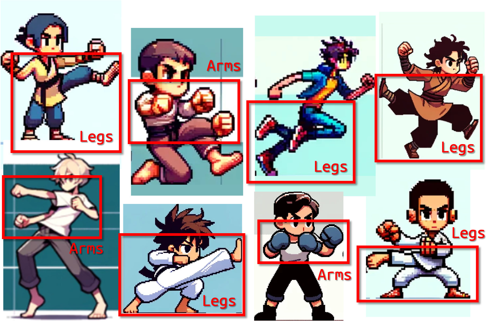

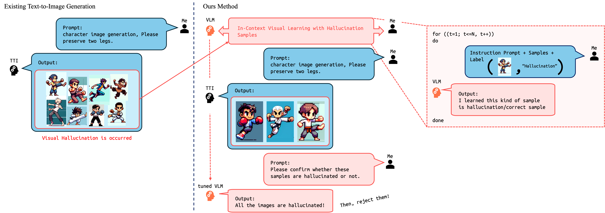

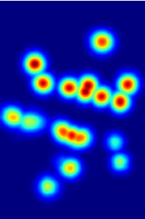

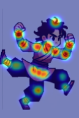

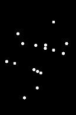

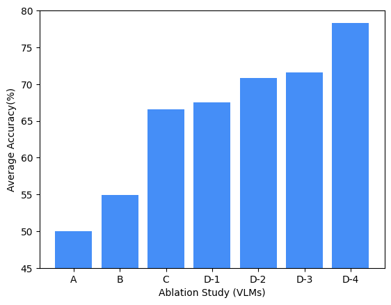

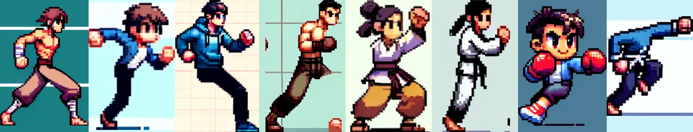

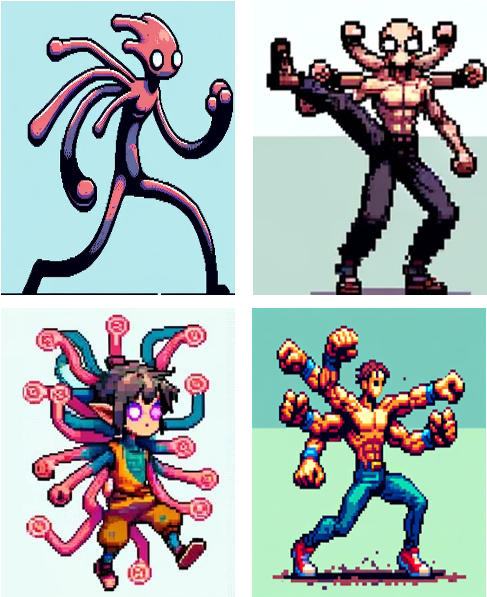

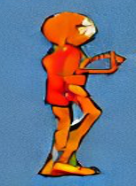

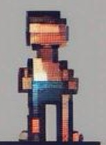

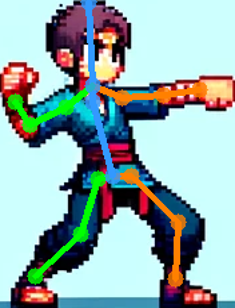

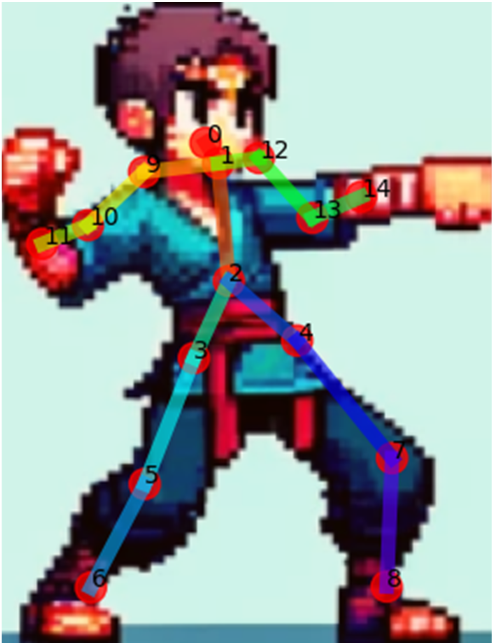

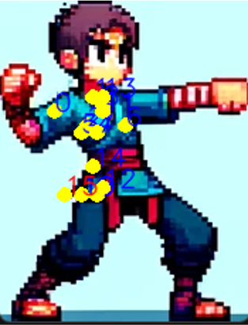

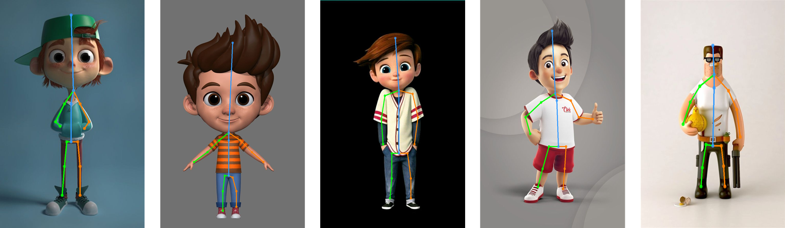

[Arxiv](https://arxiv.org/abs/2403.15048)