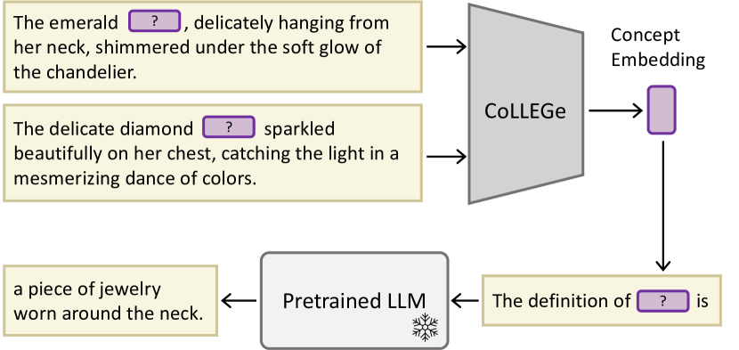
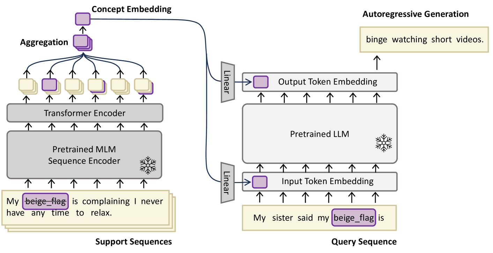

# CoLLEGe 是一种专为大型语言模型设计的概念嵌入生成方法，致力于提升模型对各类概念的理解与表达能力。

发布时间：2024年03月22日

`LLM应用` `模型优化`

> CoLLEGe: Concept Embedding Generation for Large Language Models

# 摘要

> 现今的语言模型难以即时高效掌握新概念，通常需要深度微调才能稳定习得。而上下文提示法对语境干扰敏感，对传递新概念信息效果欠佳；过去基于全局词向量的NLP少样本词学习技术，在大规模语言模型应用时局限性较大。为此，本文引入一种创新方法——CoLLEGe，致力于革新少样本概念学习。CoLLEGe作为一个元学习框架，仅通过少数例句或定义即可生成适应性强的新概念嵌入。该框架的核心元学习目标是使语言模型能轻松预测后续句子中的下一个单词，从而与语言模型预训练无缝衔接。我们精心设计了一系列实验任务，涵盖新词获取、定义推断及言语推理等复杂实际场景，证明了CoLLEGe无需针对特定任务训练就能在各场景下均展现出色的新概念学习能力。

> Current language models are unable to quickly learn new concepts on the fly, often requiring a more involved finetuning process to learn robustly. Prompting in-context is not robust to context distractions, and often fails to confer much information about the new concepts. Classic methods for few-shot word learning in NLP, relying on global word vectors, are less applicable to large language models. In this paper, we introduce a novel approach named CoLLEGe (Concept Learning with Language Embedding Generation) to modernize few-shot concept learning. CoLLEGe is a meta-learning framework capable of generating flexible embeddings for new concepts using a small number of example sentences or definitions. Our primary meta-learning objective is simply to facilitate a language model to make next word predictions in forthcoming sentences, making it compatible with language model pretraining. We design a series of tasks to test new concept learning in challenging real-world scenarios, including new word acquisition, definition inference, and verbal reasoning, and demonstrate that our method succeeds in each setting without task-specific training.

[Arxiv](https://arxiv.org/abs/2403.15362)