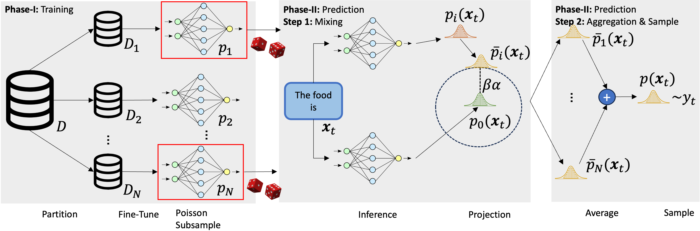
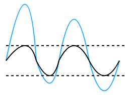
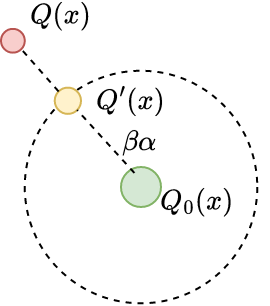
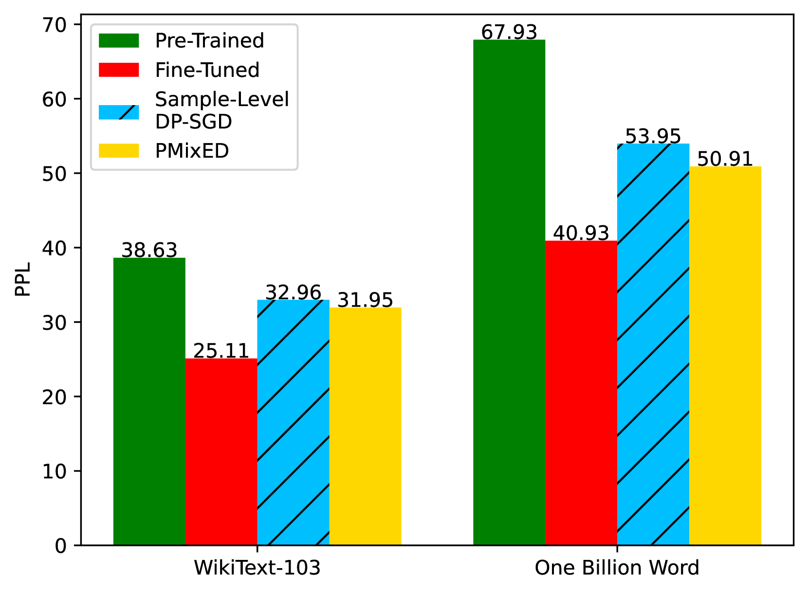
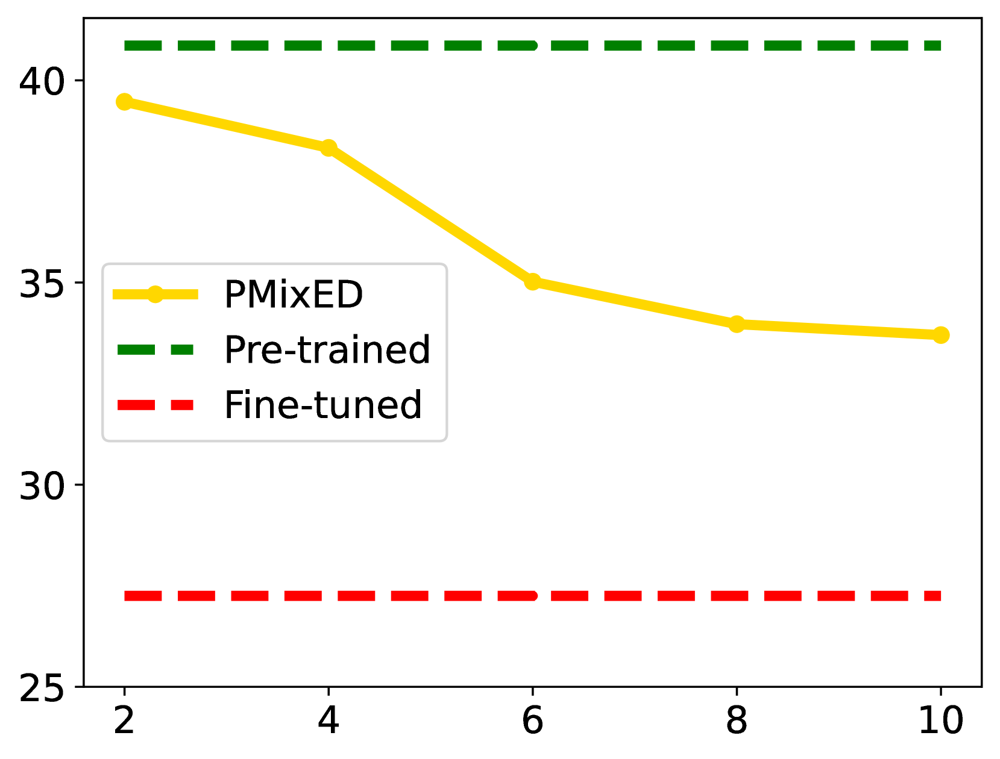
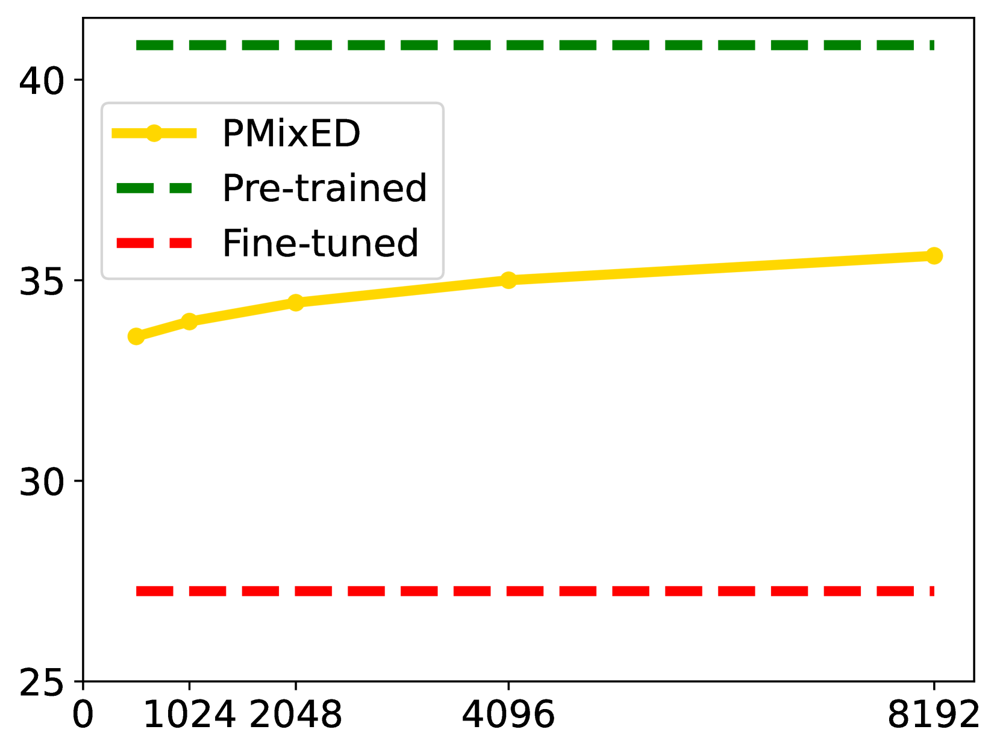
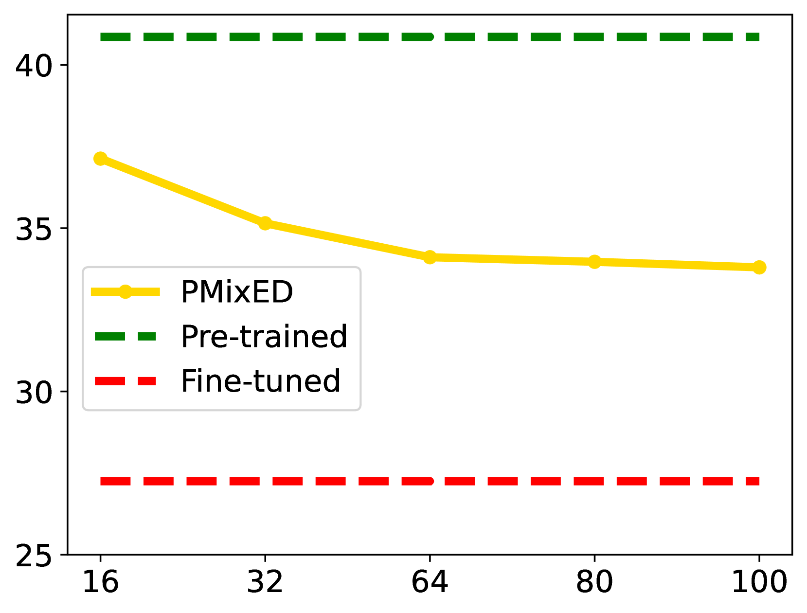
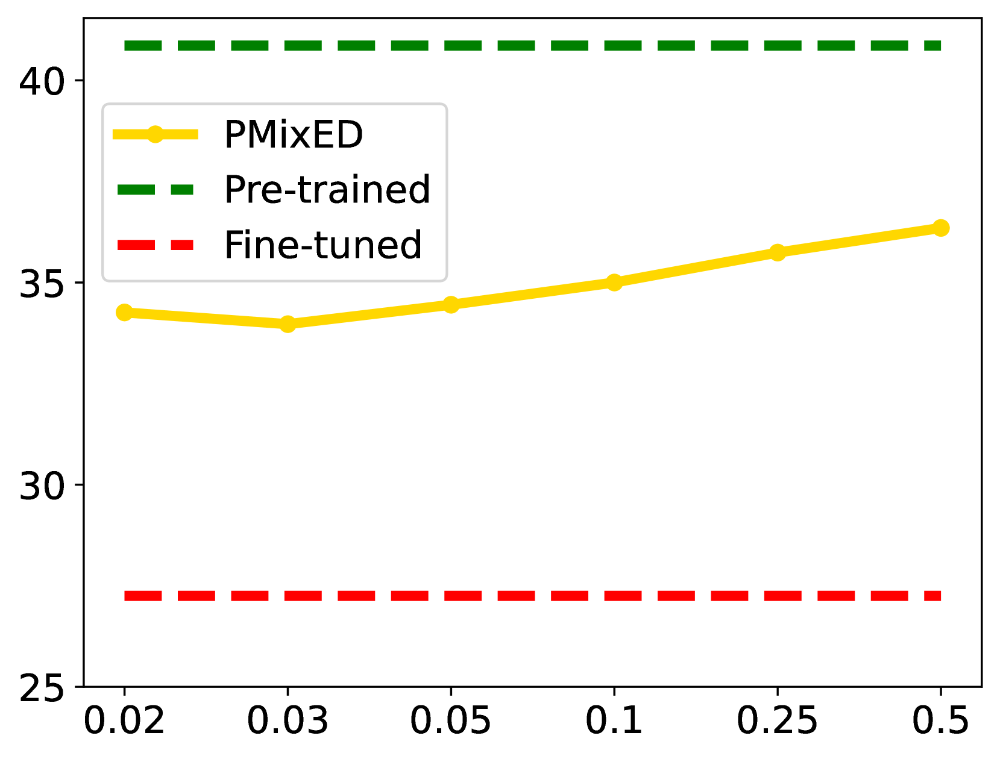
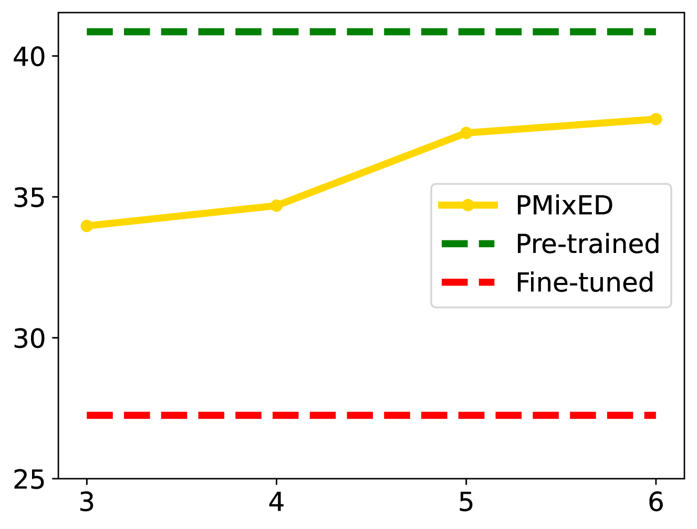

# 针对大型语言模型，研究其在保护隐私的前提下进行下一个标记预测的能力。这项研究聚焦于探索如何在保证差异隐私的同时，有效实现大规模语言模型的下一个词汇预测功能。

发布时间：2024年03月22日

`LLM应用` `隐私保护`

> Differentially Private Next-Token Prediction of Large Language Models

# 摘要

> 随着LLMs隐私性的重视程度提高，DP-SGD作为主流技术确保模型训练过程满足差异隐私标准。尽管如此，它相较于SGD训练时间更长、内存需求更大，并且可能过高估计了对手在白盒访问模型情况下的能力，而在实际场景中，对手往往仅能黑盒访问隐私敏感的LLM。鉴于此，我们创新提出“私有混合集成分布”（PMixED）方案——通过将多个微调后的LLM输出概率分布分别投影至公开LLM输出概率分布周围的集合上，再平均这些投影分布并从中采样，以此实现实用高效的下一个标记预测，同时在预测阶段而非训练阶段提供差异隐私保护。相比于DP-SGD，PMixED更具轻量化优势，不受特定模型限制。实验结果显示，在大规模数据集及隐私预算$ε= 8$的情况下，PMixED不仅提供了超越样本级别的更强隐私保障，而且在性能上也优于DP-SGD。

> Ensuring the privacy of Large Language Models (LLMs) is becoming increasingly important. The most widely adopted technique to accomplish this is DP-SGD, which trains a model in such a way that guarantees Differential Privacy (DP). However, DP-SGD requires longer training times and larger memory requirements than SGD, while overestimating an adversary's capabilities in having white box access to the model. A more realistic scenario assumes only black-box access to a privacy-sensitive LLM. Motivated by these observations, we present Private Mixing of Ensemble Distributions (PMixED): a private prediction protocol that achieves practical next-token prediction by projecting each of the model's output distribution from an ensemble of fine-tuned LLMs onto a set around a public LLM's output distribution, then averaging the projected distributions and sampling from it. Our approach is more lightweight than DP-SGD in that it is model agnostic, instead providing differential privacy at prediction rather than during training. Our results show that PMixED achieves a stronger privacy guarantee than sample-level privacy and outperforms DP-SGD for privacy $ε= 8$ on large-scale datasets.

[Arxiv](https://arxiv.org/abs/2403.15638)