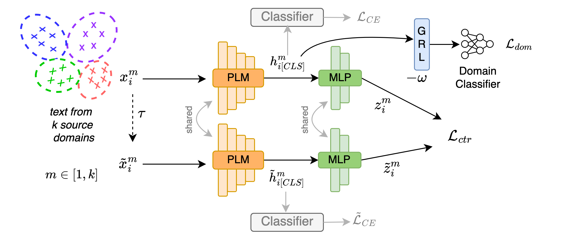
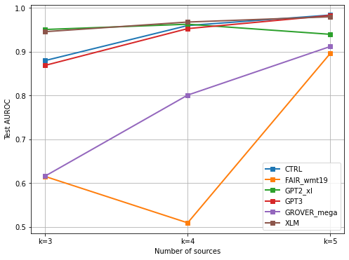

# EAGLE 是一个专为识别AI生成文本而设计的领域泛化框架，致力于解决跨不同领域的AI文本检测问题。

发布时间：2024年03月22日

`Agent` `文本生成检测`

> EAGLE: A Domain Generalization Framework for AI-generated Text Detection

# 摘要

> 随着 LLM 功能的日益强大，确保其负责任和安全使用的关键一步在于识别出自此类模型产生的文本。尽管监督型人工智能文本检测技术能有效辨别旧款 LLMs 的生成内容，但随着新款 LLMs 不断涌现，要为新模型建立监督型检测系统，则需不断更新带标签的训练数据，而这在实践中难以实施。为此，我们提出了一个解决此问题的新方案——EAGLE，这是一个应用于检测未知目标生成器生成的AI文本的领域泛化框架。EAGLE 框架巧妙利用已有的旧版语言模型的标注数据，发掘并学习跨多个生成器不变的特征，从而识别人工智能生成的未知来源文本。EAGLE 结合了自我监督对比学习的强大表示力与领域对抗训练方法，从而习得这种领域不变特征。通过实验，我们生动展现了 EAGLE 如何高效识别出包括最近顶级模型如 GPT-4 和 Claude 等在内的未见目标生成器生成的文本，其检测准确率仅比全监督检测器低4.7%，表现卓越。

> With the advancement in capabilities of Large Language Models (LLMs), one major step in the responsible and safe use of such LLMs is to be able to detect text generated by these models. While supervised AI-generated text detectors perform well on text generated by older LLMs, with the frequent release of new LLMs, building supervised detectors for identifying text from such new models would require new labeled training data, which is infeasible in practice. In this work, we tackle this problem and propose a domain generalization framework for the detection of AI-generated text from unseen target generators. Our proposed framework, EAGLE, leverages the labeled data that is available so far from older language models and learns features invariant across these generators, in order to detect text generated by an unknown target generator. EAGLE learns such domain-invariant features by combining the representational power of self-supervised contrastive learning with domain adversarial training. Through our experiments we demonstrate how EAGLE effectively achieves impressive performance in detecting text generated by unseen target generators, including recent state-of-the-art ones such as GPT-4 and Claude, reaching detection scores of within 4.7% of a fully supervised detector.

[Arxiv](https://arxiv.org/abs/2403.15690)