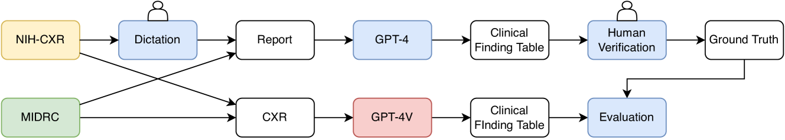
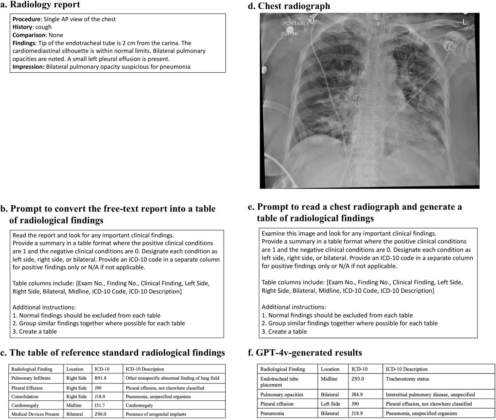
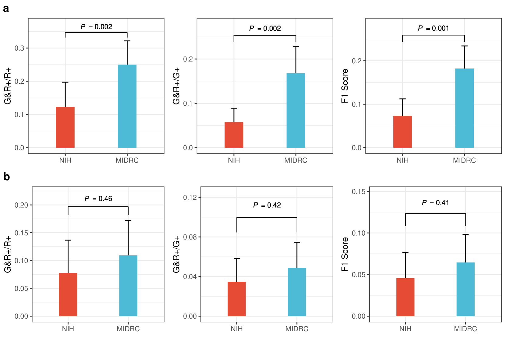
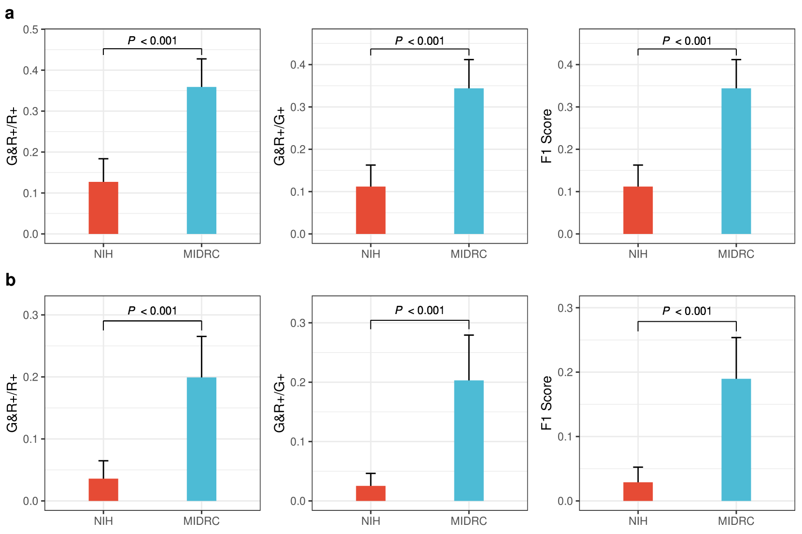
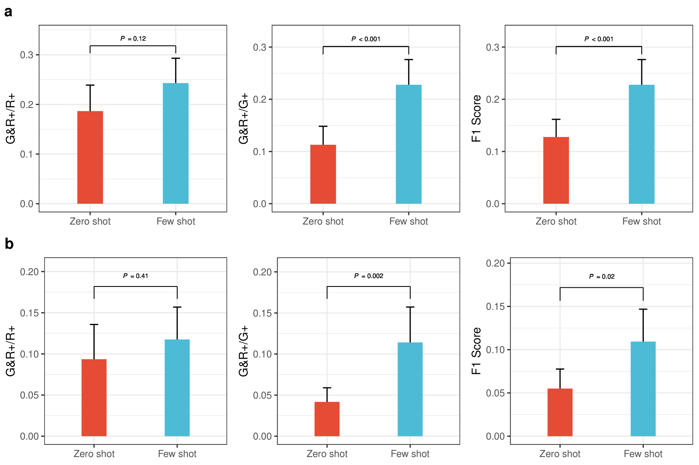

# 在胸部X线片放射学发现检测任务中，我们运用视力评估了 GPT-4 的表现能力。进一步优化后的

发布时间：2024年03月22日

`LLM应用` `放射学`

> Evaluating GPT-4 with Vision on Detection of Radiological Findings on Chest Radiographs

# 摘要

> 本研究考察了具有视觉识别能力的多模态大模型GPT-4V在100份胸部X光片放射学发现检测中的应用效果，并指出当前GPT-4V尚不具备在真实临床场景下解读胸部X光片的实用性。

> The study examines the application of GPT-4V, a multi-modal large language model equipped with visual recognition, in detecting radiological findings from a set of 100 chest radiographs and suggests that GPT-4V is currently not ready for real-world diagnostic usage in interpreting chest radiographs.

[Arxiv](https://arxiv.org/abs/2403.15528)