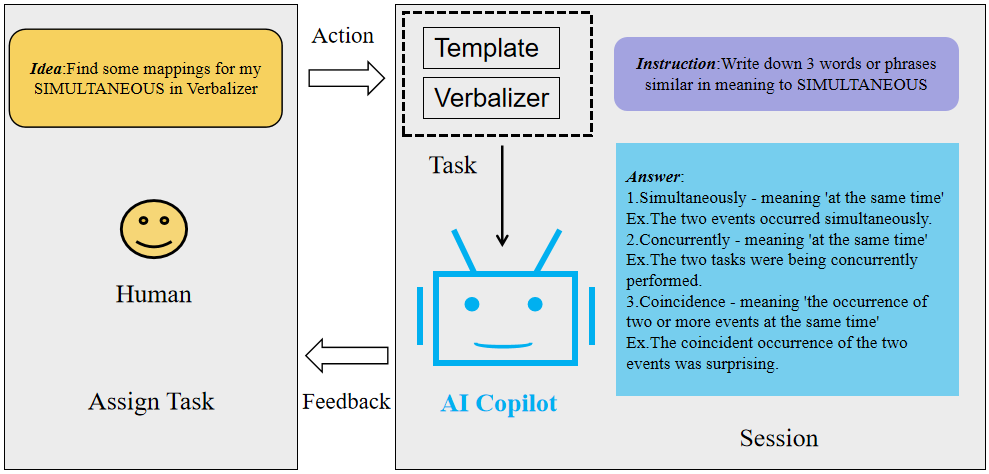
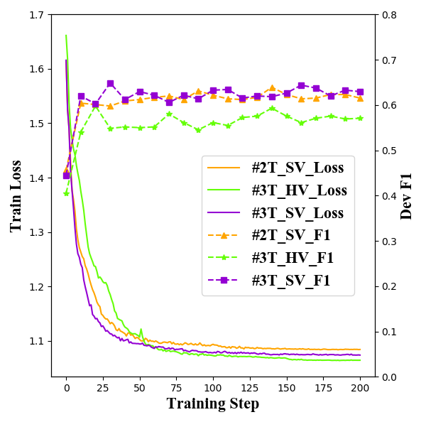
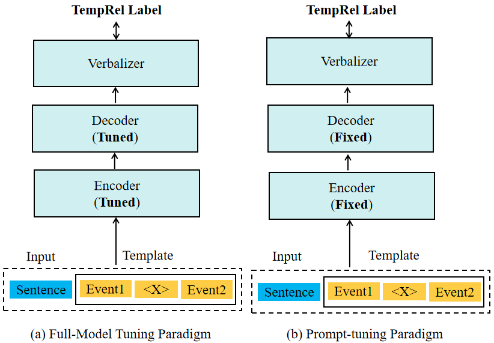
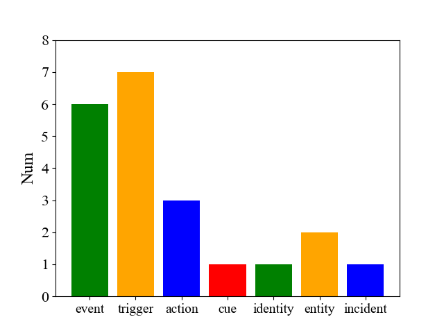
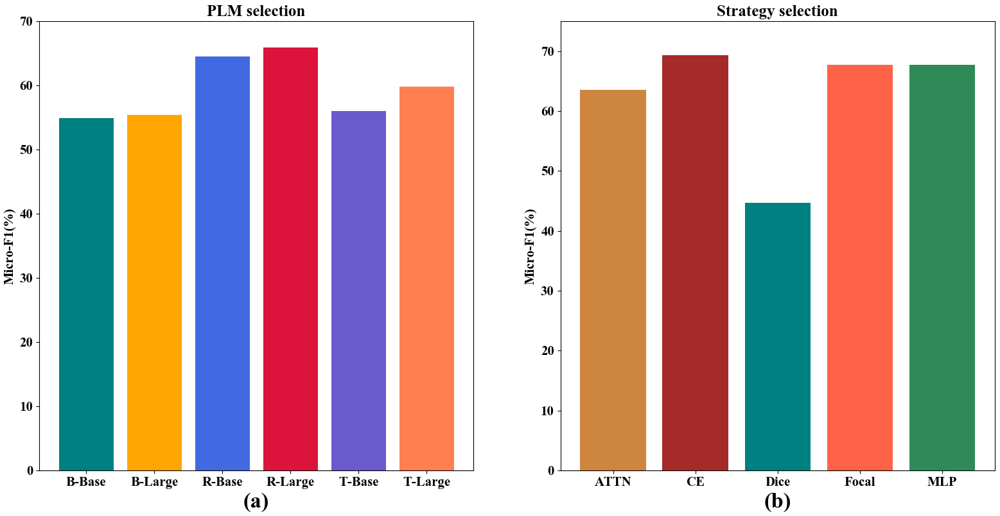
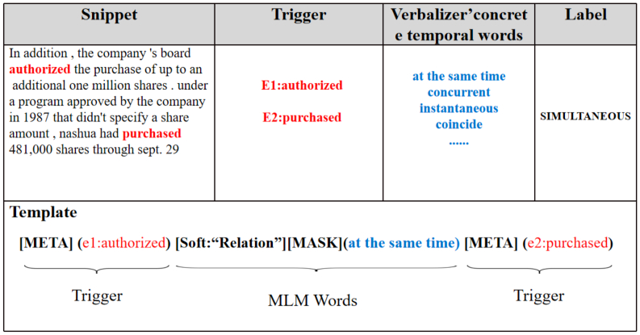

# 借助检索增强的LLMs技术进行事件时序关系抽取，本研究聚焦于利用大规模语言模型抽取事件间的时间顺序关系，通过检索辅助提升抽取效能。

发布时间：2024年03月22日

`LLM应用` `事件抽取`

> Event Temporal Relation Extraction based on Retrieval-Augmented on LLMs

# 摘要

> 事件时间关系（TempRel）作为事件关系抽取的核心课题，其内在的模糊性加大了任务挑战。当前，随着提示工程的发展，如何设计高效提示模板与词汇化策略以抽提关键知识显得尤为重要，但传统的手动设计模板在精确捕捉时间信息上存在局限。本文创新提出一种基于检索增强的TempRel抽取新方法，巧妙运用从大型语言模型（LLMs）获取的知识资源优化提示模板和词汇化工具。我们借助多种LLMs的综合能力，孕育出丰富多样的模板及词汇化设计方案。这种方法充分发掘了LLMs在生成任务中的潜能，并为我们的设计注入更多智慧元素。通过在三大知名数据集上的实证验证，证实了此方法在提升事件时间关系抽取任务表现上的显著效果。

> Event temporal relation (TempRel) is a primary subject of the event relation extraction task. However, the inherent ambiguity of TempRel increases the difficulty of the task. With the rise of prompt engineering, it is important to design effective prompt templates and verbalizers to extract relevant knowledge. The traditional manually designed templates struggle to extract precise temporal knowledge. This paper introduces a novel retrieval-augmented TempRel extraction approach, leveraging knowledge retrieved from large language models (LLMs) to enhance prompt templates and verbalizers. Our method capitalizes on the diverse capabilities of various LLMs to generate a wide array of ideas for template and verbalizer design. Our proposed method fully exploits the potential of LLMs for generation tasks and contributes more knowledge to our design. Empirical evaluations across three widely recognized datasets demonstrate the efficacy of our method in improving the performance of event temporal relation extraction tasks.

[Arxiv](https://arxiv.org/abs/2403.15273)