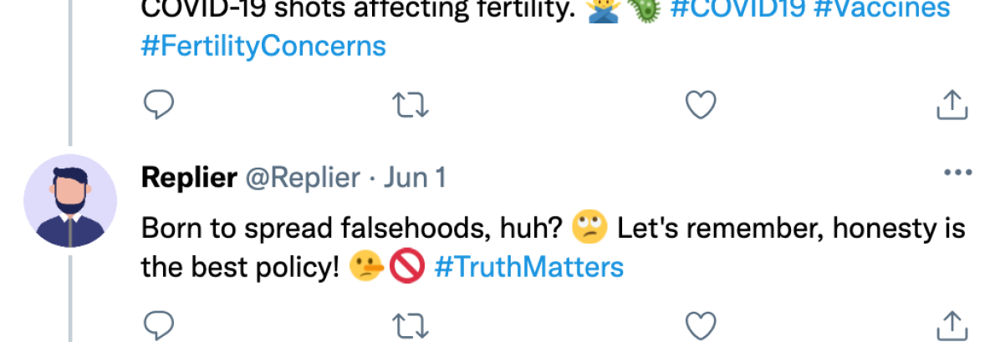
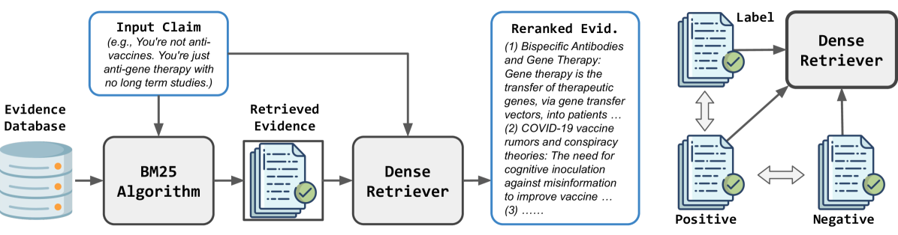
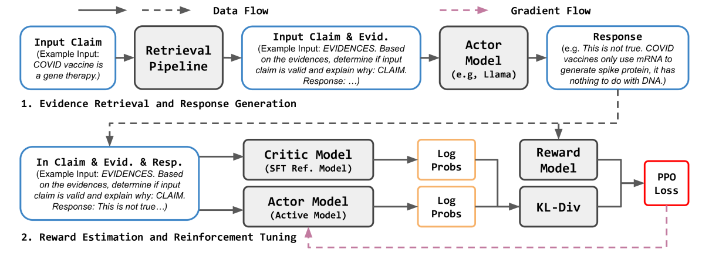
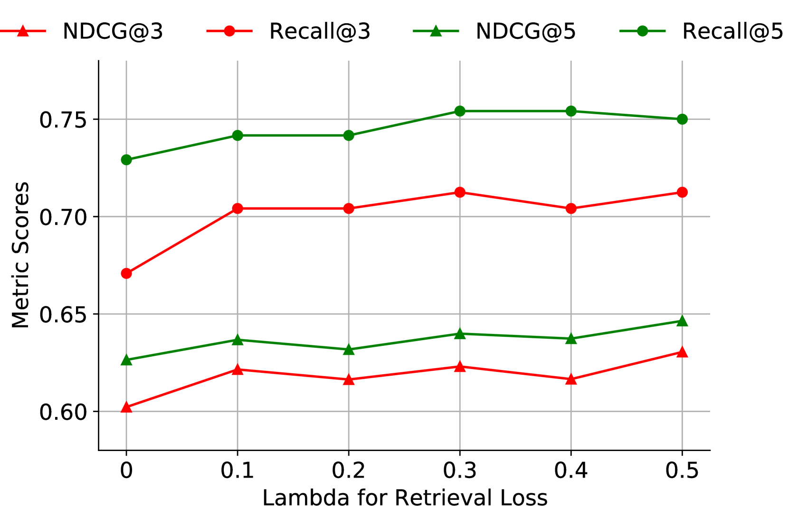

# 面对在线虚假信息挑战，我们提出了一种证据驱动的检索增强响应生成方法，通过整合有效证据信息以提高对抗虚假信息时的回应质量与准确性。

发布时间：2024年03月22日

`RAG` `社交媒体` `信息检索`

> Evidence-Driven Retrieval Augmented Response Generation for Online Misinformation

# 摘要

> 网络上的错误信息日益猖獗，严重危害公共利益。尽管不少网友积极投身于这场“打假”之战，但其回应往往欠缺礼貌与事实支撑。为此，我们提出运用文本生成技术自动生成反击错误信息的回复。遗憾的是，现有方法多依赖端到端训练而忽视了外部知识的利用，导致生成回复的质量欠佳且内容重复度较高。因此，在本文中，我们创新性地推出了针对在线错误信息的检索增强回复生成系统——RARG，它能从权威科学资源中收集有力证据，并基于这些证据生成有理有据的反驳回复。这套RARG系统包括两大关键环节：首先，设计一套高效的检索流程，借助包含百万篇学术文章的数据库筛选并排序相关证据文档；其次，运用强化学习结合人类反馈优化大型语言模型（LLMs），以确保生成基于证据的回复。我们特别设计了一种奖励机制，在充分利用已检索到的证据同时，保证生成回复的质量，最终输出既有礼貌又充满事实依据、有力驳斥错误信息的文本回复。为了验证RARG的有效性，我们在COVID-19相关案例上进行了深入研究，并在多个领域内及跨领域的大量实验中证明，RARG系统在生成高质量对抗错误信息回复时，持续超越基准方法，表现出色。

> The proliferation of online misinformation has posed significant threats to public interest. While numerous online users actively participate in the combat against misinformation, many of such responses can be characterized by the lack of politeness and supporting facts. As a solution, text generation approaches are proposed to automatically produce counter-misinformation responses. Nevertheless, existing methods are often trained end-to-end without leveraging external knowledge, resulting in subpar text quality and excessively repetitive responses. In this paper, we propose retrieval augmented response generation for online misinformation (RARG), which collects supporting evidence from scientific sources and generates counter-misinformation responses based on the evidences. In particular, our RARG consists of two stages: (1) evidence collection, where we design a retrieval pipeline to retrieve and rerank evidence documents using a database comprising over 1M academic articles; (2) response generation, in which we align large language models (LLMs) to generate evidence-based responses via reinforcement learning from human feedback (RLHF). We propose a reward function to maximize the utilization of the retrieved evidence while maintaining the quality of the generated text, which yields polite and factual responses that clearly refutes misinformation. To demonstrate the effectiveness of our method, we study the case of COVID-19 and perform extensive experiments with both in- and cross-domain datasets, where RARG consistently outperforms baselines by generating high-quality counter-misinformation responses.

[Arxiv](https://arxiv.org/abs/2403.14952)