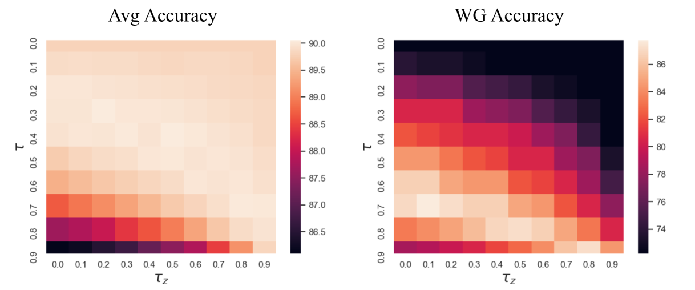
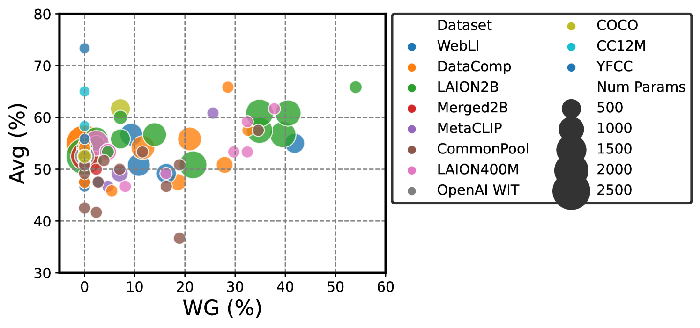

# FairerCLIP是一种方法，它利用RKHS（ reproducing kernel Hilbert spaces）中的函数来减少CLIP在零样本预测中的偏差问题，以实现更加公正的图像-文本匹配效果。进一步润色后的

发布时间：2024年03月22日

`LLM应用` `视觉识别` `机器学习 fairness`

> FairerCLIP: Debiasing CLIP's Zero-Shot Predictions using Functions in RKHSs

# 摘要

> CLIP等大型预训练视觉-语言模型能够提供灵活且高效的跨多任务零样本预测所需的文本和图像表示。然而，受训练方式影响，此类模型可能存在传递和放大训练数据中社会偏见、过度依赖偶然特征的问题。为此，本文提出了FairerCLIP方案，旨在提高CLIP的零样本预测公平性和对偶然关联的鲁棒性。我们运用再生核希尔伯特空间技术，联合处理CLIP的图像和文本表示去偏问题，这一策略带来四大优势：首先，FairerCLIP具备高度灵活性，无论是否拥有真实标签都能适应学习；其次，其优化过程采用闭式求解器实现快速迭代，训练速度比传统方法快4到10倍；再者，在样本资源有限的情况下，FairerCLIP展现出超越基线方法的出色样本效率，尤其在基线方法失效时表现突出；最后，实验表明，FairerCLIP在公平性和偶然关联基准数据集上的性能明显优于各自对应的基线方法。

> Large pre-trained vision-language models such as CLIP provide compact and general-purpose representations of text and images that are demonstrably effective across multiple downstream zero-shot prediction tasks. However, owing to the nature of their training process, these models have the potential to 1) propagate or amplify societal biases in the training data and 2) learn to rely on spurious features. This paper proposes FairerCLIP, a general approach for making zero-shot predictions of CLIP more fair and robust to spurious correlations. We formulate the problem of jointly debiasing CLIP's image and text representations in reproducing kernel Hilbert spaces (RKHSs), which affords multiple benefits: 1) Flexibility: Unlike existing approaches, which are specialized to either learn with or without ground-truth labels, FairerCLIP is adaptable to learning in both scenarios. 2) Ease of Optimization: FairerCLIP lends itself to an iterative optimization involving closed-form solvers, which leads to $4\times$-$10\times$ faster training than the existing methods. 3) Sample Efficiency: Under sample-limited conditions, FairerCLIP significantly outperforms baselines when they fail entirely. And, 4) Performance: Empirically, FairerCLIP achieves appreciable accuracy gains on benchmark fairness and spurious correlation datasets over their respective baselines.

[Arxiv](https://arxiv.org/abs/2403.15593)