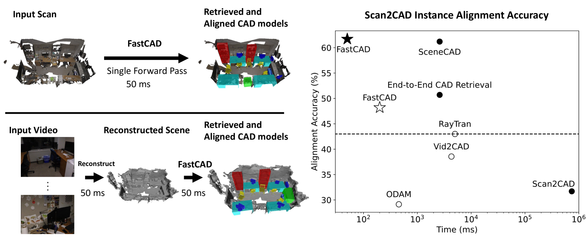
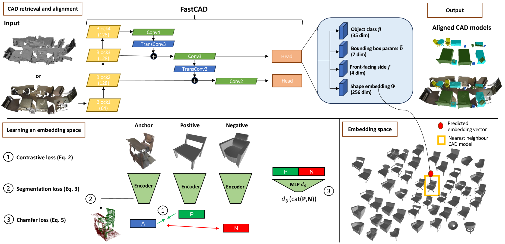
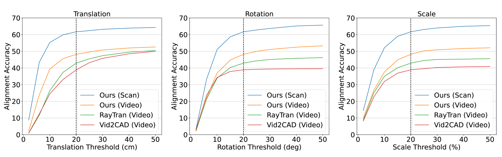
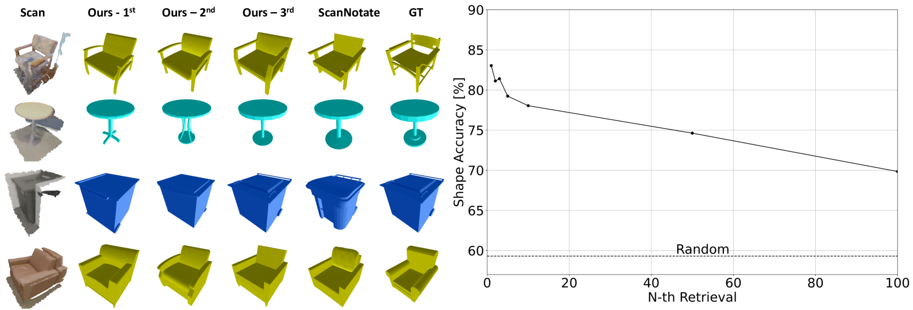
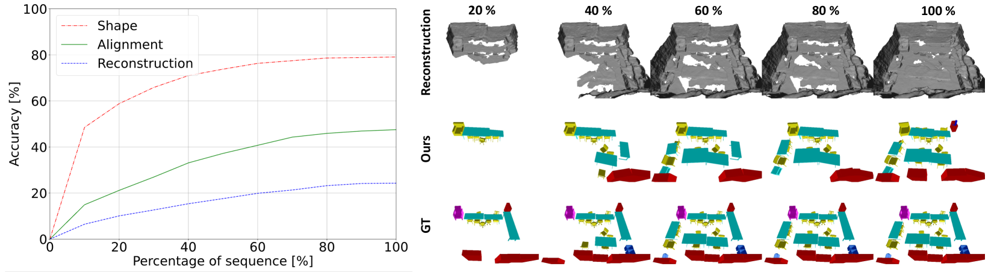
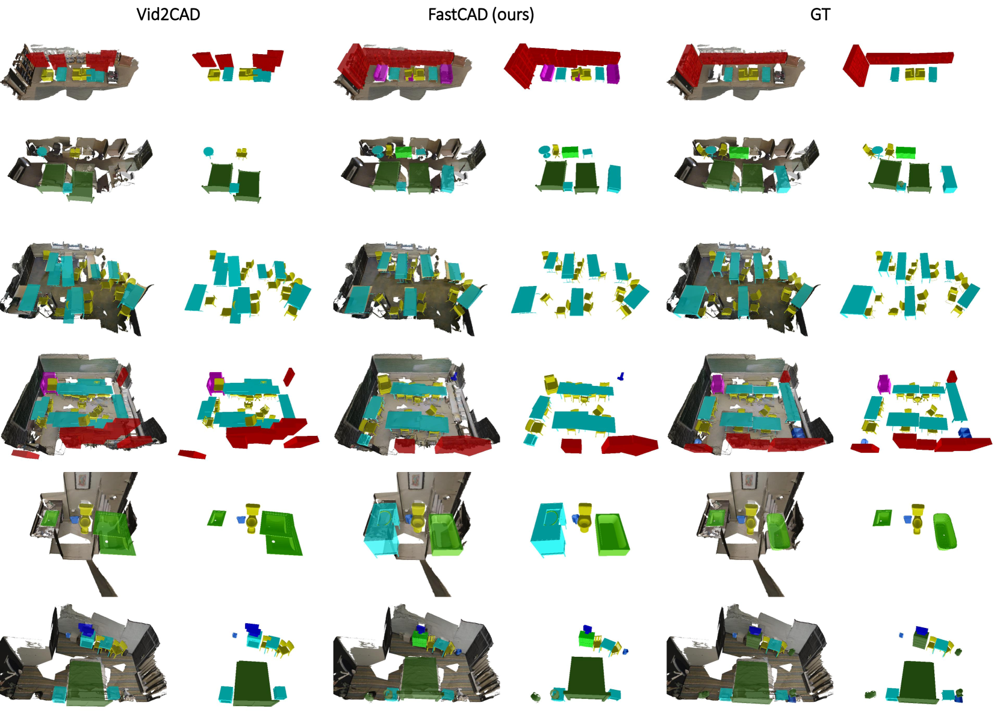
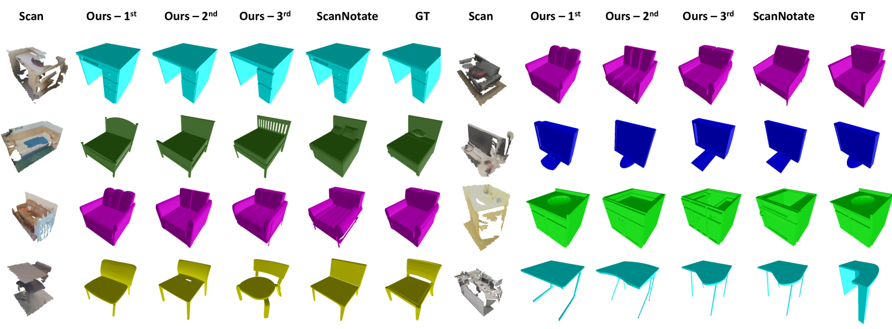

# FastCAD 系统实现了从扫描和视频数据中实时检索和精确对齐 CAD 模型的技术突破。

发布时间：2024年03月22日

`Agent` `增强现实` `机器人技术`

> FastCAD: Real-Time CAD Retrieval and Alignment from Scans and Videos

# 摘要

> 为了在增强现实和机器人应用中实现关键价值，将三维世界转化为基于CAD模型的纯净数字表示至关重要。现有顶级技术因需逐一处理每个检测物体并进行二次CAD对齐优化，导致计算资源消耗巨大。为此，我们创新性地提出了FastCAD这一实时方法，它能一次性完成对某一场景中所有物体的CAD模型检索与对齐。区别于以往的研究，我们直接预测出对齐参数和形状嵌入信息。通过在对比学习环境中训练CAD嵌入，并将其精华融入FastCAD系统，我们成功提升了形状检索的品质。相较于那些同样应用于RGB-D扫描的其它方法，FastCAD凭借单阶段流程将推理速度提升了50倍，并在极具挑战性的Scan2CAD对齐基准测试中取得了更好的成绩。更重要的是，FastCAD与在线3D重建技术能够协同运作得天衣无缝，使得从视频中以每秒10帧的速率实时生成精准的CAD模型为基础的三维重建成为可能。这一突破性进展使我们在视频环境下的Scan2CAD对齐精度由原来的43.0%跃升至48.2%，重建精度也从22.9%提升到了29.6%。

> Digitising the 3D world into a clean, CAD model-based representation has important applications for augmented reality and robotics. Current state-of-the-art methods are computationally intensive as they individually encode each detected object and optimise CAD alignments in a second stage. In this work, we propose FastCAD, a real-time method that simultaneously retrieves and aligns CAD models for all objects in a given scene. In contrast to previous works, we directly predict alignment parameters and shape embeddings. We achieve high-quality shape retrievals by learning CAD embeddings in a contrastive learning framework and distilling those into FastCAD. Our single-stage method accelerates the inference time by a factor of 50 compared to other methods operating on RGB-D scans while outperforming them on the challenging Scan2CAD alignment benchmark. Further, our approach collaborates seamlessly with online 3D reconstruction techniques. This enables the real-time generation of precise CAD model-based reconstructions from videos at 10 FPS. Doing so, we significantly improve the Scan2CAD alignment accuracy in the video setting from 43.0% to 48.2% and the reconstruction accuracy from 22.9% to 29.6%.

[Arxiv](https://arxiv.org/abs/2403.15161)