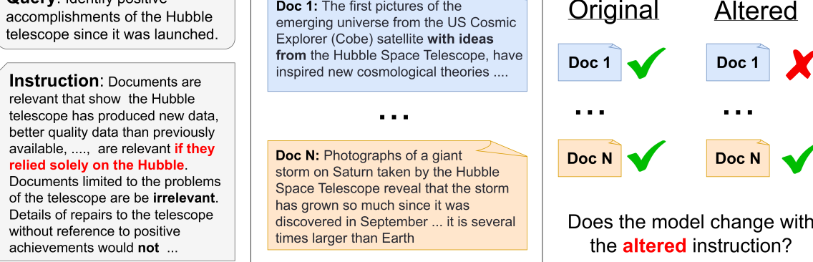
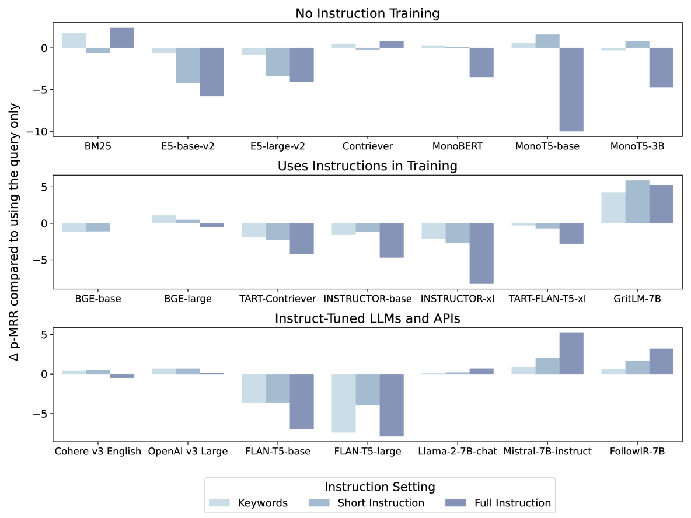

# FollowIR：评估并指导信息检索模型如何按照指令行动步骤详解：

发布时间：2024年03月22日

`LLM应用` `信息检索` `指令理解`

> FollowIR: Evaluating and Teaching Information Retrieval Models to Follow Instructions

> 现代LLMs具备处理各类复杂用户任务的长篇指令能力，但在IR模型中，即使以其为核心架构，大多数仍局限于仅接收无指令的查询输入。近期虽有少数模型开始接纳指令，但对于指令的实际运用方式却模糊不清。为此，我们推出了FollowIR数据集，它不仅包含严谨的指令评估基准，还有一套专门训练IR模型适应现实场景下指令的训练集。该数据集沿袭了历史悠久的TREC大会理念：正如TREC向人工注解员提供详尽的叙述性指令以判定文档相关度，IR模型同样应当能够理解并根据此类详细指令做出相关性判断。我们设计了一项新颖的成对评估框架，通过对三个深入评判的TREC文集调整注解指令并重新标记相关文档，以此检验IR模型遵循指令的精准度。目前的结果揭示，现存的检索模型在使用指令时存在局限性，往往仅将其简单视作关键词而难以消化长篇信息。不过，我们已证实IR模型确实能够习得遵循复杂指令的能力——经由对我们训练集进行微调后，新款FollowIR-7B模型性能提升显著（超过13%）。

> Modern Large Language Models (LLMs) are capable of following long and complex instructions that enable a diverse amount of user tasks. However, despite Information Retrieval (IR) models using LLMs as the backbone of their architectures, nearly all of them still only take queries as input, with no instructions. For the handful of recent models that do take instructions, it's unclear how they use them. We introduce our dataset FollowIR, which contains a rigorous instruction evaluation benchmark as well as a training set for helping IR models learn to better follow real-world instructions. FollowIR builds off the long history of the TREC conferences: as TREC provides human annotators with instructions (also known as narratives) to determine document relevance, so should IR models be able to understand and decide relevance based on these detailed instructions. Our evaluation benchmark starts with three deeply judged TREC collections and alters the annotator instructions, re-annotating relevant documents. Through this process, we can measure how well IR models follow instructions, through a new pairwise evaluation framework. Our results indicate that existing retrieval models fail to correctly use instructions, using them for basic keywords and struggling to understand long-form information. However, we show that it is possible for IR models to learn to follow complex instructions: our new FollowIR-7B model has significant improvements (over 13%) after fine-tuning on our training set.

[Arxiv](https://arxiv.org/abs/2403.15246)