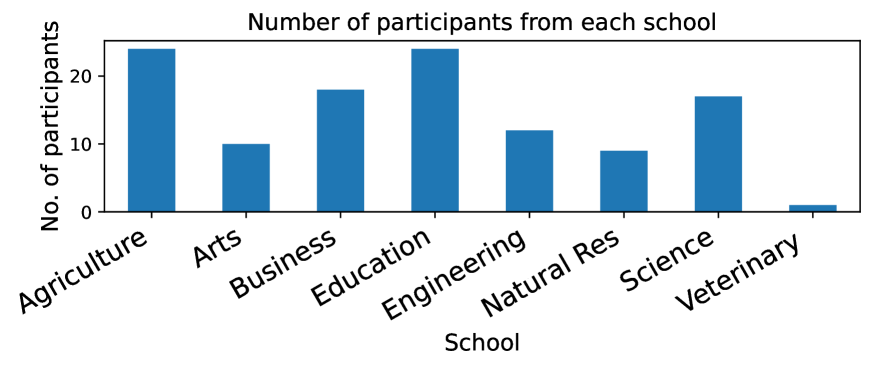
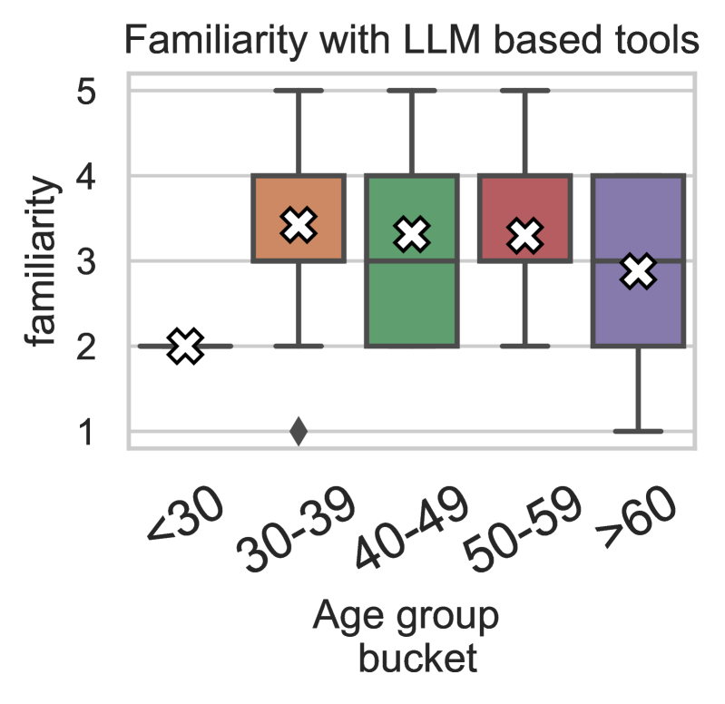
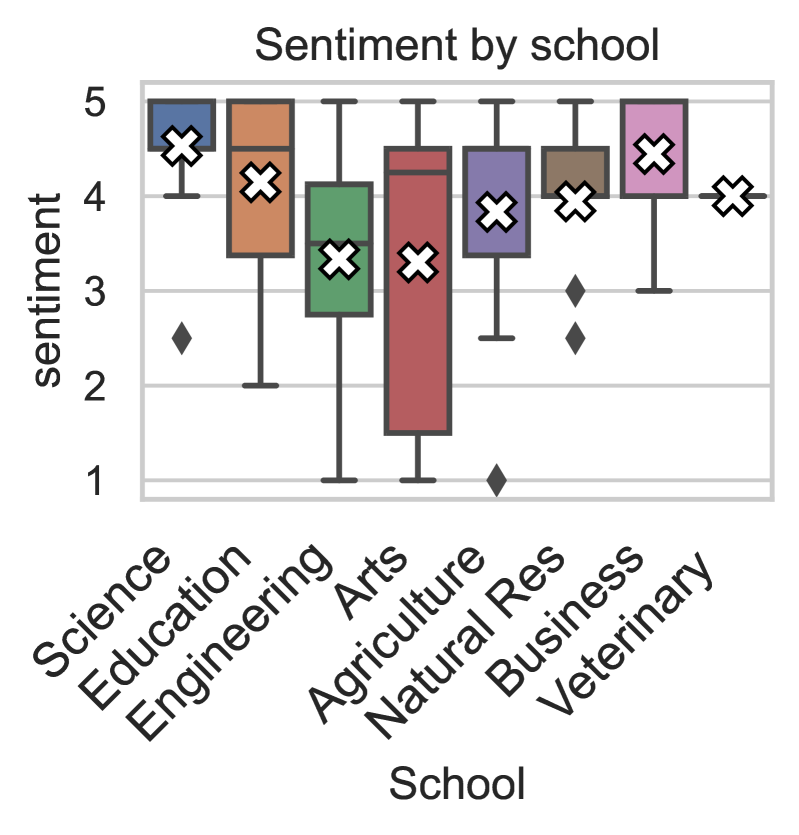
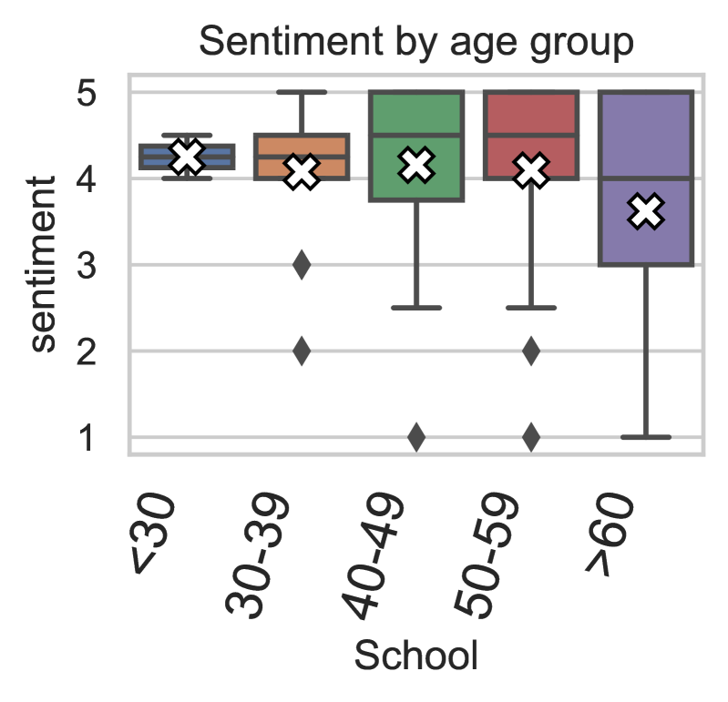
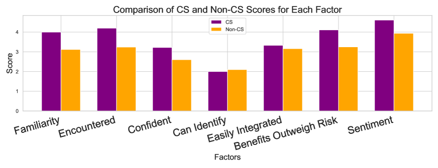

# 教育领域中的生成式AI：探究教育者对其认知、情感态度及影响因素的研究

发布时间：2024年03月22日

`LLM应用

解析：这篇论文主要探讨了大型语言模型（LLMs）在教育领域的应用，特别是大学教师对这些AI语言模型的看法和体验。研究通过调查和访谈，分析了教育者对LLMs和生成AI工具的认知程度、接受态度及其影响因素。这属于LLM在特定领域（教育）的应用研究，因此归类为LLM应用。` `人工智能`

> Generative AI in Education: A Study of Educators' Awareness, Sentiments, and Influencing Factors

# 摘要

> 随着AI技术的飞速进步，大型语言模型（LLMs）在教育领域的应用引发了广泛讨论。本研究聚焦于大学教师对AI语言模型的看法与体验，填补了现有文献中关于教育者如何看待AI在课堂中的作用及其对教学影响的空白。研究目的在于探究高等教育中对LLMs和生成AI工具的认知程度、接受态度及其影响因素。通过李克特量表调查及后续访谈，我们深入了解了教师的观点，并运用统计与主题分析方法处理数据。研究发现，教育者对这些工具的认识逐渐增强，并普遍持积极态度，但教学风格与对生成AI的态度并无明显关联。值得注意的是，尽管CS领域的教育者对生成AI工具的技术理解更为自信，且态度更为积极，但在识别AI生成内容的能力上，他们并未表现出更高的自信。

> The rapid advancement of artificial intelligence (AI) and the expanding integration of large language models (LLMs) have ignited a debate about their application in education. This study delves into university instructors' experiences and attitudes toward AI language models, filling a gap in the literature by analyzing educators' perspectives on AI's role in the classroom and its potential impacts on teaching and learning. The objective of this research is to investigate the level of awareness, overall sentiment towardsadoption, and the factors influencing these attitudes for LLMs and generative AI-based tools in higher education. Data was collected through a survey using a Likert scale, which was complemented by follow-up interviews to gain a more nuanced understanding of the instructors' viewpoints. The collected data was processed using statistical and thematic analysis techniques. Our findings reveal that educators are increasingly aware of and generally positive towards these tools. We find no correlation between teaching style and attitude toward generative AI. Finally, while CS educators show far more confidence in their technical understanding of generative AI tools and more positivity towards them than educators in other fields, they show no more confidence in their ability to detect AI-generated work.

[Arxiv](https://arxiv.org/abs/2403.15586)