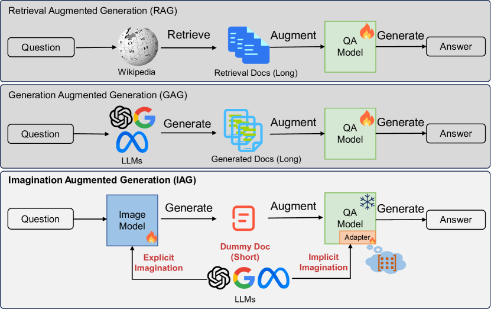
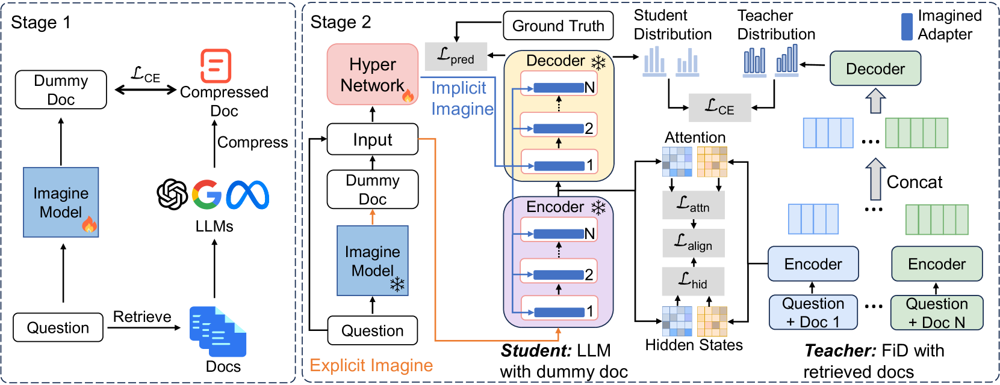
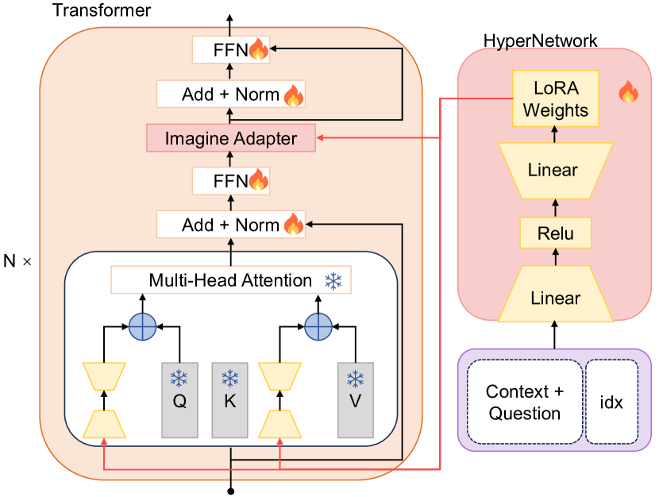
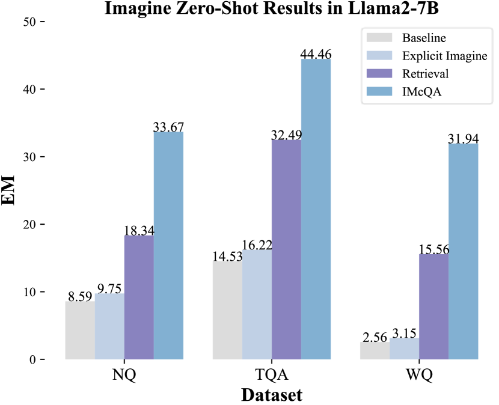
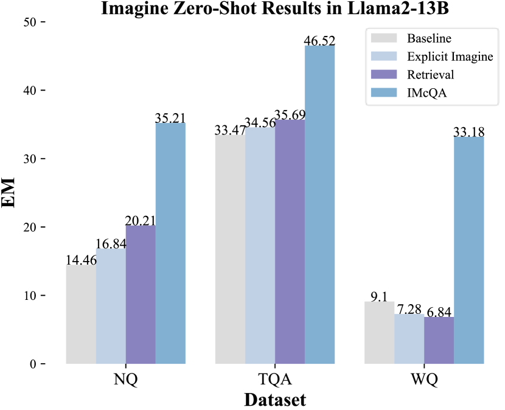
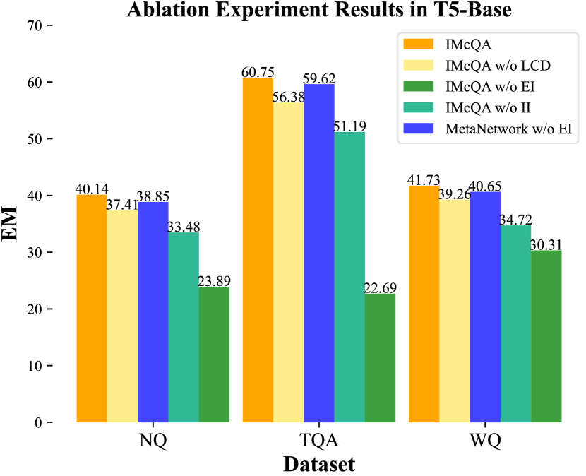
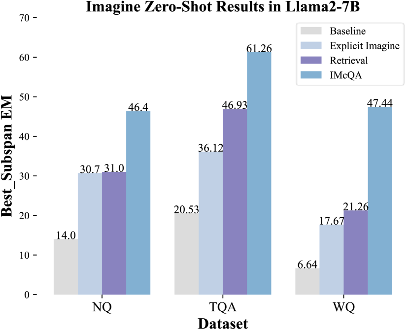
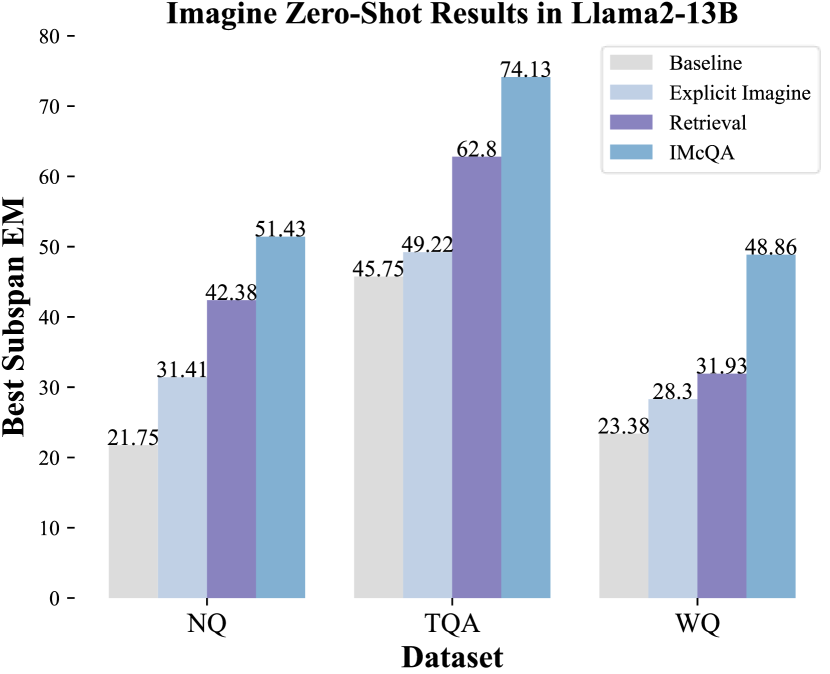

# 想象增强生成技术：针对大型语言模型上的问答任务，我们致力于学习构建更加丰富的上下文环境。这项研究聚焦于如何借助想象力，在大规模语言模型上提升解答问题的能力，通过构建更为详实多元的语境信息。

发布时间：2024年03月22日

`LLM应用` `问题回答系统`

> Imagination Augmented Generation: Learning to Imagine Richer Context for Question Answering over Large Language Models

> 为提升LLMs在问题回答中的知识含量，人们分别提出了检索增强生成与生成增强生成技术，但前者倚重外部资源，二者均需将显式文档融入上下文，导致上下文过长，消耗更多资源。最近的研究指出，虽然LLMs已具备丰富的知识模型，却未能有效调动这些知识。基于此，我们创新性地设计了一种名为“想象增强生成”(IAG)的知识增强框架，它模仿人类仅凭想象填补知识空白的能力，在无需外部资源的前提下进行问题解答。在此框架下，我们进一步提出了一种名为IMcQA的富想象上下文问题回答方法，通过两个模块构建更为丰富的上下文环境：一是借助长上下文压缩技术生成简短虚拟文档，进行明确的想象操作；二是运用HyperNetwork生成适配器权重，实现隐性的想象过程。实验证明，IMcQA在开放领域和闭卷场景下，以及在分布内性能和分布外泛化能力上均有显著提升，我们在https://github.com/Xnhyacinth/IAG公开了相关代码。

> Retrieval-Augmented-Generation and Gener-ation-Augmented-Generation have been proposed to enhance the knowledge required for question answering over Large Language Models (LLMs). However, the former depends on external resources, and both require incorporating the explicit documents into the context, which results in longer contexts that lead to more resource consumption. Recent works indicate that LLMs have modeled rich knowledge, albeit not effectively triggered or activated. Inspired by this, we propose a novel knowledge-augmented framework, Imagination-Augmented-Generation (IAG), which simulates the human capacity to compensate for knowledge deficits while answering questions solely through imagination, without relying on external resources. Guided by IAG, we propose an imagine richer context method for question answering (IMcQA), which obtains richer context through the following two modules: explicit imagination by generating a short dummy document with long context compress and implicit imagination with HyperNetwork for generating adapter weights. Experimental results on three datasets demonstrate that IMcQA exhibits significant advantages in both open-domain and closed-book settings, as well as in both in-distribution performance and out-of-distribution generalizations. Our code will be available at https://github.com/Xnhyacinth/IAG.

[Arxiv](https://arxiv.org/abs/2403.15268)