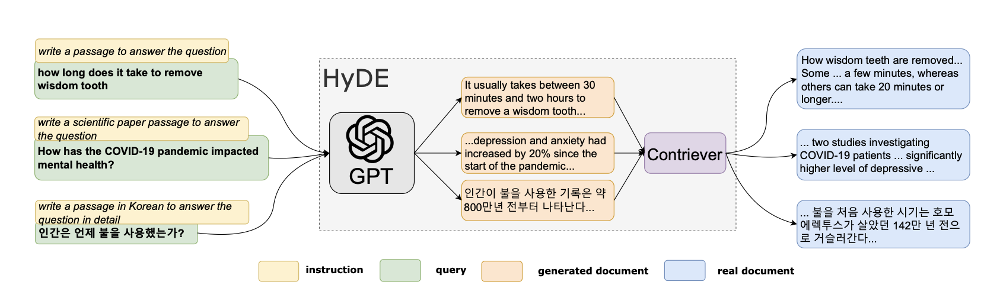

# 针对金融文件的问答，优化RAG模型的检索能力

发布时间：2024年03月22日

`RAG` `信息检索`

> Improving Retrieval for RAG based Question Answering Models on Financial Documents

# 摘要

> 大型语言模型（LLMs）能否精准回复，很大程度上取决于输入内容的质量，尤其是在运用检索增强生成（RAG）技术时。RAG通过选取最相关的文本片段来加强LLMs的查询基础。即便近年来LLMs的回复质量有了显著提升，用户偶尔仍会碰到错误或不相关的信息，这通常是由于RAG在文本片段检索上的不足，而非LLMs本身的问题。因此，精炼RAG流程对于提升LLMs的效果非常关键。本文分析了RAG操作链的局限性，并提出了提升文本检索效率的方法。文章探讨了先进分块技术、查询扩展、加入元数据注释、应用重新排序算法和调整嵌入算法等策略。通过这些策略的实施，可以显著提高检索的准确性，进而增强LLMs在处理和回应问题时的整体表现和信赖度。

> The effectiveness of Large Language Models (LLMs) in generating accurate responses relies heavily on the quality of input provided, particularly when employing Retrieval Augmented Generation (RAG) techniques. RAG enhances LLMs by sourcing the most relevant text chunk(s) to base queries upon. Despite the significant advancements in LLMs' response quality in recent years, users may still encounter inaccuracies or irrelevant answers; these issues often stem from suboptimal text chunk retrieval by RAG rather than the inherent capabilities of LLMs. To augment the efficacy of LLMs, it is crucial to refine the RAG process. This paper explores the existing constraints of RAG pipelines and introduces methodologies for enhancing text retrieval. It delves into strategies such as sophisticated chunking techniques, query expansion, the incorporation of metadata annotations, the application of re-ranking algorithms, and the fine-tuning of embedding algorithms. Implementing these approaches can substantially improve the retrieval quality, thereby elevating the overall performance and reliability of LLMs in processing and responding to queries.

[Arxiv](https://arxiv.org/abs/2404.07221)